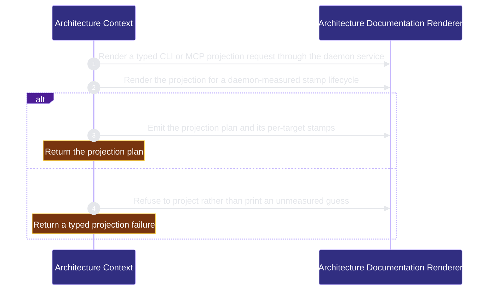

# architecture/context 架構文檔

<!-- BEGIN ARCHCONTEXT:generated target="projection_target.entity.capability-architecture-context" sourceDigest="sha256:671ce59358672428f774bb159bddbf97754135fa6edc2f058befba28419f2b75" rendererVersion="archcontext.docs-renderer/v4" outputDigest="sha256:2ffe353528640d8d15c1130584d7ce0629c1d4b6e5eca286ad5b7c8ec654890e" -->
> **狀態**:`active`
> **Capability ID**:`capability.architecture.context`(kind `capability`)
> **Matched Prefixes**:`packages/**/src/**`
> **Local Contracts**:`AGENTS.md`、`CLAUDE.md`
> **事實優先級**:倉庫當前狀態 > 本文檔機器區 > 本文檔人工區。機器區(引言、§1、§2)由 ArchContext 從架構模型與源碼度量投影生成,手改會在下次投影被覆蓋。本文檔不記錄出處;本次投影所驗證的 commit 見 `docs/architecture/.projection-manifest.json`。

Keeps product and architecture intent available to coding agents.

## 1. P1:能力架構地圖

### 1.1 架構圖

```mermaid
flowchart LR
  p1_capability_architecture_context_d82fe06a["Architecture Context"]:::component
  p1_component_architecture_context_cloud_control_plane_fa0969fd["Control Plane"]:::component
  p1_component_architecture_context_core_agent_orchestrator_dd368317["Agent Orchestrator"]:::component
  p1_component_architecture_context_core_application_8edab11b["Application Control Loop"]:::component
  p1_component_architecture_context_core_architecture_delta_4d719c08["Architecture Delta"]:::component
  p1_component_architecture_context_core_architecture_domain_29cf2d22["Architecture Domain"]:::component
  p1_component_architecture_context_core_architecture_ledger_248e87de["Architecture Ledger"]:::component
  p1_component_architecture_context_core_changeset_engine_2bed514f["ChangeSet Engine"]:::component
  p1_component_architecture_context_core_context_compiler_95b39da0["Context Compiler"]:::component
  p1_component_architecture_context_core_module_statistics_8c73f017["Module Statistics"]:::component
  p1_component_architecture_context_core_policy_engine_9bd2938f["Policy Engine"]:::component
  p1_component_architecture_context_core_practice_catalog_8597299c["Practice Catalog"]:::component
  p1_component_architecture_context_core_practice_engine_d354078b["Practice Engine"]:::component
  p1_component_architecture_context_core_pressure_engine_5893cda8["Pressure Engine"]:::component
  p1_component_architecture_context_core_recommendation_engine_bb326e86["Recommendation Engine"]:::component
  p1_component_architecture_context_core_reconcile_engine_9ad7a924["Reconcile Engine"]:::component
  p1_component_architecture_context_core_refactor_assessment_3ccf5012["Refactor Assessment"]:::component
  p1_component_architecture_context_core_refactor_decision_d3de1854["Refactor Decision"]:::component
  p1_component_architecture_context_core_retrieval_3cb3b2c1["Retrieval"]:::component
  p1_component_architecture_context_core_review_engine_f590debf["Review Engine"]:::component
  p1_component_architecture_context_local_runtime_agent_jobs_33e671d3["Agent Job Service"]:::component
  p1_component_architecture_context_local_runtime_audit_eaeac660["Architecture Audit Service"]:::component
  p1_component_architecture_context_local_runtime_control_file_security_af51dbd4["Control File Security"]:::component
  p1_component_architecture_context_local_runtime_developer_review_run_dfe068ce["Developer Review Runs and Attestations"]:::component
  p1_component_architecture_context_local_runtime_explorer_server_52082528["Explorer Server and Session"]:::component
  p1_component_architecture_context_local_runtime_external_documentation_cb71400c["External Documentation Service"]:::component
  p1_component_architecture_context_local_runtime_ledger_admin_0c86ee18["Ledger Administration Service"]:::component
  p1_component_architecture_context_local_runtime_local_store_sqlite_cd341e9b["SQLite Local Store"]:::component
  p1_component_architecture_context_local_runtime_process_liveness_f8365b95["Process Liveness"]:::component
  p1_component_architecture_context_local_runtime_projection_apply_154446a6["Projection Receipt Service"]:::component
  p1_component_architecture_context_local_runtime_projection_paths_f737d52b["Projection Paths"]:::component
  p1_component_architecture_context_local_runtime_projection_service_5fe94894["Architecture Projection Service"]:::component
  p1_component_architecture_context_local_runtime_rpc_client_4a0f2fbb["Runtime RPC Client and Contract"]:::component
  p1_component_architecture_context_local_runtime_rpc_server_90daf412["Runtime RPC Server and Control"]:::component
  p1_component_architecture_context_local_runtime_runtime_daemon_edb1d9b0["Runtime Daemon"]:::component
  p1_component_architecture_context_local_runtime_runtime_state_paths_13691514["Runtime State Paths"]:::component
  p1_component_architecture_context_projection_renderer_53dbb119["Architecture Documentation Renderer"]:::component
  p1_component_architecture_context_surfaces_cli_c2747804["CLI"]:::component
  p1_component_architecture_context_surfaces_github_review_state_a43938db["GitHub Review State Privacy"]:::component
  p1_component_architecture_context_surfaces_mcp_local_d11d91ff["Local MCP Server"]:::component
  p1_module_architecture_context_cloud_8901d681["Cloud Workspace"]:::component
  p1_module_architecture_context_contracts_c9d1ed3f["Contracts Workspace"]:::component
  p1_module_architecture_context_core_2f786c1e["Core Workspace"]:::component
  p1_module_architecture_context_local_runtime_d4d4d218["Local Runtime Workspace"]:::component
  p1_module_architecture_context_surfaces_7bec6277["Surfaces Workspace"]:::component
  p1_module_architecture_context_tooling_d6655cd5["Repository Tooling"]:::component
  p1_component_architecture_context_local_runtime_agent_jobs_33e671d3 -->|"Resolve repository sessions and ledger scope without moving store transactional ownership"| p1_component_architecture_context_local_runtime_runtime_daemon_edb1d9b0
  p1_component_architecture_context_local_runtime_audit_eaeac660 -->|"Use the same job completion， ID， risk and proposal validation semantics through the existing daemon callbacks"| p1_component_architecture_context_local_runtime_agent_jobs_33e671d3
  p1_component_architecture_context_local_runtime_audit_eaeac660 -->|"Run read-only investigation and compile advisory proposals before daemon-owned ledger recording"| p1_component_architecture_context_core_agent_orchestrator_dd368317
  p1_component_architecture_context_surfaces_cli_c2747804 -->|"Use shared private control-file permission authority"| p1_component_architecture_context_local_runtime_control_file_security_af51dbd4
  p1_component_architecture_context_surfaces_cli_c2747804 -->|"Persist and read only review metadata and apply the shared CLI credential privacy guard"| p1_component_architecture_context_surfaces_github_review_state_a43938db
  p1_component_architecture_context_surfaces_cli_c2747804 -->|"Use the shared state path authority in the fast hook client"| p1_component_architecture_context_local_runtime_runtime_state_paths_13691514
  p1_component_architecture_context_local_runtime_developer_review_run_dfe068ce -->|"Compute deterministic review results from daemon-owned digests before persistence and attestation signing"| p1_component_architecture_context_core_review_engine_f590debf
  p1_component_architecture_context_local_runtime_developer_review_run_dfe068ce -->|"Use shared daemon control paths， process liveness and strict persisted run manifest decoding"| p1_component_architecture_context_local_runtime_rpc_server_90daf412
  p1_component_architecture_context_local_runtime_explorer_server_52082528 -->|"Request authoritative projection and delta through daemon callbacks without moving cache or ledger ownership"| p1_component_architecture_context_local_runtime_runtime_daemon_edb1d9b0
  p1_component_architecture_context_local_runtime_external_documentation_cb71400c -->|"Open repository sessions and execute approved pins under the daemon writer and recovery guard"| p1_component_architecture_context_local_runtime_runtime_daemon_edb1d9b0
  p1_component_architecture_context_surfaces_github_review_state_a43938db -->|"Resolve the worktree-specific user state directory for local review metadata"| p1_component_architecture_context_local_runtime_runtime_state_paths_13691514
  p1_component_architecture_context_local_runtime_ledger_admin_0c86ee18 -->|"Plan explicit ledger migrations and Git projection changes with shared ledger contracts"| p1_component_architecture_context_core_architecture_ledger_248e87de
  p1_component_architecture_context_local_runtime_runtime_daemon_edb1d9b0 -->|"Use the same generated projection path guard"| p1_component_architecture_context_local_runtime_projection_paths_f737d52b
  p1_component_architecture_context_local_runtime_local_store_sqlite_cd341e9b -->|"Use the shared process liveness semantics before stale-owner recovery"| p1_component_architecture_context_local_runtime_process_liveness_f8365b95
  p1_component_architecture_context_local_runtime_local_store_sqlite_cd341e9b -->|"Use shared private control-file permission authority"| p1_component_architecture_context_local_runtime_control_file_security_af51dbd4
  p1_component_architecture_context_local_runtime_local_store_sqlite_cd341e9b -->|"Resolve runtime storage partitions and re-export the existing public state-path contract"| p1_component_architecture_context_local_runtime_runtime_state_paths_13691514
  p1_component_architecture_context_surfaces_mcp_local_d11d91ff -->|"Resolve and call the daemon through the client-only RPC entrypoint"| p1_component_architecture_context_local_runtime_rpc_client_4a0f2fbb
  p1_component_architecture_context_local_runtime_projection_apply_154446a6 -->|"Rebuild fixed-point proof from repository， model and CodeGraph authority before receipt delivery"| p1_component_architecture_context_projection_renderer_53dbb119
  p1_capability_architecture_context_d82fe06a -->|"Project the accepted architecture model into documentation"| p1_component_architecture_context_projection_renderer_53dbb119
  p1_component_architecture_context_local_runtime_projection_service_5fe94894 -->|"Render deterministic documentation and agent context using daemon-owned inputs"| p1_component_architecture_context_projection_renderer_53dbb119
  p1_component_architecture_context_local_runtime_rpc_client_4a0f2fbb -->|"Read the shared daemon connection file through control helpers without loading the server implementation"| p1_component_architecture_context_local_runtime_rpc_server_90daf412
  p1_component_architecture_context_local_runtime_rpc_server_90daf412 -->|"Resolve daemon connection， lock and review-run paths through the shared state path authority"| p1_component_architecture_context_local_runtime_runtime_state_paths_13691514
  p1_component_architecture_context_local_runtime_rpc_server_90daf412 -->|"Use shared private control-file permission authority"| p1_component_architecture_context_local_runtime_control_file_security_af51dbd4
  p1_component_architecture_context_local_runtime_rpc_server_90daf412 -->|"Use the shared process liveness semantics before stale-owner recovery"| p1_component_architecture_context_local_runtime_process_liveness_f8365b95
  p1_component_architecture_context_local_runtime_rpc_server_90daf412 -->|"Use the common wire protocol and construct a client from a validated daemon connection file"| p1_component_architecture_context_local_runtime_rpc_client_4a0f2fbb
  p1_component_architecture_context_local_runtime_runtime_daemon_edb1d9b0 -->|"Compose job queue orchestration and supply existing session and ledger scope ports"| p1_component_architecture_context_local_runtime_agent_jobs_33e671d3
  p1_component_architecture_context_local_runtime_runtime_daemon_edb1d9b0 -->|"Delegate audit orchestration with existing lifecycle cancellation， writer gate， stores and job completion"| p1_component_architecture_context_local_runtime_audit_eaeac660
  p1_component_architecture_context_local_runtime_runtime_daemon_edb1d9b0 -->|"Delegate review worktree lifecycle through the composed service with the daemon running-state guard and clock"| p1_component_architecture_context_local_runtime_developer_review_run_dfe068ce
  p1_component_architecture_context_local_runtime_runtime_daemon_edb1d9b0 -->|"Compose Explorer session lifecycle and send committed projection and authority invalidations"| p1_component_architecture_context_local_runtime_explorer_server_52082528
  p1_component_architecture_context_local_runtime_runtime_daemon_edb1d9b0 -->|"Compose external documentation operations using the existing provider， store and writer ports"| p1_component_architecture_context_local_runtime_external_documentation_cb71400c
  p1_component_architecture_context_local_runtime_runtime_daemon_edb1d9b0 -->|"Delegate explicit ledger administration using the existing writer gate， stores and transactional append callback"| p1_component_architecture_context_local_runtime_ledger_admin_0c86ee18
  p1_component_architecture_context_local_runtime_runtime_daemon_edb1d9b0 -->|"Delegate projection receipt operations through the composed service with the daemon running guard and writer gate"| p1_component_architecture_context_local_runtime_projection_apply_154446a6
  p1_component_architecture_context_local_runtime_runtime_daemon_edb1d9b0 -->|"Delegate typed projection operations after validating transport input and MCP one-time approval"| p1_component_architecture_context_local_runtime_projection_service_5fe94894
  p1_component_architecture_context_local_runtime_runtime_daemon_edb1d9b0 -->|"Compose the loopback RPC client through the runtime facade while preserving the public protocol"| p1_component_architecture_context_local_runtime_rpc_client_4a0f2fbb
  p1_component_architecture_context_local_runtime_runtime_daemon_edb1d9b0 -->|"Compose the public RPC server and share control-file， HTTP and strict review-boundary helpers"| p1_component_architecture_context_local_runtime_rpc_server_90daf412
  p1_component_architecture_context_surfaces_cli_c2747804 -->|"Use the same generated projection path guard"| p1_component_architecture_context_local_runtime_projection_paths_f737d52b
  classDef actor fill:#111827,color:#ffffff,stroke:#f9fafb,stroke-width:2px
  classDef component fill:#075985,color:#ffffff,stroke:#bae6fd,stroke-width:2px
  classDef datastore fill:#3f6212,color:#ffffff,stroke:#d9f99d,stroke-width:2px
  classDef external fill:#7c2d12,color:#ffffff,stroke:#fed7aa,stroke-width:2px
```

- Proof: `proven` (`sha256:5e1efb4708698994488a0761bbff49032d8ff5c0823307f2dc0b66bdf0c53b73`).
- Semantic nodes: `46`; declared relations: `36`.

### 1.2 模組職責表

| 宣告入口 | 錨點 | 職責 |
| --- | --- | --- |
| `entrypoint.architecture-context.projection-service` | `packages/local-runtime/runtime-daemon/src/projection-service.ts#buildArchitectureDocsProjection` | `sink.architecture-context.render` → `packages/core/projection-engine/src/index.ts#renderArchitectureDocumentationProjection` |
| `entrypoint.architecture-context.daemon` | `packages/local-runtime/runtime-daemon/src/index.ts#completeTaskProjectionDrift` | `sink.architecture-context.render-daemon` → `packages/core/projection-engine/src/index.ts#renderArchitectureDocumentationProjection` |

### 1.3 規模信號

- 規模量級:`100–200` 個文件 / `50k–100k` 行
- 匹配前綴:`packages/**/src/**`
- 排除前綴:`packages/**/test/**`
- 推導:掃描 `source.include` 減 `source.exclude`,跳過 `.git/` 與 `node_modules/`,再按 1–2–5 階梯分桶。精確計數不入本文檔:量級足以回答「這個能力有多大」,而逐行計數會讓覆蓋範圍內任何一次源碼改動都改寫本文檔。

### 1.4 依賴邊界

出向關係:

- `calls` → `component.architecture-context.projection-renderer` — Project the accepted architecture model into documentation

入向關係:

- 無。

## 2. P2:端到端數據流

> **Proof**: `proven` (`sha256:5e1efb4708698994488a0761bbff49032d8ff5c0823307f2dc0b66bdf0c53b73`); selectors `2/2`.

<!-- END ARCHCONTEXT:generated target="projection_target.entity.capability-architecture-context" -->

## 3. P3:設計決策與不變量

## 4. 歷史決策記錄(append-only)

## Optimization Backlog
