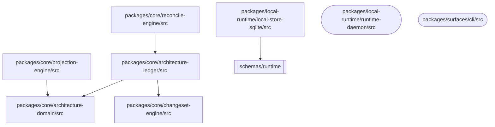
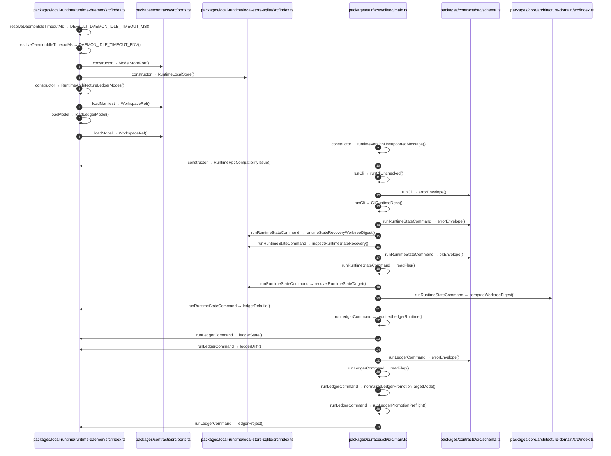

# Architecture Context 架構文檔

<!-- BEGIN ARCHCONTEXT:generated target="projection_target.entity.capability-architecture-context" sourceDigest="sha256:64d357f43251d115006bd6c6ac3b10c6e2d8c6cc1c75cb5de549eb821669581d" rendererVersion="archcontext.docs-renderer/v1" outputDigest="sha256:f5fa942b7557201becfce915ec6b46fd2806db551bd66e5f141cb0ced1af1188" verifiedAgainst="codex/archctx-capability-docs-projection@74153295e9bbcd5a5145829f8392d018327565c1@2026-07-14T12:32:10+08:00" -->
> **狀態**:`active`
> **Verified against**:`codex/archctx-capability-docs-projection@74153295e9bbcd5a5145829f8392d018327565c1`(2026-07-14)
> **Capability ID**:`capability.architecture-context`(kind `capability`)
> **Matched Prefixes**:`packages/**/src/**`
> **Local Contracts**:未宣告(`extensions.localContracts` 缺失)
> **事實優先級**:倉庫當前狀態 > 本文檔機器區 > 本文檔人工區。機器區(引言、§1、§2)由 ArchContext 從架構模型與 Git 狀態投影生成,手改會在下次投影被覆蓋。

Keeps product and architecture intent available to coding agents.

## 1. P1:能力架構地圖

### 1.1 架構圖

- 圖例:`([...])` 宣告入口所在目錄、`[...]` 能力範圍內目錄、`[[...]]` 能力範圍外的匯入目標目錄。
- 邊:倉庫匯入邊索引解析到真實檔案的 `import` 邊,按目錄聚合去重後 `5` 條(檔案級原始邊 `19` 條);同目錄內部的匯入不畫。
- 節點:僅含參與上述邊的目錄與宣告入口所在目錄;能力範圍共 `63` 個檔案。
- 不含呼叫關係:呼叫索引的軌跡混入型別引用,不作為 P1 邊來源。

### 1.2 模組職責表

| 宣告入口 | 錨點 | 職責 |
| --- | --- | --- |
| `packages/local-runtime/runtime-daemon/src/index.ts` | `packages/local-runtime/runtime-daemon/src/index.ts` | 尚未生成(需符號索引提供行錨點) |
| `packages/surfaces/cli/src/main.ts` | `packages/surfaces/cli/src/main.ts` | 尚未生成(需符號索引提供行錨點) |

### 1.3 規模信號

- 文件數:`63`
- 總行數:`50689`
- 匹配前綴:`packages/**/src/**`
- 排除前綴:`packages/**/test/**`
- 復算:`archctx docs plan --json`(掃描 `source.include` 減 `source.exclude`,跳過 `.git/` 與 `node_modules/`)

### 1.4 依賴邊界

出向關係:

- 無。

入向關係:

- 無。

## 2. P2:端到端數據流

> **半自動生成的候選圖**:participant 名稱直接取機器可得的檔案路徑,本版無語義命名覆寫機制;呼叫索引的呼叫軌跡混入型別引用,可能多列或漏列。修訂意見寫在 §3,本區每次投影都會被覆寫。

- 入口 `packages/local-runtime/runtime-daemon/src/index.ts`:種子符號 `resolveDaemonIdleTimeoutMs`(:144)、`auditGithubIssuesEnabledInManifestText`(:198)、`constructor`(:801)、`loadManifest`(:807)、`loadModel`(:811);另有頂層函式超出種子預算未列入
- 入口 `packages/surfaces/cli/src/main.ts`:種子符號 `constructor`(:65)、`runCli`(:192)、`runCliUnchecked`(:203)、`runRuntimeStateCommand`(:488)、`runLedgerCommand`(:566);另有頂層函式超出種子預算未列入
- 訊息:`29` 條,全部來自呼叫索引對種子符號回報的呼叫軌跡。
- 錯誤路徑:呼叫索引未提供 throw/error 分支資訊,本圖不列錯誤分支,也不編造。
- 注意:`runRuntimeStateCommand`、`runLedgerCommand` 的呼叫軌跡被索引截斷,訊息可能不完整。
<!-- END ARCHCONTEXT:generated target="projection_target.entity.capability-architecture-context" -->
