# Architecture Context 架構文檔

<!-- BEGIN ARCHCONTEXT:generated target="projection_target.entity.capability-architecture-context" sourceDigest="sha256:90d15719f0bb6ab5db50e4fb1bacd903b754b085c20dae49da36d080945c6fb5" rendererVersion="archcontext.docs-renderer/v4" outputDigest="sha256:d831f2441413d4613a8dc56919849dfbfa9ad1b162898e9979e14e7782edf046" -->
> **狀態**:`active`
> **Capability ID**:`capability.architecture-context`(kind `capability`)
> **Matched Prefixes**:`packages/**/src/**`
> **Local Contracts**:未宣告(`extensions.localContracts` 缺失)
> **事實優先級**:倉庫當前狀態 > 本文檔機器區 > 本文檔人工區。機器區(引言、§1、§2)由 ArchContext 從架構模型與源碼度量投影生成,手改會在下次投影被覆蓋。本文檔不記錄出處;本次投影所驗證的 commit 見 `docs/architecture/.projection-manifest.json`。

Keeps product and architecture intent available to coding agents.

## 1. P1:能力架構地圖

### 1.1 架構圖

```mermaid
flowchart LR
  p1_capability_architecture_context_19e55d58["Architecture Context"]:::component
  p1_component_architecture_context_cloud_control_plane_fa0969fd["Control Plane"]:::component
  p1_component_architecture_context_core_agent_orchestrator_dd368317["Agent Orchestrator"]:::component
  p1_component_architecture_context_core_application_8edab11b["Application Control Loop"]:::component
  p1_component_architecture_context_core_architecture_delta_4d719c08["Architecture Delta"]:::component
  p1_component_architecture_context_core_architecture_domain_29cf2d22["Architecture Domain"]:::component
  p1_component_architecture_context_core_architecture_ledger_248e87de["Architecture Ledger"]:::component
  p1_component_architecture_context_core_changeset_engine_2bed514f["ChangeSet Engine"]:::component
  p1_component_architecture_context_core_context_compiler_95b39da0["Context Compiler"]:::component
  p1_component_architecture_context_core_module_statistics_8c73f017["Module Statistics"]:::component
  p1_component_architecture_context_core_policy_engine_9bd2938f["Policy Engine"]:::component
  p1_component_architecture_context_core_practice_catalog_8597299c["Practice Catalog"]:::component
  p1_component_architecture_context_core_practice_engine_d354078b["Practice Engine"]:::component
  p1_component_architecture_context_core_pressure_engine_5893cda8["Pressure Engine"]:::component
  p1_component_architecture_context_core_recommendation_engine_bb326e86["Recommendation Engine"]:::component
  p1_component_architecture_context_core_reconcile_engine_9ad7a924["Reconcile Engine"]:::component
  p1_component_architecture_context_core_refactor_assessment_3ccf5012["Refactor Assessment"]:::component
  p1_component_architecture_context_core_refactor_decision_d3de1854["Refactor Decision"]:::component
  p1_component_architecture_context_core_retrieval_3cb3b2c1["Retrieval"]:::component
  p1_component_architecture_context_core_review_engine_f590debf["Review Engine"]:::component
  p1_component_architecture_context_local_runtime_local_store_sqlite_cd341e9b["SQLite Local Store"]:::component
  p1_component_architecture_context_local_runtime_runtime_daemon_edb1d9b0["Runtime Daemon"]:::component
  p1_component_architecture_context_projection_renderer_53dbb119["Architecture Documentation Renderer"]:::component
  p1_component_architecture_context_surfaces_cli_c2747804["CLI"]:::component
  p1_component_architecture_context_surfaces_mcp_local_d11d91ff["Local MCP Server"]:::component
  p1_module_architecture_context_cloud_8901d681["Cloud Workspace"]:::component
  p1_module_architecture_context_contracts_c9d1ed3f["Contracts Workspace"]:::component
  p1_module_architecture_context_core_2f786c1e["Core Workspace"]:::component
  p1_module_architecture_context_local_runtime_d4d4d218["Local Runtime Workspace"]:::component
  p1_module_architecture_context_surfaces_7bec6277["Surfaces Workspace"]:::component
  p1_capability_architecture_context_19e55d58 -->|"Project the accepted architecture model into documentation"| p1_component_architecture_context_projection_renderer_53dbb119
  classDef actor fill:#111827,color:#ffffff,stroke:#f9fafb,stroke-width:2px
  classDef component fill:#075985,color:#ffffff,stroke:#bae6fd,stroke-width:2px
  classDef datastore fill:#3f6212,color:#ffffff,stroke:#d9f99d,stroke-width:2px
  classDef external fill:#7c2d12,color:#ffffff,stroke:#fed7aa,stroke-width:2px
```

- Proof: `proven` (`sha256:7a0229995b2146a2313a93cd9ac0e5ffc8c0d1564a177285a32feaac30d8563f`).
- Semantic nodes: `30`; declared relations: `1`.

### 1.2 模組職責表

| 宣告入口 | 錨點 | 職責 |
| --- | --- | --- |
| `entrypoint.architecture-context.cli` | `packages/surfaces/cli/src/main.ts#buildArchitectureDocsProjection` | `sink.architecture-context.render` → `packages/core/projection-engine/src/index.ts#renderArchitectureDocumentationProjection` |
| `entrypoint.architecture-context.daemon` | `packages/local-runtime/runtime-daemon/src/index.ts#completeTaskProjectionDrift` | `sink.architecture-context.render-daemon` → `packages/core/projection-engine/src/index.ts#renderArchitectureDocumentationProjection` |

### 1.3 規模信號

- 規模量級:`50–100` 個文件 / `50k–100k` 行
- 匹配前綴:`packages/**/src/**`
- 排除前綴:`packages/**/test/**`
- 推導:掃描 `source.include` 減 `source.exclude`,跳過 `.git/` 與 `node_modules/`,再按 1–2–5 階梯分桶。精確計數不入本文檔:量級足以回答「這個能力有多大」,而逐行計數會讓覆蓋範圍內任何一次源碼改動都改寫本文檔。

### 1.4 依賴邊界

出向關係:

- `calls` → `component.architecture-context.projection-renderer` — Project the accepted architecture model into documentation

入向關係:

- 無。

## 2. P2:端到端數據流

> **human-action-required**: P2 flow evidence is unprovable; no sequence diagram was generated.
- `selector-evidence-missing`: entrypoint.architecture-context.cli :: buildArchitectureDocsProjection :: sink.architecture-context.render
- `selector-evidence-missing`: entrypoint.architecture-context.daemon :: completeTaskProjectionDrift :: sink.architecture-context.render-daemon
- `selector-evidence-missing`: entrypoint.architecture-context.cli :: buildArchitectureDocsProjection :: sink.architecture-context.render
- `selector-evidence-missing`: entrypoint.architecture-context.cli :: buildArchitectureDocsProjection :: sink.architecture-context.render
<!-- END ARCHCONTEXT:generated target="projection_target.entity.capability-architecture-context" -->
