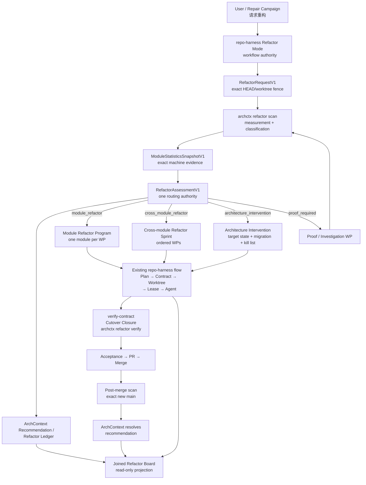

# 代码重构模式：双仓权威边界与实施 Sprint

## 最终决策

应采用一条非常清晰的分界：

```text
ArchContext
= 观察代码
+ 定义模块
+ 统计模块
+ 分析依赖与结构压力
+ 判断模块级 / 跨模块 / 架构级
+ 生成重构建议
+ 验证重构前后结构变化
+ 保存语义重构账本

repo-harness
= 接收用户或 Campaign 授权
+ 调用并验证 archctx CLI
+ 把建议物化为 Sprint / Work Package / Plan / Contract
+ 派发 Claude / Codex
+ 管理 Lease / Worktree / WorkEnvelope
+ 执行 Cutover Closure
+ 测试、验收、PR、合并、Issue 关闭和分支清理
+ 展示“建议—执行—完成”的联合看板
```

一句话判断规则：

> **任何脱离 repo-harness 也应该对其他代码仓库有用的重构分析能力，都放进 ArchContext；任何涉及 Task、Plan、Contract、Lease、Agent、PR、AcceptanceReceipt、GitHub Issue 或 Campaign 的功能，都留在 repo-harness。**

不应在 repo-harness 中自行实现：

* LOC／文件／symbol 统计器；
* import graph、fan-in/fan-out、SCC或cycle分析器；
* 模块边界解析器；
* “整体架构还是单模块”的第二套判定器；
* 第二份 `refactor-ledger.json`；
* 直接解析 CodeGraph输出的适配器。

---

# 一、当前基础与真正缺口

ArchContext 当前已经不是一张简单架构图工具。它已有 CodeGraph adapter、architecture pressure、refactor posture、Architecture Intervention、Architecture Ledger、Recommendation lifecycle、audit、book、investigation和projection等基础能力。CLI目前提供 `prepare`、`checkpoint`、`recommendations`、`book`、`investigate`、`audit` 等命令，但尚无一个 first-class、稳定版本化的 `archctx refactor` 协议。

它已经可以按 `.archcontext/model/nodes/*.yaml` 中声明的 `source.include - source.exclude` 计算每个 node的精确文件数和行数，也已有每个 capability的真实已解析 import edge图和 `truncated` 状态。不过生成架构文档时，当前故意只输出 1–2–5 量级区间，而不是精确数字，避免每次普通代码修改都造成文档 churn。

CodeGraph adapter已经固定 `@colbymchenry/codegraph@1.5.0`，支持 index、context、symbol search、impact radius，也会把相对 import解析到真实文件；无法解析的bare package或不存在目标不会被猜成一条边。其projection handshake还会绑定binary、版本、index状态和worktree digest。

但当前判定层还不能直接成为无人值守重构的机器权威：

* pressure engine仍混合task text regex和observed graph evidence；
* `prepareTask()`在调用者没有提供证据时，会默认 `callerCoverage=0.8`、`testsAvailable=true`、`rollbackAvailable=true`；
* `createInterventionProposal()`目前生成的target owner、relation和kill-list仍有通用placeholder；
* 当前 `ArchitecturePosture` 只有 `normal | structural | intervention | proof-required`，还没有明确区分“单模块”“跨模块但不改架构”“整体架构切换”。

所以正确方向不是在 repo-harness 补这些算法，而是先把它们在 ArchContext上游收敛成一个可消费的公开协议。

---

# 二、P1 架构



## 权威关系

```text
ArchContext assessment.route
    是唯一“采用什么重构规模”的判定

repo-harness
    可以比assessment更保守地停止
    但不得把architecture_intervention降级成module_refactor
```

也就是说：

* ArchContext可以说“这是架构级变更”；
* repo-harness可以说“需要人工批准”；
* repo-harness不能说“为了自动执行，我把它当单模块改动”。

---

# 三、功能归属表

| 功能                                     |   ArchContext上游  |            repo-harness            |
| -------------------------------------- | :--------------: | :--------------------------------: |
| Architecture node／module身份             |      **权威**      |                 只消费                |
| `source.include/exclude` footprint     |      **权威**      |                 不重算                |
| 文件数、行数、symbol数                         |     **计算与协议**    |                只显示摘要               |
| CodeGraph index和版本绑定                   |     **权威适配器**    |           不直接调用CodeGraph           |
| import graph、fan-in、fan-out            |      **计算**      |                 只消费                |
| SCC、cycle、跨边界edge                      |      **计算**      |              用于调度但不重算              |
| entrypoint、owner、lifecycle             |    **架构模型权威**    |                 不推断                |
| unowned／multiply-owned path            |      **检测**      |       遇到即停止或触发model adoption       |
| caller coverage                        | **测量，允许unknown** | Cutover Closure补work-package proof |
| test evidence availability             |     **观察信号**     |              实际测试执行权威              |
| persisted data／external consumer       |     **结构证据**     |          Contract风险和迁移gate         |
| architecture pressure                  |      **计算**      |              不复制score              |
| module／cross-module／architecture判级     |     **唯一权威**     |             映射到workflow            |
| Architecture Intervention target state |     **权威模型**     |             生成Sprint和执行            |
| Refactor recommendation fingerprint    |      **权威**      |               绑定到Task              |
| 重构语义账本                                 |     **唯一权威**     |               不建第二账本               |
| Task／Sprint／Work Graph                 |         否        |               **权威**               |
| Plan／Contract／allowed paths            |         否        |               **权威**               |
| Lease／Claim／WorkEnvelope               |         否        |               **权威**               |
| Claude／Codex并行派工                       |         否        |               **权威**               |
| Cutover Closure                        |      提供结构复测      |             **执行收口权威**             |
| 验证命令和AcceptanceReceipt                 |      可提供检查结果     |               **权威**               |
| PR、merge、Issue closure                 |         否        |               **权威**               |
| GPT Pro出Issue／审计main                   |         否        |           **Campaign权威**           |
| 重构联合看板                                 |      提供语义状态      |            **生成执行联合投影**            |

---

# 四、ArchContext 上游需要新增的能力

## 4.1 模块定义不得按文件夹猜测

“模块”必须定义为：

```text
.archcontext node
+ source.include
- source.exclude
+ declared entrypoints
+ declared relations
```

不得做：

```text
src/foo 文件夹 = foo module
packages/bar = bar module
```

除非 `.archcontext/model` 已明确如此声明。

当出现：

* 文件不属于任何node；
* 同一个文件被多个node覆盖；
* source selector冲突；
* CodeGraph index缺失；
* import graph被截断；

结果必须是：

```text
proof_required
或
model_adoption_required
```

不能继续用目录启发式猜一个module。

---

## 4.2 `ModuleStatisticsSnapshotV1`

建议新增到 `archctx-contracts`：

```ts
interface ModuleStatisticsSnapshotV1 {
  schemaVersion: 'archcontext.module-statistics/v1';

  repository: {
    repositoryId: string;
  };

  worktree: {
    workspaceId: string;
    branch: string;
    headSha: string;
    worktreeDigest: string;
  };

  modelDigest: string;

  codeFacts: {
    provider: 'codegraph';
    version: string;
    binaryDigest: string;
    indexedWorktreeDigest: string | null;

    coverage: 'complete' | 'partial' | 'unknown';
    truncated: boolean;
    reasonCodes: string[];
  };

  modules: ModuleStatisticsV1[];

  repositorySummary: {
    moduleCount: number;
    ownedFileCount: number;
    unownedFileCount: number;
    multiplyOwnedFileCount: number;

    crossModuleEdgeCount: number;
    crossModuleCycleCount: number;
    stronglyConnectedComponentCount: number;

    unresolvedImportCount: number;
    dynamicInvocationRiskCount: number;
  };

  snapshotDigest: string;
}
```

每个module：

```ts
interface ModuleStatisticsV1 {
  nodeId: string;
  nodeDigest: string;

  footprint: {
    fileCount: number;
    lineCount: number;
    sourceFilesDigest: string;
    includePatterns: string[];
    excludePatterns: string[];
  };

  surfaces: {
    declaredEntrypoints: string[];
    observedEntrypoints: string[];
    lifecycleOwners: string[];
    datastoreSubjects: string[];
  };

  dependencyGraph: {
    internalEdgeCount: number;
    inboundModuleEdges: number;
    outboundModuleEdges: number;
    fanIn: number;
    fanOut: number;
    instability: number | null;

    stronglyConnectedComponentId: string | null;
    cycleCount: number;
    directionViolationCount: number;
  };

  tests: {
    testFileCount: number;
    observedTestEdges: number;
    callerCoverage: number | null;
    coverageStatus: 'measured' | 'partial' | 'unknown';
  };

  uncertainty: {
    unresolvedImports: number;
    dynamicInvocation:
      | 'none_observed'
      | 'possible'
      | 'known'
      | 'unknown';
    ambiguousOwnership: boolean;
    graphTruncated: boolean;
  };

  moduleDigest: string;
}
```

## 4.3 精确统计不进入普通架构文档

现有“架构文档只显示量级bucket”的设计应保持。

建议：

```text
机器JSON:
  exact fileCount / lineCount / edgeCount

docs/architecture:
  2–5 files
  1k–2k lines
  high inbound coupling
  one cycle
```

理由是：

* 重构route需要精确机器输入；
* Git追踪文档不应因每次加20行代码而重写；
* ledger绑定 `snapshotDigest`，不需要把全部精确数字复制到Markdown。

---

# 五、ArchContext 的重构判定协议

## 5.1 `RefactorAssessmentV1`

```ts
type RefactorRoute =
  | 'no_action'
  | 'module_refactor'
  | 'cross_module_refactor'
  | 'architecture_intervention'
  | 'proof_required';

interface RefactorAssessmentV1 {
  schemaVersion: 'archcontext.refactor-assessment/v1';

  requestId: string;
  statisticsSnapshotDigest: string;
  modelDigest: string;
  codeFactsDigest: string;

  requestedScope:
    | { kind: 'repository' }
    | { kind: 'node'; nodeId: string }
    | { kind: 'paths'; paths: string[] };

  route: RefactorRoute;
  routeReasonCodes: RefactorRouteReasonCode[];

  affectedNodeIds: string[];

  pressure: {
    level: 'low' | 'medium' | 'high';
    score: number;
    signalIds: string[];
  };

  confidence: {
    level: 'low' | 'medium' | 'high';
    callerCoverage: number | null;
    testsObserved: boolean | null;
    rollbackObserved: boolean | null;
    unresolvedEvidence: string[];
  };

  majorChangeReasons: string[];

  opportunities: RefactorOpportunityV1[];

  assessmentDigest: string;
}
```

## 5.2 判级顺序

判级必须按以下顺序执行，不应先看LOC：

```text
1. 模型与code facts是否完整？
   否 → proof_required

2. module ownership是否唯一？
   否 → proof_required / model_adoption_required

3. 是否涉及architecture major change？
   是 → architecture_intervention

4. 是否涉及多个architecture nodes？
   是 → cross_module_refactor

5. 是否明确只在一个node内部？
   是 → module_refactor

6. 是否有足够结构问题证据？
   否 → no_action
```

## 5.3 `architecture_intervention` 的触发

应复用现有major-change语义，例如：

* node added／removed／moved／renamed；
* relation changed；
* ownership changed；
* lifecycle changed；
* entrypoint changed；
* interface changed；
* responsibility changed；
* risk boundary changed；
* constraint changed；
* migration target state changed。

repo-harness当前已经用一个闭合major-change reason vocabulary处理这些架构变化，也已经有 `architecture-projection accept` 和 `reconcile` 入口。因此重构模式不应再发明一个“架构改动批准”系统。

## 5.4 `cross_module_refactor` 与架构级的区别

跨模块不一定等于架构切换。

例如：

```text
模块A与模块B重复实现相同serializer
→ 将实现收敛到现有模块A
→ 不新增node
→ 不改变owner
→ 不改变public interface
→ cross_module_refactor
```

而下面属于architecture intervention：

```text
模块A与模块B都有lifecycle owner
→ 创建新的模块C作为唯一owner
→ 删除旧relation
→ 新增public boundary
→ architecture_intervention
```

---

# 六、必须修正的现有 ArchContext 判定缺口

## 6.1 禁止默认“证据充足”

当前：

```ts
callerCoverage ?? 0.8
testsAvailable ?? true
rollbackAvailable ?? true
```

用于交互建议尚可，但不能成为自动重构route的依据。

新协议必须改为：

```text
unknown remains unknown
unknown essential evidence
→ proof_required
```

## 6.2 Task text只可产生advisory signal

类似：

```text
task出现 wrapper / fallback / legacy / cycle
```

只能增加调查方向，不能单独令：

```text
route = architecture_intervention
```

当前pressure engine已经把纯heuristic结果上限压到25，这是正确基础；新classifier应进一步规定，architecture route至少需要一个observed或verified结构signal。

## 6.3 Intervention不能再输出placeholder target

当前示例中的：

```text
module.target-owner
relation.target-calls-boundary
symbol.legacyWrapper
```

必须替换为：

* exact architecture node ID；
* exact relation ID；
* exact path／symbol selector；
* 或明确 `unresolved`，进入proof-required。

不能把placeholder写进可执行Sprint。

---

# 七、重构账本：只保留一个语义权威

## 7.1 语义账本放在 ArchContext

ArchContext当前Architecture Ledger已经可以记录：

* repository/worktree/head；
* architecture events；
* evidence items与bindings；
* snapshots；
* recommendations；
* recommendation feedback；
* recommendation状态变更；
* audit runs。

Recommendation当前已有：

```text
open
acknowledged
accepted
rejected
deferred
waived
resolved
superseded
expired
```

并且所有 accept/reject/defer/resolve均要求显式actor与reason，不允许implicit acceptance。

所以不应该再建：

```text
repo-harness/refactor-ledger.json
```

记录：

```json
{ "module-a": "done" }
```

这会马上成为第二个状态权威。

## 7.2 建议升级为 `RecommendationV3`

当前 `RecommendationV2` 缺少typed category/payload。重构语义若只塞进自由 `extensions`，以后会难以机器验证。

建议上游新增：

```ts
interface RecommendationV3 {
  schemaVersion: 'archcontext.recommendation/v3';

  recommendationId: string;
  runId: string;
  fingerprint: string;

  category:
    | 'practice'
    | 'refactor'
    | 'architecture_intervention';

  subjectSelector: {
    kind: 'repository' | 'node' | 'relation' | 'path' | 'symbol';
    id: string;
  };

  payload:
    | PracticeRecommendationPayloadV1
    | RefactorRecommendationPayloadV1
    | ArchitectureInterventionPayloadV1;

  status:
    | 'open'
    | 'acknowledged'
    | 'accepted'
    | 'rejected'
    | 'deferred'
    | 'waived'
    | 'resolved'
    | 'superseded'
    | 'expired';

  evidenceBindingIds: string[];
  createdAt: string;
  updatedAt: string;
}
```

重构payload：

```ts
interface RefactorRecommendationPayloadV1 {
  assessmentDigest: string;
  route: RefactorRoute;
  affectedNodeIds: string[];

  baselineSnapshotDigest: string;

  targetOutcomes: Array<{
    metricOrInvariant: string;
    operator:
      | 'equals'
      | 'less_than'
      | 'greater_than'
      | 'absent'
      | 'present';
    expected: string | number | boolean;
  }>;

  killList: Array<{
    kind: 'path' | 'symbol' | 'relation' | 'fallback' | 'compatibility';
    id: string;
    required: boolean;
  }>;

  risk: 'low' | 'medium' | 'high';
}
```

## 7.3 “已做”的严格定义

不能以PR merged直接显示“重构完成”。

```text
implemented
= repo-harness PR已合并

resolved
= PR已合并
  + exact final main已重新扫描
  + ArchContext验证target outcomes
  + kill list满足
  + Recommendation状态转为resolved
```

因此看板需要区分：

```text
open
accepted
planned
executing
merged_pending_measurement
partially_resolved
resolved
deferred
rejected
superseded
regressed
stale
```

## 7.4 回归不重写历史

一个已解决问题以后再次出现：

```text
旧Recommendation仍保持resolved
→ 新scan产生新的Recommendation
→ 新记录supersedes / regresses_from旧记录
```

不能把旧记录从resolved重新改回open，避免抹掉历史上确实完成过的重构。

---

# 八、重构结果验证

## 8.1 `RefactorResolutionEvidenceV1`

```ts
interface RefactorResolutionEvidenceV1 {
  schemaVersion: 'archcontext.refactor-resolution-evidence/v1';

  recommendationId: string;
  recommendationDigest: string;

  beforeSnapshotDigest: string;
  afterSnapshotDigest: string;

  verifiedHeadSha: string;
  verifiedWorktreeDigest: string;

  expectedOutcomes: RefactorTargetOutcomeV1[];
  observedOutcomes: RefactorObservedOutcomeV1[];

  residuals: Array<{
    code: string;
    subject: string;
    severity: 'low' | 'medium' | 'high';
  }>;

  executionEvidenceRefs: Array<{
    kind:
      | 'task_contract'
      | 'cutover_closure'
      | 'acceptance_receipt'
      | 'merge_receipt';
    locator: string;
    sha256: string;
  }>;

  disposition:
    | 'resolved'
    | 'partially_resolved'
    | 'not_improved'
    | 'regressed'
    | 'stale';

  resolutionDigest: string;
}
```

`executionEvidenceRefs`只负责回答：

> 哪个Task／PR执行了这项重构？

真正回答：

> 结构问题是否解决？

必须由ArchContext重新测量后的 `afterSnapshot` 决定。

---

# 九、ArchContext CLI 设计

建议只新增三个核心verb，复用现有 `recommendations` 和 `book`，不要再造完整平行命令族。

## 9.1 扫描

```bash
archctx refactor scan \
  --request-json '<RefactorRequestV1>'
```

支持scope：

```text
repository
node:<node-id>
paths:<bounded-path-set>
```

输出：

```text
ModuleStatisticsSnapshotV1
RefactorAssessmentV1
proposed RecommendationV3 records
```

默认只读。

## 9.2 记录建议

```bash
archctx refactor record \
  --assessment-digest sha256:... \
  --expected-worktree-digest sha256:...
```

作用：

* 把assessment和selected recommendations写入Architecture Ledger；
* idempotent；
* worktree/head漂移失败；
* 不修改代码；
* 不创建Task；
* 不创建GitHub Issue。

## 9.3 验证结果

```bash
archctx refactor verify \
  --request-json '<RefactorVerificationRequestV1>'
```

输出：

```text
RefactorResolutionEvidenceV1
```

然后复用已有：

```bash
archctx recommendations resolve \
  --id <recommendation-id> \
  --reason "Resolved by exact main verification" \
  --evidence-digest sha256:...
```

当前 `archctx recommendations` 已有 acknowledge、accept、reject、defer、waive、resolve 和 metrics，因此无需再复制一套状态转换。

## 9.4 查询账本

继续复用：

```bash
archctx book recommendations --open --explain
archctx book show <node-id>
archctx book timeline <node-id>
archctx book diff --from <ref> --to <ref>
archctx book evidence <recommendation-id>
```

---

# 十、repo-harness 的 Refactor Mode

## 10.1 产品入口

建议增加root action：

```bash
repo-harness refactor scan
repo-harness refactor start
repo-harness refactor status
repo-harness refactor board
repo-harness refactor stop
```

**不要新增独立的 `repo-harness-refactor` Skill／facade package。**

继续执行仍使用现有：

```bash
repo-harness execute
```

也就是：

```text
refactor start
  负责分析、route和物化

root execute
  负责Plan → Contract → Worktree → Verify → Ship
```

这样不会复活旧autoplan，也不会建立第二个workflow engine。

## 10.2 Policy

```json
{
  "refactor": {
    "mode": "off",
    "provider": "archctx",
    "required_features": [
      "module-statistics-v1",
      "refactor-assessment-v1",
      "refactor-resolution-v1",
      "recommendation-v3"
    ],
    "routing": {
      "module_refactor": "auto_plan_low_risk",
      "cross_module_refactor": "refactor_sprint",
      "architecture_intervention": "human_architecture_approval",
      "proof_required": "investigation_only",
      "no_action": "record_and_stop"
    },
    "maximum_modules_per_program": 10,
    "maximum_parallel_modules": 3,
    "require_cutover_closure": true,
    "require_post_merge_measurement": true
  }
}
```

状态：

```text
off
shadow
active
```

### `off`

完全禁止Refactor Program mutation。

### `shadow`

允许：

* scan；
* assessment；
* recommendation record；
* joined board；
* GPT Pro生成Issue。

禁止：

* Task materialization；
* Worktree；
  -代码修改；
* PR／merge。

### `active`

允许进入正常Task执行流，但auto-merge仍由独立merge policy控制。

---

# 十一、repo-harness 路由行为

## 11.1 `module_refactor`

条件：

* 恰好一个architecture node；
* 无major architecture reason；
* 无owner/lifecycle/public interface变化；
* code facts coverage完整；
* risk不高；
* 无protected surface。

流程：

```text
Assessment
→ one Refactor Program item
→ one Work Package
→ local /think
→ Task Contract
→ isolated worktree
→ Cutover Closure
→ verify
→ PR
```

通常不需要产品PRD。

## 11.2 `cross_module_refactor`

条件：

* 涉及多个node；
* 但不改变architecture node/relation/owner/lifecycle；
* 需要有顺序的迁移或共同cutover；
* 每个模块仍有明确rollback boundary。

流程：

```text
Assessment
→ Refactor Sprint
→ one row per module/cutover stage
→ Work Graph dependencies
→ each row expands to Plan
→ parallel where safe
```

示例：

```text
R1 freeze shared contract
R2 move module A callers
R3 move module B callers
R4 remove old adapter
R5 final closure and after-scan
```

## 11.3 `architecture_intervention`

流程：

```text
ArchContext ArchitectureInterventionModel
→ target state
→ migration state
→ compatibility contracts
→ kill list
→ benefit/cost ledger
→ repo-harness Architecture Refactor Sprint
→ explicit human architecture approval
→ existing architecture-projection accept
→ implementation
```

v1下禁止自动批准和自动合并。

如果重构同时改变：

* 用户可见行为；
* product requirement；
* public API semantics；
* 新capability；
* 新workflow；

则退出Refactor Mode，转回：

```text
PRD → Sprint → Plan
```

## 11.4 `proof_required`

不允许开始重构，只能创建调查Work Package：

```text
补CodeGraph index
确认dynamic callers
定位unowned paths
运行真实entrypoint fixture
确认persisted data
验证rollback
```

调查完成后重新执行 `archctx refactor scan`，不得由本地Agent手工把route改成module。

## 11.5 `no_action`

可能出现：

* GPT Pro怀疑的问题无法证实；
* metrics没有明显问题；
* 已在ledger中resolved；
* recommendation已被superseded。

处理：

```text
记录no-action evidence
→ Issue可按not_planned关闭
→ 不制造无意义重构
```

---

# 十二、Refactor Program 与执行绑定

repo-harness需要一个**执行映射**，但它不是第二个账本。

建议文件：

```text
plans/refactors/
  <stamp>-<slug>.refactor-program.v1.json
```

```ts
interface RefactorProgramV1 {
  schemaVersion: 'repo-harness.refactor-program/v1';

  programId: string;

  baseMainSha: string;
  archctxVersion: string;
  statisticsSnapshotDigest: string;
  assessmentDigest: string;

  route: RefactorRoute;
  affectedNodeIds: string[];

  bindings: Array<{
    recommendationId: string;
    recommendationDigest: string;

    workPackageId: string;
    taskRef: string;

    executionBoundary:
      | 'module'
      | 'cross_module_stage'
      | 'architecture_intervention';
  }>;

  programDigest: string;
}
```

不包含：

```text
recommendationStatus
done=true
resolved=true
```

这些状态必须从ArchContext重新读取。

## `RefactorExecutionBindingV1`

每次执行只追加不可变引用：

```ts
interface RefactorExecutionBindingV1 {
  recommendationId: string;
  recommendationDigest: string;

  taskId: string;
  taskRevision: string;

  planPath: string;
  planSha256: string;

  contractPath: string;
  contractSha256: string;

  cutoverClosureSha256: string;
  acceptanceReceiptSha256: string;

  pullRequestNumber: number;
  pullRequestHeadSha: string;
  mergeCommitSha: string;

  bindingSha256: string;
}
```

---

# 十三、联合重构看板

建议生成：

```text
tasks/workstreams/refactor/<program-id>.md
tasks/workstreams/refactor/<program-id>.board.v1.json
```

这两份均为投影。

输入：

```text
ArchContext Recommendation/Resolution
+ Refactor Program
+ Task/Lease state
+ AcceptanceReceipt
+ PR/MergeReceipt
```

输出示例：

| Recommendation                     | Route        | Module         | Execution          | Architecture result |
| ---------------------------------- | ------------ | -------------- | ------------------ | ------------------- |
| `recommendation.auth-dual-owner`   | architecture | auth/session   | Awaiting approval  | Open                |
| `recommendation.cli-wrapper`       | module       | cli            | PR merged          | Pending after-scan  |
| `recommendation.legacy-hook`       | cross-module | init/hooks     | 3/4 WPs complete   | Accepted            |
| `recommendation.state-parser-copy` | module       | workflow-state | Merged and cleaned | Resolved            |

这里的：

```text
PR merged
```

来自repo-harness。

```text
Resolved
```

来自ArchContext。

---

# 十四、与 GPT Pro Repair Campaign 的整合

## 14.1 Refactor批次应先跑archctx

之前的流程是：

```text
GPT Pro读仓库
→ 创建10个Issues
```

加入Refactor Mode后，建议改成：

```text
local archctx refactor scan
→ RefactorAssessment
→ open/resolved recommendation summary
→ bounded GPT Pro authoring bundle
→ GPT Pro读exact main并创建Issues
```

GPT Pro仍然拥有：

* 独立阅读代码；
* 独立选择哪些问题值得开Issue；
* Issue标题和正文。

但不拥有：

* module/cross-module/architecture route；
* recommendation状态；
* Task materialization。

## 14.2 使用短candidate alias

本地为候选生成：

```text
C01
C02
...
C25
```

Intent中保存：

```text
C01 → exact recommendationId + digest
```

GPT Pro Issue只需要写：

```json
{
  "issue_kind": "refactor",
  "candidate_ref": "C01"
}
```

不要求GPT Pro复制64位digest。

## 14.3 Issue kind 与 route 是两种不同数据

```text
issue_kind = refactor
    由GPT Pro自述

refactor route =
    module_refactor
    cross_module_refactor
    architecture_intervention
    proof_required
    由ArchContext决定
```

本地不得根据Issue标题自行推断route。

## 14.4 避免双重Issue writer

ArchContext当前 `audit run/approve` 已能持久化architecture audit并发行GitHub Issue drafts。由于你的Repair Campaign已经决定由GPT Pro直接写Issue，同一Campaign不应再调用 `archctx audit approve` 创建另一组Issue。ArchContext在这条lane只提供measurement、recommendation和ledger；它自己的audit issue能力保留给独立使用。

---

# 十五、P2 端到端数据流

```text
1. 用户启动Refactor Mode或Repair Campaign
2. repo-harness冻结exact main SHA
3. repo-harness构造RefactorRequestV1
4. 通过exact-version adapter调用archctx refactor scan
5. ArchContext读取：
   - architecture model
   - source footprints
   - CodeGraph snapshot
   - import graph
   - ledger/recommendations
6. ArchContext输出：
   - ModuleStatisticsSnapshotV1
   - RefactorAssessmentV1
   - candidate recommendations
7. repo-harness验证：
   - package version
   - capabilities
   - repository/workspace/head/worktree
   - assessment digest
8. archctx refactor record写入Recommendation
9. 可选：GPT Pro基于bounded bundle创建Issues
10. repo-harness把accepted recommendations物化为：
    - module Work Package
    - cross-module Refactor Sprint
    - architecture approval request
    - proof investigation
11. local parent生成Plan
12. plan → contract → worktree
13. Worker通过Lease/WorkEnvelope执行
14. verify-contract
15. Cutover Closure验证：
    - old implementation
    - callers
    - fallback
    - comments
    - tests
    - docs
    - generated projections
16. archctx refactor verify对candidate worktree预验
17. AcceptanceReceipt
18. PR与guarded merge
19. exact new main重新运行archctx refactor verify
20. 达到target outcomes：
    → recommendations resolve
21. 未完全达到：
    → partially resolved / follow-up
22. 生成joined Refactor Board
23. Fresh GPT Pro读取exact new main做组级验收
```

---

# 十六、repo-harness 对 ArchContext 的消费方式

当前repo-harness已经采用一个正确模式：

* package-local `archctx`解析；
* exact version要求；
* `capabilities` handshake；
* Node runtime验证；
* versioned request JSON；
* exact expected repository/workspace/head/worktree；
* provider结果和本地readback复核；
* 不相信PATH中任意版本。

Refactor Mode必须复制这个**调用模式**，但不复制projection实现。

建议：

```text
src/core/refactor/provider-contract.ts
    只import archctx-contracts类型

src/effects/refactor/archctx-provider.ts
    复用现有package/runtime resolver

src/cli/commands/refactor.ts
    adapter only
```

禁止：

```text
src/core/refactor/module-statistics.ts
src/core/refactor/cycle-detector.ts
src/core/refactor/refactor-score.ts
```

这些都应在上游。

---

# 十七、版本与发布顺序

目前ArchContext仓库版本已到 `0.4.8`，而repo-harness当前provider contract仍固定要求 `archctx@0.4.7` 以及现有projection feature集合。

建议新协议发布为：

```text
archctx@0.5.0
```

原因：

* 新CLI命令；
* 新module statistics protocol；
* 新refactor assessment protocol；
* Recommendation V3；
* 新resolution evidence；
* capabilities feature set变化。

顺序必须是：

```text
1. ArchContext完成并发布0.5.0
2. npm/release readback
3. repo-harness更新exact pin
4. repo-harness增加required feature handshake
5. shadow canary
6. active canary
```

不得：

```text
archctx 0.4.7没有refactor功能
→ repo-harness本地fallback自己统计
```

版本不匹配应直接：

```text
refactor_provider_version_mismatch
```

---

# 十八、双仓 Program / Sprint

这个“Refactor Mode”本身是一个新功能，所以仍应按你的规则走：

```text
PRD → Sprint → Plan
```

模式落地之后，普通内部重构才可以通过Refactor Mode运行，而无需每次写产品PRD。

## Program A：ArchContext Refactor Intelligence

建议PRD：

```text
Refactor Intelligence, Module Statistics and Resolution Ledger
```

### AC-RF0 — Freeze existing evidence contracts

范围：

* 当前scale loader；
* import graph；
* CodeGraph handshake；
* pressure engine；
* refactor decision；
* architecture ledger；
* recommendations。

验收：

* characterization fixtures冻结；
* 当前docs bucket行为不变；
* 当前recommendation lifecycle不丢失。

### AC-RF1 — Module Statistics Snapshot

实现：

* `ModuleStatisticsSnapshotV1`；
* exact module metrics；
* ownership coverage；
* SCC/cycle；
* fan-in/out；
* uncertainty/truncation；
* deterministic digest。

验收：

* 同model/code/head字节一致；
* missing index不返回零；
* ambiguous ownership不返回正常统计；
* docs仍只输出bucket。

### AC-RF2 — Refactor Assessment and Routing

实现：

* `RefactorAssessmentV1`；
* route classifier；
* route reason codes；
* exact affected node IDs；
* proof-required semantics。

验收：

* 单module fixture；
* cross-module fixture；
* architecture owner change fixture；
* incomplete evidence fixture；
* task-text-only不能触发architecture route。

### AC-RF3 — Recommendation V3 and Ledger Projection

实现：

* typed category/payload；
* stable fingerprint；
* dedup；
* resolve/supersede/regression关系；
* generated ledger projection。

验收：

* 同一snapshot不重复生成recommendation；
* resolved历史不可被改写；
* regression生成新记录；
* ledger replay一致。

### AC-RF4 — Before/After Resolution Verification

实现：

* `RefactorResolutionEvidenceV1`；
* target outcome evaluator；
* kill-list evaluator；
* residual reporting；
* stale base/head检测。

验收：

* merged但未改善不能resolved；
* 部分改善为partial；
* final main漂移为stale；
* exact after snapshot达到目标才resolved。

### AC-RF5 — CLI, MCP, Capabilities and Release

实现：

```text
archctx refactor scan
archctx refactor record
archctx refactor verify
```

增加capabilities：

```text
module-statistics-v1
refactor-assessment-v1
refactor-resolution-v1
recommendation-v3
```

验收：

* CLI/MCP同一core path；
* daemon crash recovery；
* release 0.5.0；
* npm readback。

---

## Program B：repo-harness ArchContext-backed Refactor Mode

建议PRD：

```text
ArchContext-backed Refactor Mode and Execution Integration
```

### RH-RF0 — Consumer protocol and exact provider handshake

实现：

* import新 `archctx-contracts`；
* exact 0.5.0 pin；
* refactor request/result validators；
* package-local execution；
* no local fallback。

验收：

* 0.4.x拒绝；
* feature缺失拒绝；
* wrong head/worktree拒绝；
* malformed result拒绝。

### RH-RF1 — Refactor Mode policy and state machine

实现：

```text
off / shadow / active
scan / start / status / board / stop
```

状态：

```text
created
→ scanning
→ assessed
→ routing
→ materializing
→ planning
→ executing
→ verifying
→ merging
→ post_merge_measuring
→ resolving
→ complete
```

异常：

```text
proof_required
architecture_approval_required
stale
blocked
reconciliation_required
```

### RH-RF2 — Module and cross-module materialization

实现：

* `RefactorProgramV1`；
* module Work Packages；
* cross-module Sprint；
* dependency graph；
* concurrency keys；
* recommendation-to-task bindings。

验收：

* one module = one rollback boundary；
* same module writers不并行；
* cross-module依赖保持；
* recommendation不直接成为Lease。

### RH-RF3 — Architecture Intervention route

实现：

* consume `ArchitectureInterventionModel`；
* architecture request；
* existing architecture-projection accept；
* migration/kill-list projection；
* human approval stop。

验收：

* architecture route无法被auto plan降级；
* 未批准不能implementation；
* public behavior变化转产品PRD；
* generated architecture docs只通过projection更新。

### RH-RF4 — Execution and Cutover Closure

实现：

* refactor contract profile；
* mandatory closure inventory；
* caller/reference proof；
* comments/tests/docs disposition；
* projection drift；
* compatibility expiry；
* candidate `archctx refactor verify`。

验收：

* 旧fallback剩余时失败；
* 旧test/doc未处理时失败；
* dynamic caller unresolved时失败；
* module metrics改善但旧public surface仍在时失败。

### RH-RF5 — Post-merge resolution and joined board

实现：

* exact final main scan；
* ArchContext recommendation resolution；
* `RefactorExecutionBindingV1`；
* workstream/board projections；
* GPT Pro Issue candidate alias；
* resolved duplicate prevention。

验收：

* merged显示`pending_measurement`；
* only ArchContext resolved显示`resolved`；
* stale Issue/recommendation阻止closure；
* board可以从authority重建。

### RH-RF6 — Canary and activation

Canaries：

1. model-free module refactor；
2. incomplete CodeGraph → proof-required；
3. cross-module cutover；
4. ownership change → architecture approval；
5. merged但指标未改善；
6. exact final main resolved；
7. regression产生新recommendation；
8. GPT Pro不会重开已resolved候选；
9. two-worker concurrency；
10. version mismatch fail-closed。

Promotion：

```text
off
→ shadow
→ active/module-only
→ active/cross-module
```

Architecture intervention始终保留human approval。

---

# 十九、依赖顺序

```text
AC-RF0
  → AC-RF1
  → AC-RF2
     ├→ AC-RF3
     └→ AC-RF4
AC-RF3 + AC-RF4
  → AC-RF5 / archctx 0.5.0 release

archctx 0.5.0
  → RH-RF0
  → RH-RF1
     ├→ RH-RF2
     └→ RH-RF3

RH-RF2 + Cutover Closure
  → RH-RF4

RH-RF3 + RH-RF4
  → RH-RF5
  → RH-RF6
```

两个仓库不能在未发布协议上同时猜字段开发。上游必须先冻结contract并发布，repo-harness再消费exact release。

---

# 二十、关键失败闭合行为

```text
archctx model缺失
→ model_adoption_required

module ownership歧义
→ proof_required

CodeGraph index缺失或truncated
→ proof_required

caller coverage unknown
→ proof_required

assessment base SHA漂移
→ refactor_assessment_stale

architecture route未批准
→ architecture_approval_required

repo-harness试图降级route
→ refactor_route_conflict

Cutover Closure缺失
→ refactor_closure_missing

PR merged但未跑after-scan
→ merged_pending_measurement

after-scan未达到target outcomes
→ partially_resolved / not_improved

ArchContext recommendation已resolved
→ campaign不得重复adopt

archctx版本或feature不匹配
→ provider_version_mismatch
```

---

# 二十一、最终边界清单

## 必须上游至 `Ancienttwo/arch-context`

1. `ModuleStatisticsSnapshotV1`
2. module footprint和ownership coverage
3. CodeGraph module import graph
4. fan-in／fan-out／SCC／cycle
5. uncertainty和truncation
6. `RefactorAssessmentV1`
7. module／cross-module／architecture／proof判级
8. observed-only architecture pressure route
9. typed Architecture Intervention
10. Recommendation V3
11. recommendation fingerprint/dedup/supersede
12. semantic refactor ledger
13. before/after structural verification
14. `RefactorResolutionEvidenceV1`
15. `archctx refactor scan|record|verify`
16. capabilities和MCP／daemon协议
17. generated refactor ledger/document projection

## 必须留在 `Ancienttwo/repo-harness`

1. Refactor Mode用户入口
2. off／shadow／active policy
3. exact archctx provider adapter
4. user／Campaign authorization
5. GPT Pro issue-authoring bundle
6. Issue adoption和candidate alias
7. Refactor Program
8. Sprint／Work Graph／Task materialization
9. local `/hunt`／`/think` Plan
10. Contract／allowed paths
11. Lease／Claim／WorkEnvelope
12. Claude／Codex并行派工
13. Cutover Closure Gate
14. tests和verification execution
15. AcceptanceReceipt
16. PR／merge
17. GitHub Issue closure
18. branch／worktree cleanup
19. `RefactorExecutionBindingV1`
20. joined Refactor Board
21. Fresh GPT Pro final-main audit

## 明确不得出现的第三层

```text
repo-harness自制module analyzer
repo-harness自制refactor score
repo-harness直接读CodeGraph
repo-harness复制Recommendation状态
ArchContext创建repo-harness Task
ArchContext管理Lease或Agent
GPT Pro决定module/architecture route
PR merged自动等于refactor resolved
```

**最终架构是：ArchContext决定“哪里有结构问题、问题有多大、应该在哪个层次改、改完是否真的改善”；repo-harness决定“谁来改、如何拆任务、如何安全执行、如何验收合并以及如何把执行证据绑定回这项结构改进”。**
