# Versioned Practice Catalog for arch-context

## Executive Summary

Adding a versioned, evidence-driven **Practice Catalog** layer to `arch-context` is a strong fit for the repository’s actual strengths. The public repo already has a deterministic control loop built around a shared daemon, thin CLI/MCP adapters, `.archcontext/` as the Git-tracked fact source, path-safe changesets, stale-context checks, compatibility-contract validation, and digest-based attestation. What it does **not** yet have is a first-class, versioned catalogue of architecture practices that can be matched against real repository evidence and surfaced consistently at `prepare`, re-evaluated at `checkpoint`, and partially verified at `complete`. citeturn28view0turn29view3turn19view5turn23view3turn22view3

The main recommendation is to add a new built-in package at **`packages/core/practices/assets`** plus a repo overlay directory at **`.archcontext/practices`**, with the daemon remaining the sole decision authority. The built-in catalogue should ship curated, versioned YAML practice definitions; the repo overlay should allow team-specific add/replace/disable rules. Because the current write allowlist only permits `.archcontext/model`, `.archcontext/policies`, `.archcontext/decisions`, and `.archcontext/generated`, you will need to extend the policy engine before any first-party workflow can safely write `.archcontext/practices`. citeturn9view1turn22view3turn28view0

At the time this research was written, the public repository state also made a **release and provenance clean-up** necessary before this work shipped. The repo was **public**, the default branch was **`main`**, the root `package.json` still reported **version `0.1.0`**, and the GitHub tags/releases page showed **no releases**. That did not line up with the `0.1.3` reference in the review context supplied then, so the public state was treated as an **unreconciled version mismatch** until maintainers published tags or updated the manifest. This historical mismatch has since been superseded by the `archctx@0.1.4` release/readback evidence. citeturn9view1turn31view1turn32view3turn31view0

Architecturally, the right design is **not** to bolt “best-practice text” onto the current task-text heuristic. The repository’s own code and eval harness show why. `prepareTask` calls `compileTaskContext`, then re-runs `detectArchitecturePressure` using task text plus relevant nodes, and `decidePosture` still maps pressure/confidence into a simple deterministic posture table. Meanwhile `compileTaskContext` leaves `constraints`, `decisions`, and `unknowns` empty and mostly acts as a byte-budget trimmer, while retrieval defaults to lexical search and keeps embeddings disabled and local-only behind an eval gate. That means a Practice Catalog should be matched primarily from **CodeFacts signals** such as symbols, edges, diffs, and tests, with task text allowed only as a low-confidence hint. citeturn18view0turn13view5turn13view6turn24view0turn26view1

My overall recommendation is a **two-sprint implementation**: first establish catalogue schema, loader, matching engine, repo overlay, and prepare/checkpoint integration; then add machine-checkable completion rules, hook trigger wiring, eval datasets, and release/versioning discipline. The plan below includes explicit file targets, acceptance criteria, and detailed tracking checklists.

## Historical Repo State and Relevant Code Paths

The public repository snapshot used by this research presented itself as **`Ancienttwo/arch-context`**, marked **Public** on GitHub, with **`main`** as the default branch. The branches page showed `main` updated on **20 June 2026** and at least one active staging branch updated on **22 June 2026**. The tags/releases page showed **no releases**. At the root, `package.json` declared `"name": "archcontext"`, `"version": "0.1.0"`, and `"private": true`. Taken together, that meant the **public manifest state was `0.1.0` with no public release tags**, so any `0.1.3` reference was treated as external context rather than something proven by the public repo. Later release evidence supersedes this snapshot. citeturn9view1turn31view1turn31view0turn32view3

The repo’s product spec describes the intended local product as a single versioned `archctx` delivery that bundles CLI, `archctxd`, MCP stdio adapter, local RPC schema, SQLite migrations, and provenance, with **CLI/MCP kept as thin adapters over the same daemon RPC** and `.archcontext/` as the Git-tracked structured YAML source of architecture facts. The quickstart confirms the same operational shape: `archctx mcp` talks to the **same repository daemon** and does not create a second store, CodeGraph handle, or ChangeSet engine. citeturn28view0turn29view3

That design is reflected in code. In `packages/local-runtime/runtime-daemon/src/index.ts`, `RuntimeDaemon.prepare()` opens a session and calls `prepareTask(...)`. In `packages/core/application/src/index.ts`, `prepareTask()` imports `compileTaskContext`, `detectArchitecturePressure`, `computeRefactorConfidence`, `decidePosture`, and `completeTaskGate`; after compiling task context, it **re-runs pressure detection** over `task` and `context.relevantNodes`, then computes confidence and posture. In `packages/core/refactor-decision/src/index.ts`, confidence is a deterministic score over caller coverage, tests, rollback, external consumers, and persisted data, and `decidePosture()` maps high pressure to `intervention` or `proof-required`, medium pressure to `structural`, and otherwise `normal`. citeturn13view0turn18view0turn19view0turn19view1

The part that most directly motivates a Practice Catalog is the current **context and retrieval weakness**. `compileTaskContext()` obtains task context from CodeFacts and then constructs a result with `constraints: []`, `decisions: []`, `realConstraints: []`, and `unknowns: []`; if the payload is too large, it simply truncates relevant nodes and resources by byte budget. The eval harness explicitly states that this is the wrong surface for measuring retrieval quality because `compileTaskContext` “hardcodes `constraints: []` and performs no relevance ranking — it is a byte-budget trimmer over whatever the code-facts adapter returns.” In retrieval, the default mode is **lexical**, embeddings are **disabled**, and embedding egress must remain **forbidden** until evals pass. citeturn13view5turn13view6turn24view0turn24view1turn26view1

The completion and write-path gates are already strong and should be preserved. `completeTaskGate()` only checks machine-observable conditions: stale head (`headSha !== currentHeadSha`), compatibility-path introduction requiring `validateCompatibilityContract(...)`, and incomplete cleanup counts. The daemon’s `applyUpdate()` requires an `expectedWorktreeDigest` and rejects apply if the current digest changed before execution. The policy engine restricts writes to an allowlist under `.archcontext/` and rejects paths that escape the repository root. citeturn19view3turn19view5turn23view3turn22view3

This matters for asset placement. The `packages/core` tree currently contains `application`, `architecture-domain`, `changeset-engine`, `context-compiler`, `policy-engine`, `pressure-engine`, `reconcile-engine`, `refactor-decision`, `retrieval`, `review-engine`, and `src`, but **no `practices` package yet**. Also, the current write allowlist does **not** include `.archcontext/practices/`, so the repo overlay proposed in this report is new work rather than wiring that already exists. citeturn9view1turn22view3

The hook state is also important. The repo’s `.ai/hooks/README.md` says the repo does **not** pin `"hook_source": "repo"` by default, that active hook execution is “user-level and central-first”, and that repo-local hook runtime files are intentionally not vendored as active hooks unless there is an explicit reviewed override. That strongly supports a hook design in which repo hooks are **trigger-only** and the daemon remains the source of truth. citeturn9view2

### Code locations to modify

The following locations should be treated as the primary implementation surface:

| Area | File or path | Why it matters |
|---|---|---|
| Pressure scoring | `packages/core/pressure-engine/src/index.ts` `detectArchitecturePressure` | Current drift signals are a major weak point and should be upgraded to accept structured evidence, not task-text-heavy hints. citeturn26view0 |
| Prepare orchestration | `packages/core/application/src/index.ts` `prepareTask` | Best place to attach practice retrieval after context compilation and before posture output is returned. citeturn18view0 |
| Context compiler | `packages/core/context-compiler/src/index.ts` `compileTaskContext` | Best place to emit richer symbol/edge/test evidence and practice-candidate features. citeturn13view5turn13view6 |
| Retrieval | `packages/core/retrieval/src/index.ts` | Existing lexical/eval discipline can be reused for practice corpora and gating. citeturn24view0turn24view1 |
| Review gate | `packages/core/review-engine/src/index.ts` `completeTaskGate` | Must stay machine-check-only; add practice rule verification here only where deterministic. citeturn19view2turn19view5 |
| Policy allowlist | `packages/core/policy-engine/src/index.ts` | Must permit `.archcontext/practices/` without weakening repo escape protections. citeturn22view3 |
| New package | `packages/core/practices/` | New loader, schema, matcher, assets, precedence logic, and tests. |
| Daemon prepare/apply/complete | `packages/local-runtime/runtime-daemon/src/index.ts` | Hook practice lookup into daemon prepare, checkpoint-like re-evaluation, and completion verification. citeturn13view0turn23view3turn23view2 |
| CLI | `packages/surfaces/cli/src/main.ts` | Add `practices` subcommands and keep CLI thin. Existing commands already pass digests for checkpoint/apply. citeturn23view1 |
| Hook repo files | `.ai/hooks/` and `.ai/harness/` | Optional trigger wiring, but only under explicit reviewed repo-local override. citeturn9view2 |

## Practice Catalog Design and Release Model

The catalogue should be implemented as a **two-layer asset model**:

- **Built-in layer:** `packages/core/practices/assets/**/*.yaml`
- **Repo overlay:** `.archcontext/practices/**/*.yaml`

This structure matches the repo’s existing split between product-owned deterministic logic and Git-tracked repository facts. The built-in layer gives you curated, versioned defaults that ship with the product; the overlay gives each repository a way to specialise or suppress guidance without patching core code. Because `.archcontext/` is already the designated structured fact source in Git, placing repository-specific practice overlays there keeps the audit trail in the same place as architecture models and decisions. citeturn28view0turn22view3

The release model should make the mismatch problem impossible to repeat. I recommend three independent versions in every prepare response and every practice-resolution audit record:

1. **`productVersion`** — sourced from the packaged product.
2. **`catalogVersion`** — semantic version of the built-in practice bundle.
3. **`overlayDigest`** — digest of all repo overlay practice files loaded for the session.

In other words, a `prepare` result should be able to say: *product 0.1.x, built-in catalogue 2026.06.0, overlay digest abc123, winning practice set digest def456*. That is consistent with the repo’s current preference for digests, deterministic replay, and provenance. citeturn23view2turn23view3turn19view5

### Recommended schema

Each practice definition should have four kinds of fields:

- **Identity and provenance**
- **Matching signals**
- **Enforcement semantics**
- **Machine-checkable completion rules**

A practical minimal schema is below.

```yaml
schemaVersion: archcontext.practice/v1
id: practice.compatibility.internal-consumers.single-path
practiceVersion: 1.2.0
status: active
title: Prefer migration over permanent compatibility when consumers are internal
summary: >
  If the old path is only consumed internally, migrate callers and remove the old path
  instead of adding a permanent wrapper, mapper, or fallback.
category: architecture-governance
tags:
  - compatibility
  - migration
  - internal-api
scope:
  languages: ["*"]
  paths: ["**/*"]
postures: ["normal", "structural", "proof-required", "intervention"]

triggers:
  symbolKindsAny: ["function", "class", "module"]
  edgeKindsAny: ["calls", "imports", "references"]
  diffSignalsAny:
    - adds_wrapper_symbol
    - adds_fallback_branch
    - adds_mapper_symbol
    - adds_legacy_alias
  taskHintsAny:
    - wrapper
    - adapter
    - fallback
    - mapper
    - legacy
  minScore: 0.62

excludeWhen:
  requiredContractKindsAny:
    - external-contract
    - rolling-deployment
    - persisted-data-migration
  pathMatchesAny:
    - "migrations/**"

requiredEvidence:
  anyOf:
    - kind: edge-observed
      rule: internal_consumers_only
    - kind: diff-observed
      rule: compatibility_symbol_added
  allOf:
    - kind: symbol-observed
      rule: old_and_new_path_coexist
  advisory:
    - kind: task-text-heuristic
      rule: migration_language_present

enforcement:
  prepare: advisory
  checkpoint: required
  complete: machine-check-only

machineChecks:
  - id: no-open-ended-compat-reason
    type: compatibility-contract-reason
  - id: cleanup-complete
    type: cleanup-counts
  - id: single-path-restored
    type: diff-or-symbol-absence

outputs:
  rationaleTemplate: >
    Internal consumers observed; choose caller migration and cleanup plan over permanent shim.
  requiredActions:
    - list_callers
    - define_kill_list
    - set_cleanup_owner
    - set_review_date

provenance:
  sources:
    - sourceId: builtin.owasp.secure-design
      note: Governance pattern adapted, not copied verbatim
    - sourceId: builtin.madr
      note: ADR-style justification fields
  authoring:
    maintainedBy: "archcontext-core"
    generatedFrom: "curated"
```

### Template schema for general use

```yaml
schemaVersion: archcontext.practice/v1
id: practice.<domain>.<slug>
practiceVersion: 0.1.0
status: active
title: ""
summary: ""
category: ""
tags: []
scope:
  languages: ["*"]
  paths: ["**/*"]
postures: ["normal", "structural", "proof-required", "intervention"]

triggers:
  symbolKindsAny: []
  edgeKindsAny: []
  diffSignalsAny: []
  taskHintsAny: []
  minScore: 0.0

excludeWhen:
  requiredContractKindsAny: []
  pathMatchesAny: []

requiredEvidence:
  anyOf: []
  allOf: []
  advisory: []

enforcement:
  prepare: advisory
  checkpoint: advisory
  complete: none

machineChecks: []
outputs:
  rationaleTemplate: ""
  requiredActions: []

provenance:
  sources: []
  authoring:
    maintainedBy: ""
    generatedFrom: "curated"
```

### Enforcement model

The enforcement model should be intentionally narrow:

- **`prepare`** returns top-N practice matches plus evidence and suggested actions.
- **`checkpoint`** re-evaluates matches against the currently observed symbol/edge/diff/test state and can escalate an advisory to “required action”.
- **`complete`** only verifies **machine-checkable** practice rules. It should not attempt semantic architecture judgement beyond deterministic checks, because the current completion gate is intentionally limited to stale context, compatibility contract validity, and cleanup state. citeturn19view3turn19view5

### Recommended precedence and override rules

I recommend the following deterministic precedence model:

1. Load all built-in practices.
2. Load repo overlay practices.
3. Apply overlay precedence in this order:
   - `disable` tombstones
   - `replace` with same `id`
   - `add` for new IDs
4. Reject overlays that:
   - mutate schema version incompatibly
   - introduce unsupported machine-check types
   - define any hook or network action
   - lack provenance metadata
5. Digest the final resolved catalogue and store it in session state.

This keeps the audit model aligned with current `arch-context` practice: the **daemon** resolves state, the **CLI stays thin**, and completion relies on machine-verifiable state snapshots. citeturn28view0turn29view3turn23view3

### Practice fields mapped to evidence and enforcement

| Practice field | Primary evidence signals | Typical enforcement level |
|---|---|---|
| `triggers.symbolKindsAny` | `symbol-observed` from CodeFacts symbol inventory | `prepare: advisory` |
| `triggers.edgeKindsAny` | `edge-observed` from callers/imports/dependency relations | `prepare` or `checkpoint` |
| `triggers.diffSignalsAny` | `diff-observed` from planned/applied changeset operations or current diff scan | `checkpoint: required` |
| `excludeWhen.requiredContractKindsAny` | `diff-observed` or `symbol-observed` contract metadata; `complete` contract state | `prepare` suppression + `complete` machine-check |
| `requiredEvidence.anyOf` | one or more of task-text, symbol, edge, diff, test observations | `checkpoint: required` |
| `requiredEvidence.allOf` | multi-signal convergence, especially edge + diff or symbol + test | `checkpoint: required` |
| `machineChecks` | machine-checkable state only: head, digest, contract fields, cleanup counts, symbol absence/presence | `complete: machine-check-only` |
| `outputs.requiredActions` | derived from evidence bundle, not free text | advisory only |
| `provenance.sources` | static asset metadata; digestable | always required |
| `practiceVersion` and `schemaVersion` | loader validation | load-time hard fail |

## Retrieval, Evidence, and Event Flow

The catalogue matcher should be **evidence-led**, not prompt-led. The right default is to compute a **practice feature bundle** from CodeFacts and repository state, then perform scoring against practice triggers. Task text can still contribute, but only as a low-weight heuristic, because the current repo already shows the downside of keyword-heavy drift detection and the eval harness explicitly measures drift precision and irrelevant retrieval ratio. citeturn18view0turn24view0turn26view0turn26view1

### Evidence model

I recommend standardising evidence records into exactly the five categories you asked for:

- **`task-text-heuristic`** — words such as “wrapper”, “fallback”, “legacy”; low trust, never sufficient alone.
- **`symbol-observed`** — symbols found in CodeFacts or diff-introduced names such as `LegacyAdapter`, `PaymentV2Mapper`, or feature flags.
- **`edge-observed`** — callers/importers/references showing internal-only consumption, fan-out, boundary-crossing, or ownership spread.
- **`diff-observed`** — added compatibility branches, new config toggles, new aliases, file patterns, deleted cleanup targets.
- **`test-observed`** — touched or added tests, missing coverage on changed boundary, golden tests, migration tests, rollback tests.

Each matched practice should emit **a scored evidence bundle**, for example:

```yaml
evidence:
  - kind: edge-observed
    weight: 0.35
    confidence: high
    detail: "12 callers of old payment path are all inside repository"
  - kind: diff-observed
    weight: 0.30
    confidence: high
    detail: "new CompatibilityWrapper symbol introduced in diff"
  - kind: symbol-observed
    weight: 0.20
    confidence: medium
    detail: "legacy/v2 pair coexists"
  - kind: task-text-heuristic
    weight: 0.05
    confidence: low
    detail: "task mentions fallback wrapper"
  - kind: test-observed
    weight: 0.10
    confidence: medium
    detail: "no migration cleanup test present"
```

### Matching algorithm

A good first local-only matcher is a deterministic weighted scorer:

\[
score = 0.35 * edge + 0.30 * diff + 0.20 * symbol + 0.10 * test + 0.05 * task
\]

Where each component is normalised to `[0,1]` and can be vetoed by exclusions. The most important rule is that **high-severity practice matches must require at least one non-task signal**, and preferably both an `edge-observed` or `diff-observed` signal plus one supporting signal. That recommendation is directly aligned with the repo’s current weakness: pressure today is still task/symbol heavy, while retrieval itself already has a disciplined lexical baseline and eval culture you can reuse. citeturn18view0turn24view0turn26view0

### Integration points across the workflow

1. **Prepare**
   - Compile task context.
   - Build a feature bundle from CodeFacts symbols, edges, and repo state.
   - Match top-N practices.
   - Return them with evidence, confidence, and suggested actions alongside posture.

2. **Checkpoint**
   - Recompute features using current changed paths, worktree digest, and possibly draft operations.
   - Re-rank practices.
   - Escalate required practices whose evidence threshold is now met.
   - Mark practices satisfied, still open, or invalidated.

3. **Complete**
   - Verify only machine-checkable items:
     - contract fields present and durable
     - cleanup counts complete
     - stale context absent
     - optional symbol/diff absence for a small approved rule subset
   - Never ask `complete` to decide “good architecture” from prose.

This preserves the repo’s strong deterministic gates while giving `prepare` and `checkpoint` much richer architecture guidance. citeturn19view3turn19view5turn23view1turn23view3

### Recommended event flow

The flow below preserves the daemon-centred model already documented in the repo and adds practice retrieval as a new evidence layer rather than a new authority. citeturn29view3turn9view2turn19view5

```mermaid
flowchart LR
    A[User task or agent action] --> B[CLI or MCP thin adapter]
    B --> C[archctxd daemon]
    C --> D[compileTaskContext]
    D --> E[Build evidence bundle from CodeFacts symbols, edges, diff, tests]
    E --> F[Practice Catalog matcher]
    F --> G[Prepare result: posture + top-N practices + evidence]
    G --> H[Agent executes change plan]
    H --> I[Checkpoint trigger]
    I --> J[Daemon re-evaluates evidence and practice state]
    J --> K[Open required actions or satisfied practices]
    K --> L[Complete task]
    L --> M[Machine-check-only verification]
    M --> N[Review result + digests + attestation-ready provenance]
```



### Evaluation metrics table

The repo already defines four important eval gates: unjustified compatibility recall, architecture drift precision, context constraint recall, and irrelevant-content ratio. The Practice Catalog should inherit those ideas and add a few practice-specific metrics. citeturn26view0turn26view1turn26view3

| Metric | Definition | Existing repo target | Recommended Practice Catalog target |
|---|---|---:|---:|
| Unjustified compatibility recall | Catch cases that should require a contract | ≥ 85% citeturn26view0turn26view3 | unchanged |
| Architecture drift precision | Correctness of non-`normal` drift/posture calls | ≥ 90% citeturn26view0turn26view3 | unchanged, but now measured with practice-aware evidence |
| Context constraint recall | Recall of expected constraints in retrieval corpus | ≥ 95% citeturn26view0turn26view3 | unchanged |
| Irrelevant-content ratio | Proportion of irrelevant retrieved context | ≤ 20% citeturn26view0turn26view1 | unchanged |
| Practice match precision | Correct practice surfaced in top-N when surfaced | — | ≥ 90% |
| Practice match recall | Relevant practice appears in top-N | — | ≥ 80% in sprint one, ≥ 90% later |
| Benign negative false-positive rate | Benign tasks that wrongly trigger strong practices | — | ≤ 10% |
| Evidence purity | Share of matches justified by non-task signals | — | ≥ 80% for required practices |

## Hook Behaviour, Security, and Privacy

Hooks should be treated as **triggers only**, never as decision-makers. The repo’s current hook README explicitly says active hook execution is user-level and central-first by default, with repo-local hook execution only under an explicit reviewed override. That setup is a good match for the Practice Catalog: a hook may tell the daemon to refresh practice state, but the daemon should remain the only component allowed to interpret evidence, emit required actions, or approve completion. citeturn9view2

I recommend the following hook contract:

- **Allowed behaviour**
  - Detect worktree change or codex/claude event.
  - Debounce for a short local window such as 300–500 ms.
  - Invoke a local daemon endpoint or CLI wrapper such as `archctx practices refresh --changed-paths ...`.
  - Exit quietly if daemon is unavailable.

- **Forbidden behaviour**
  - No LLM calls.
  - No network access.
  - No direct reads of private daemon DB internals.
  - No writes outside daemon-owned code path.
  - No direct modification of completion status.

This is consistent with the repo’s local-first design, zero-code-egress boundaries, and embedding egress prohibition. The spec explicitly says the SaaS code-content routing count must be zero, and retrieval config keeps embeddings default-off with egress forbidden. citeturn28view0turn24view0turn24view1

On the filesystem side, the new overlay path must inherit the same safety properties as every other `.archcontext/` write. The current policy engine already enforces both a prefix allowlist and repository-escape prevention. Extend that allowlist to include `.archcontext/practices/`, but do not weaken the `assertRepoRelativePath(...)` and root-relative escape checks. citeturn22view3turn22view4

On provenance and signing, you should continue the repo’s existing digest discipline. The daemon already builds review and attestation material from `worktreeDigest`, `modelDigest`, `policyDigest`, and `codeFactsDigest`, and the product spec states that a new commit invalidates prior developer attestation. The Practice Catalog should therefore become another digested input into prepare/review results, not a side channel. citeturn23view2turn28view0

My recommended additional digests are:

- `practiceCatalogDigest`
- `practiceOverlayDigest`
- `practiceMatchDigest`
- `practiceEvidenceDigest`

Those four values should appear in prepare/checkpoint/review artefacts, so you can later answer *which practice version matched, why it matched, and under which code state*.

## Candidate Sources to Mine

The best sources are the ones that are **official, versionable, and legally mineable into structured internal assets**. For runtime use, none of these should be fetched live; they should be curated offline into YAML assets and shipped locally. The priority order below favours official and clearly licensed material first.

| Name | URL | Licence | Useful artifacts to extract |
|---|---|---|---|
| Context7 | `https://github.com/upstash/context7` | MIT | Use as a **catalogue-ingestion helper** for version-specific public docs and examples; do not make it a runtime dependency. citeturn33search0turn33search8 |
| OWASP Cheat Sheet Series | `https://github.com/OWASP/CheatSheetSeries` | CC-BY-SA-4.0 | Security-focused practices, prohibited patterns, evidence examples, and machine-check candidates for logging, secrets, auth, and secure design. citeturn36search5turn36search0turn36search15 |
| MADR | `https://github.com/adr/madr` | MIT OR CC0-1.0 | ADR field template and lightweight justification structure for `reason`, `tradeoffs`, `status`, and `consequences`. citeturn37search11turn37search9 |
| Google SRE Book | `https://sre.google/sre-book/table-of-contents/` | CC BY-NC-ND 4.0 | Reliability, operational readiness, error-budget, rollback, toil, and production-readiness practices. Good for advisory patterns and evidence vocabulary. citeturn33search3turn33search19 |
| Azure Architecture Center and Well-Architected | `https://learn.microsoft.com/en-us/azure/architecture/` | Microsoft documentation terms | Excellent source of practice taxonomy, pattern names, trade-offs, and checklists; use for curated summaries, not bulk verbatim ingestion. citeturn35search1turn35search0turn35search3turn35search6 |
| CNCF TAG App Delivery | `https://github.com/cncf/tag-app-delivery` | Apache-2.0 | Platform, GitOps, internal platform, cooperative delivery, and engineering governance patterns. Good for platform-team and repo-governance practices. citeturn38search1turn38search0turn34search9 |
| SEI ATAM | `https://www.sei.cmu.edu/library/architecture-tradeoff-analysis-method-collection/` | Public institutional material; check reuse terms per asset | Use as a source for quality-attribute tradeoff fields, risk themes, and scenario-based evidence categories. Prefer distilled internal summaries over copied text. citeturn34search3 |
| Thoughtworks Technology Radar | `https://www.thoughtworks.com/en-us/radar` | Copyrighted publication, not an OSS repo | Use only for **editorial prioritisation** of emerging techniques and anti-patterns. Do not bulk-ingest text; extract metadata and labels. citeturn34search8turn34search5 |
| ADR guidance from Microsoft | `https://learn.microsoft.com/en-us/azure/well-architected/architect-role/architecture-decision-record` | Microsoft documentation terms | Helpful secondary source on ADR content, decision justification, and delivery expectations for architects. citeturn37search17 |

### Recommended mining order

The practical order for sprint execution is:

1. **MADR**
2. **OWASP Cheat Sheet Series**
3. **Google SRE Book**
4. **CNCF TAG App Delivery**
5. **Azure Architecture Center / Well-Architected**
6. **SEI ATAM**
7. **Thoughtworks Technology Radar metadata**
8. **Context7 only as an ingestion aid, not as a live runtime dependency**

That ordering keeps the first iteration highly local, auditable, and legally straightforward.

## Sprint Backlog, Tracking Checklist, and Eval Plan

### Prioritised sprint backlog

| Task | Estimate | Priority | Owner role | Acceptance criteria | Checklist items |
|---|---:|---|---|---|---|
| Create practices core package and loader | 3–4 days | P0 | Core maintainer | `packages/core/practices` exists; built-in assets load deterministically; invalid schema fails fast; asset digests emitted | schema types; YAML loader; digesting; asset tests; error reporting |
| Extend policy and repo overlay support | 1–2 days | P0 | Runtime/security engineer | `.archcontext/practices/` is allowlisted without repo-escape regression; overlay precedence works | allowlist update; overlay discovery; replace/disable rules; path tests |
| Prepare integration with top-N match output | 3–4 days | P0 | Application/runtime engineer | `prepare` returns `practiceMatches[]` with evidence bundle, score, and required actions | feature bundle; matcher; daemon wiring; CLI/MCP schema; docs |
| Checkpoint re-evaluation flow | 2–3 days | P1 | Runtime engineer | checkpoint refreshes practice state using changed paths and worktree digest | refresh endpoint; state model; re-rank logic; status transitions |
| Complete machine-check rules | 2–3 days | P1 | Review/policy engineer | `complete` verifies deterministic practice rules only; no prose-based judgement added | allowed machine checks; review-engine wiring; failure messages; tests |
| Hook trigger wiring | 1–2 days | P1 | DX/tooling engineer | optional repo-local hook can trigger refresh without network/LLM and under reviewed override only | debounce; daemon invocation; opt-in flag; docs |
| Eval corpus and verify gates | 3–5 days | P0 | QA/evals engineer | new evals for practice precision/recall and benign negatives run in CI; `bun run verify` fails on threshold miss | datasets; scorers; threshold config; CI scripts; regression cases |
| Seed catalogue from primary sources | 4–6 days | P1 | Staff architect / content curator | first 15–25 practices shipped with provenance and coverage across reliability, security, migration, and governance | source shortlist; extraction rubric; YAML authoring; review pass |
| Release/versioning hygiene | 1–2 days | P0 | Release manager | public manifest, tags, and catalogue versioning are consistent; mismatch removed | product version bump; tag/release process; catalogue version file; changelog |

### Detailed implementation checklist

#### Create practices core package and loader

- [ ] Add `packages/core/practices/package.json`.
- [ ] Add `packages/core/practices/src/index.ts`.
- [ ] Add `packages/core/practices/src/schema.ts`.
- [ ] Add `packages/core/practices/src/loader.ts`.
- [ ] Add `packages/core/practices/src/matcher.ts`.
- [ ] Add `packages/core/practices/assets/README.md` documenting authoring rules.
- [ ] Add JSON-schema or Zod validation for `archcontext.practice/v1`.
- [ ] Validate `schemaVersion`, `id`, `practiceVersion`, `status`, `enforcement`, and `provenance`.
- [ ] Reject unsupported machine-check types at load time.
- [ ] Digest every loaded asset and the resolved catalogue.
- [ ] Add unit tests for valid asset, missing field, invalid enum, invalid override, and digest stability.
- [ ] Add snapshot tests for resolved catalogue output.

#### Extend policy and repo overlay support

- [ ] Update `packages/core/policy-engine/src/index.ts` allowlist to include `.archcontext/practices/`.
- [ ] Preserve root-relative and escape-path rejection.
- [ ] Add overlay loader for `.archcontext/practices/**/*.yaml`.
- [ ] Support `add`, `replace`, and `disable`.
- [ ] Forbid overlay-defined shell commands, network actions, or unknown hook behaviours.
- [ ] Add tests for overlay precedence and tombstones.
- [ ] Add tests that symlink targets remain rejected.
- [ ] Add tests that overlay digest changes when one file changes.

#### Prepare integration with top-N match output

- [ ] Extend `compileTaskContext` to expose richer symbol/edge/test features or add a sibling feature-builder.
- [ ] Add `buildPracticeEvidenceBundle(...)`.
- [ ] Integrate matching into `packages/core/application/src/index.ts` after context compilation.
- [ ] Return `practiceMatches` from `prepareTask`.
- [ ] Include per-practice `score`, `evidence`, `enforcement`, `requiredActions`, `catalogVersion`, and digest fields.
- [ ] Update daemon `prepare(...)` response schema.
- [ ] Update CLI output formatting.
- [ ] Update MCP output contract if applicable.
- [ ] Add a fixture showing one benign task and one genuine migration task.

#### Checkpoint re-evaluation flow

- [ ] Decide whether to extend the existing checkpoint command or add a daemon-side practice-refresh method that checkpoint calls.
- [ ] Require current worktree digest when checkpointing.
- [ ] Allow changed-path hints.
- [ ] Rebuild evidence bundle incrementally when possible.
- [ ] Mark practice state as `open`, `satisfied`, `invalidated`, or `escalated`.
- [ ] Emit `practiceStateDigest`.
- [ ] Add at least one test where a practice becomes satisfied after caller migration.
- [ ] Add at least one test where a practice escalates because a compatibility symbol was added mid-task.

#### Complete machine-check rules

- [ ] Keep `completeTaskGate` limited to deterministic checks.
- [ ] Add a practice verification registry with explicit allowed check types.
- [ ] Implement only safe checks in sprint one:
  - [ ] contract field presence and durable kind
  - [ ] cleanup counts
  - [ ] symbol absence/presence from local CodeFacts snapshot
  - [ ] diff/path absence for declared temporary compatibility files
- [ ] Do **not** add free-text policy reasoning to `complete`.
- [ ] Emit practice-related findings with stable IDs.
- [ ] Ensure failures remain auditable and reproducible.
- [ ] Add negative tests for stale context plus open practice obligations.

#### Hook trigger wiring

- [ ] Add a small repo-local helper under `.ai/hooks/lib/` or `.ai/harness/scripts/`.
- [ ] Keep it trigger-only.
- [ ] Add debounce.
- [ ] Require explicit opt-in when `hook_source: "repo"` is enabled.
- [ ] Refuse network access.
- [ ] Refuse LLM/provider invocation.
- [ ] Log only minimal event metadata.
- [ ] Document fallback when daemon is stopped.
- [ ] Document that daemon remains decision authority.

#### Eval corpus and verify gates

- [ ] Add `evals/practice-match/` with labelled JSONL cases.
- [ ] Add benign negative samples:
  - [ ] rename tasks
  - [ ] README/doc-only edits
  - [ ] harmless helper wrappers
  - [ ] versioned test fixtures
  - [ ] migration wording with no structural evidence
- [ ] Add positive samples:
  - [ ] internal-only compatibility path
  - [ ] boundary-crossing retry logic
  - [ ] ownership violation
  - [ ] missing rollback path
  - [ ] insecure secret handling
- [ ] Add scorer for top-N precision and recall.
- [ ] Add scorer for evidence purity.
- [ ] Add scorer for benign negative false-positive rate.
- [ ] Add `bun run eval:practices`.
- [ ] Add `bun run verify:practices`.
- [ ] Include practice eval in the main verify pipeline.

#### Seed catalogue from primary sources

- [ ] Define an extraction rubric:
  - [ ] practice title
  - [ ] concern
  - [ ] trigger signals
  - [ ] exclusions
  - [ ] machine-check candidates
  - [ ] provenance
- [ ] Curate first 15–25 practices across:
  - [ ] migration and compatibility
  - [ ] boundary ownership
  - [ ] retries/timeouts/circuit breaking
  - [ ] secrets and logging
  - [ ] ADR discipline
  - [ ] observability and rollback
- [ ] Review each practice for:
  - [ ] local-only applicability
  - [ ] deterministic evidence
  - [ ] non-overlapping scope
  - [ ] no dependency on a live external source
- [ ] Add provenance metadata for every practice.
- [ ] Run legal/licensing review before committing mined text.

#### Release/versioning hygiene

- [ ] Decide the authoritative product version source.
- [ ] Reconcile public `package.json` with shipped product version.
- [ ] Publish a real Git tag for the sprint release.
- [ ] Add `catalogVersion` manifest file.
- [ ] Add changelog entries for added/replaced/disabled practices.
- [ ] Include catalogue digest in prepare/checkpoint review artefacts.
- [ ] Document override precedence in the repo.
- [ ] Document how built-in vs overlay assets are reviewed.

### Recommended tests and verify gates

The repo already has a strong verification culture, including `bun test`, eval-driven scoring in `evals/run.ts`, and documented verification commands such as `bun run verify:acceptance-ledger` and `bun run check:sprint`. The Practice Catalog should integrate into that existing pattern rather than invent a separate QA lane. citeturn32view3turn25view0turn29view3

I recommend adding these scripts:

```bash
bun run test:practices
bun run eval:practices
bun run verify:practices
bun run verify
```

Where `bun run verify` should aggregate:

- existing contract and acceptance checks
- existing evals
- practice schema validation
- practice overlay precedence tests
- practice precision/recall gates
- benign-negative false-positive gate
- audit-digest stability tests

### Proposed eval plan

The first sprint should add **three new corpses of labelled data**:

- **Practice positives** — tasks and diffs that should surface one or more practices.
- **Benign negatives** — tasks with tempting keywords but no structural evidence.
- **Machine-check completion cases** — known passes/fails for contract, cleanup, and symbol-absence checks.

The key point is to evaluate the catalogue on **repository evidence**, not on task wording alone. The repo’s own eval commentary is blunt that the current context compiler performs no relevance ranking and that drift precision is the meaningful pressure-engine gate. The Practice Catalog should therefore be scored primarily as an evidence matcher, with task text measured separately as a weak hint. citeturn26view0turn26view1

### Bottom-line recommendation

Yes: **add the Practice Catalog assets layer**. But add it as a **daemon-resolved, versioned, evidence-driven catalogue**, not as a hook-executed pile of prose files. Concretely:

- put curated built-ins in **`packages/core/practices/assets`**
- put repo-specific overlays in **`.archcontext/practices`**
- extend the allowlist safely
- match practices from **CodeFacts symbols, edges, diffs, and tests**
- use hooks only to **trigger** refresh
- keep `complete` strictly **machine-checkable**
- wire everything into the repo’s existing **digest/provenance/eval** model

If you implement it that way, the new layer will strengthen `arch-context` where it is already strongest: **local-first operation, auditability, and deterministic governance**. citeturn28view0turn22view3turn19view5turn23view3turn24view0
