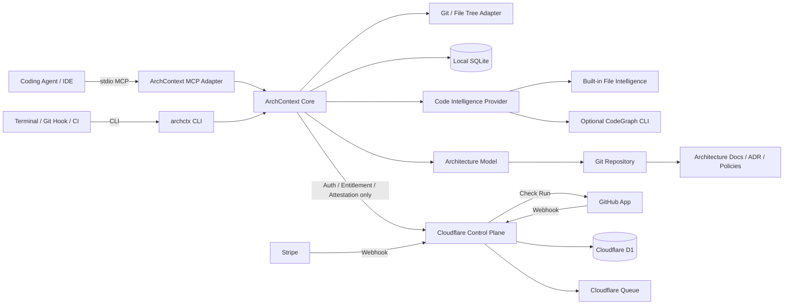

> **状态：已被 `plans/prds/20260619-2039-archcontext.prd.md`（ArchContext PRD v2.0）取代（2026-06-19）。** 按"编号大、时间最新者为准"，v2.0 是当前权威 PRD，且已吸收本稿全部结论（CodeGraph 硬依赖、`.archcontext/` Agent-first YAML、vibe-coding 定位、渐进式治理、决策边界）。本稿保留为早期决策快照；与 v2.0 冲突处以 v2.0 为准。

可以把现在的方案收敛成一句话：

> **ArchContext 是 Coding Agent 的本地架构运行时：把 CodeGraph 的代码事实和仓库中的架构意图编译成任务上下文、安全变更和可验证 Review，让没有架构经验的开发者也能把简单应用持续养成可维护的复杂产品。CLI 是核心接口，MCP 是面向 Agent 的薄适配层，GitHub App 是治理入口，Cloudflare SaaS 只负责身份、订阅和 Review Attestation。**

> 本稿已按 `peer-research2.md`、`prd-appendix.md` 两份后续研究拉齐：CodeGraph 从"可选 Provider"改为硬依赖（仅经 adapter 软耦合）；架构模型从"Markdown + frontmatter"改为 Agent-first 结构化 YAML（Markdown/图表降为生成投影）；并补入 vibe-coding 定位、渐进式治理与决策自动化边界。架构模型目录采用 `.archcontext/`（冲突处以编号大、时间最新的 `peer-research2.md` 为准）。

## 当前建议结论

| 决策项        | 建议                                                   |
| ---------- | ---------------------------------------------------- |
| CodeGraph  | **硬依赖（精确锁定版本），仅经 CodeFacts adapter 软耦合；不读取其内部数据库、不暴露其原始工具** |
| 本地数据库      | **SQLite**                                           |
| PGlite     | 暂不引入，仅保留给未来浏览器端架构浏览器                                 |
| MCP        | **薄 MCP，但调用共享 Core，不要每个 Tool 都冷启动 CLI**              |
| Skill      | 自己维护第一方 Skill，不依赖外部 Skill                            |
| Cloud      | Cloudflare Workers + D1 + 一条 Queue                   |
| Auth       | CLI 登录，MCP 复用本地凭证                                    |
| GitHub App | PR 事件、Check、Installation 管理                          |
| Slack      | MVP 不做，先设计 Notification Port                         |
| 架构文件       | Git 中的 **Agent-first 结构化 YAML**（`.archcontext/model/*.yaml`）是 Source of Truth；Markdown、Mermaid、ADR 正文是生成/人读投影 |
| 本地 DB      | 可重建的索引、Evidence、Review 和缓存                           |
| 技术栈        | MVP 建议全 TypeScript，Node.js 24 LTS                    |
| SaaS 定价    | Public 免费；个人 Pro $5/月，覆盖全部私有仓库                       |
| 产品定位       | Coding Agent 的软件工程层；服务 vibe-coding 用户，治理复杂度随产品复杂度渐进 |
| 决策边界       | 变更分四类自动处理：auto-accept / auto-sync / ask-user / block（核心护城河） |

---

# 一、完整系统架构



数据边界：

```text
用户本地环境
├── Source Code
├── Git Diff
├── File Tree
├── CodeGraph
├── Architecture Graph
├── Architecture Documents
├── Review Findings
└── Local SQLite

ArchContext SaaS
├── GitHub User ID
├── Subscription Status
├── GitHub Installation ID
├── Repository Numeric ID
├── Pull Request Number
├── Commit SHA
├── Review Result: pass / fail
├── Policy Digest
├── Model Digest
└── Signed Attestation
```

SaaS 不接收代码、Diff、文件名、Symbol、架构节点、架构文档或 Review 明细。

---

# 二、CodeGraph：硬依赖，但只通过 Adapter 软耦合

按 `peer-research2.md` 的修正，这里推翻早期"可选 Provider"的判断：

> **ArchContext requires CodeGraph.** CodeGraph 已经提供本地 Tree-sitter 解析、SQLite/FTS5、Symbol、Call Graph、Impact、File Tree、CLI JSON、可嵌入 Node API 和多 Agent 共享 daemon。它是代码事实底座，ArchContext 不重复造这一层。

它仍在快速演进，并已规划自己的 PR 分析产品。因此把它锁在一个内部接口后面：依赖它的能力，但不依赖它的内部实现、数据库或工具形态。

## 推荐分层

```typescript
export interface CodeFacts {
  ensureIndexed(root: string): Promise<void>;
  getTaskContext(input: { root: string; task: string; budget: ContextBudget }): Promise<CodeContext>;
  getChangedSymbols(input: { root: string; baseRef: string; headRef?: string }): Promise<ChangedSymbol[]>;
  getImpact(input: { root: string; files?: string[]; symbols?: string[] }): Promise<CodeImpact>;
  getEvidence(input: { root: string; selectors: SourceSelector[] }): Promise<CodeEvidence[]>;
}
```

这个接口不是为了支持多个 Provider，而是为了：

```text
防止 CodeGraph API 变化渗透整个项目
能写 Mock 和 Fixture 测试
固定 ArchContext 依赖的最小能力集
升级 CodeGraph 时只改 adapter
杜绝读取其内部 SQLite Schema
```

## 集成方式

MVP 优先直接依赖其公开 Node API，并锁精确版本：

```json
{ "dependencies": { "@colbymchenry/codegraph": "<pinned-exact-version>" } }
```

ArchContext 自己管理 CodeGraph 的 init/open、index/sync、context、impact、symbol query 和 lifecycle。

明确禁止：

```text
读取 .codegraph/codegraph.db（对方内部 Schema）
MCP 套 MCP（ArchContext MCP → CodeGraph MCP，多一层 Schema/序列化/生命周期/上下文消耗）
向用户或 Agent 暴露原始 CodeGraph 工具
```

Agent 只看到 ArchContext MCP，不需要同时理解十个 CodeGraph Tool 和五个 ArchContext Tool。

## 产品行为

```yaml
codeIntelligence:
  provider: codegraph        # 硬依赖；仅此一个，经 adapter 访问
  pinnedVersion: "<exact>"
  telemetry: false
```

在隐私产品中应默认关闭第三方遥测。CodeGraph 本身提供遥测关闭选项，因此适配器启动时应设置 `DO_NOT_TRACK=1`。([GitHub][1])

> **分工：CodeGraph 告诉 Agent 代码是什么、在哪、如何调用；ArchContext 告诉 Agent 系统为什么这样设计、哪些边界不能破坏、当前任务应该如何改架构。** CodeGraph 能返回 `OrderController → OrderService → PaymentClient → POST /payments/authorize`；ArchContext 进一步返回 `service.order 调用 service.payment` 的允许/禁止边界、相关 ADR 和本次任务要同步更新的节点。

### 降级而非兜底

> **CodeGraph 是 ArchContext 的代码事实底座（硬依赖），不是可选增强。**

CodeGraph 不可用时，ArchContext 仍能读取已有架构文件、执行 Schema 与链接校验、渲染文档；但 `impact`、`drift` 返回 `degraded` 并明确缺失能力，**不再宣称提供 Builtin 代码情报兜底**，也不会自动切换到"上传代码"的替代方案。`init` / `doctor` 应在 CodeGraph 缺失时引导安装。

---

# 三、PGlite 还是 SQLite

结论很明确：

> **本地 ArchContext Store 使用 SQLite，不使用 PGlite。**

PGlite 是运行于 WASM 中的 PostgreSQL，支持 Node、浏览器、文件系统持久化和 pgvector，但核心实现是单一独占连接；官方为多标签页和多连接场景额外提供了 Worker 和 Multiplexer。([pglite.dev][2])

| 维度                 | SQLite         | PGlite                    |
| ------------------ | -------------- | ------------------------- |
| 本地 CLI             | 更适合            | 可以，但没有明显优势                |
| 文件结构               | 单文件            | PostgreSQL data directory |
| 并发读取               | WAL 下表现成熟      | 单连接，需要代理                  |
| FTS                | FTS5           | PostgreSQL FTS            |
| Vector             | 需要扩展或单独索引      | pgvector                  |
| 浏览器                | 需要 WASM 版本     | 原生优势                      |
| 与 Cloudflare D1 语义 | 接近             | 不一致                       |
| 启动和备份              | 简单             | 更重                        |
| 多 Agent 共享         | WAL + 单 Writer | 需要单实例调度                   |

SQLite 的 WAL 适合一个 Writer、多个 Reader；FTS5 也足以承担架构文档、ADR 和节点搜索。([SQLite][3])

## 不要为了未来的 Vector Search 选择 PGlite

MVP 不需要 Embedding：

```text
Architecture Node Search
= SQLite FTS5

ADR Search
= SQLite FTS5

Code Symbol Search
= CodeGraph

Relationship Query
= SQLite Edge Table + Recursive CTE
```

只有未来真的推出浏览器内完全离线的 Architecture Explorer，并且需要在浏览器中运行 PostgreSQL/pgvector 时，再单独考虑 PGlite。

## TypeScript 下的 SQLite Driver

MVP 可以使用：

```text
better-sqlite3
```

所有调用放在 `LocalStore` 接口之后。后续若改用 `node:sqlite`，业务层不需要变化。

---

# 四、薄 MCP 包 CLI：方向正确，但实现上不要“每次 spawn CLI”

你的判断是对的：

> **CLI 应该是稳定、可测试、可脚本化的主接口；MCP 是薄适配层。**

但不建议这样实现：

```text
每次 MCP Tool Call
    ↓
spawn archctx context ...
    ↓
启动 Node
    ↓
打开 SQLite
    ↓
加载配置
    ↓
退出
```

这会造成启动成本、数据库锁、重复初始化和日志处理问题。

## 推荐实现

```text
                    ┌────────────────────┐
archctx CLI ───────►│                    │
                    │ ArchContext Core   │
archctx mcp ───────►│ ApplicationService │
                    │                    │
                    └─────────┬──────────┘
                              │
                         SQLite / Git /
                       CodeGraph / Renderer
```

CLI 和 MCP 使用同一个 npm package、同一组 Use Case 和同一套输入输出 Schema。

```text
packages/surfaces/cli/src/bin.ts
packages/surfaces/cli/src/mcp.ts
packages/core/src/application-service.ts
```

MCP `stdio` 本身就是由 Client 启动本地子进程，MCP 协议通过 stdin/stdout 传递 JSON-RPC。官方规范也明确区分：HTTP MCP 使用授权协议，本地 stdio MCP 通常从环境或本地凭证获取认证信息。([Model Context Protocol][4])

因此：

```text
archctx login
    ↓
浏览器完成 GitHub OAuth
    ↓
Refresh Token 存 OS Keychain
    ↓
archctx mcp 启动
    ↓
从 Keychain 读取凭证
```

不是在每一次 MCP 调用中重新 OAuth。

## CLI 设计

```bash
archctx init
archctx sync

archctx tree
archctx context --task "增加退款重试"
archctx impact --base main
archctx review
archctx validate
archctx render

archctx plan-update
archctx apply <changeset-id>

archctx login
archctx account status
archctx submit-attestation

archctx mcp
```

所有命令支持：

```bash
--format json
--max-items 30
--max-bytes 12000
--include-source false
--compact
```

稳定输出 Envelope：

```json
{
  "schemaVersion": "1",
  "command": "context",
  "snapshot": {
    "headSha": "abc123",
    "worktreeDigest": "sha256:..."
  },
  "result": {},
  "diagnostics": [],
  "provenance": {
    "architectureModelDigest": "sha256:...",
    "codeProvider": "codegraph"
  }
}
```

## MCP Tool 数量要控制

CodeGraph 自己也把默认显示的 Tool 收敛到四个，因为过多 Tool 会影响 Agent 选择和上下文效率。([GitHub][1])

ArchContext 建议只公开五个：

```text
archcontext_context
archcontext_impact
archcontext_plan_update
archcontext_apply_update
archcontext_review
```

`status`、`validate`、`render` 等作为 CLI 或非默认 Tool。

读取单个对象可以用 MCP Resources：

```text
archcontext://tree
archcontext://nodes/service.order
archcontext://decisions/adr.0007
archcontext://policies/dependency-boundaries
archcontext://reviews/latest
```

真正节省上下文的关键不是“CLI”三个字，而是：

* Tool 数量少
* 一次返回完整任务上下文
* 有严格结果预算
* 默认返回引用而不是完整文件
* 支持分页
* 只在需要时读取详细 Resource

---

# 五、Skill：自己写第一方 Skill，不引入外部运行时依赖

Agent Skills 已经形成开放格式，核心是 `SKILL.md` 加可选的 references、scripts 和 assets，并采用渐进式加载。([GitHub][5])

但当前 Skill 标准主要定义格式和发现方式；依赖解析、版本锁定和传递依赖仍在提案阶段，并不是稳定的标准能力。([GitHub][6])

因此建议：

```text
ArchContext 核心逻辑
= TypeScript 代码

ArchContext Skill
= 教 Agent 在何时、按什么顺序调用 CLI/MCP

外部 Skill
= 可选扩展，不是产品依赖
```

第一方 Skill 只需要四个：

```text
skills/
├── archcontext-bootstrap/
│   └── SKILL.md
├── archcontext-develop/
│   └── SKILL.md
├── archcontext-review/
│   └── SKILL.md
└── archcontext-adr/
    └── SKILL.md
```

Skill 中不要重新实现架构逻辑，只写工作流，例如：

```text
1. 调用 archcontext_context 获取任务相关架构
2. 修改代码
3. 调用 archcontext_impact
4. 如果架构发生变化，调用 archcontext_plan_update
5. 用户确认后调用 archcontext_apply_update
6. 调用 archcontext_review
```

未来支持外部 Skill 时：

```text
archctx skill add <git-ref>
archctx skill audit
archctx skill lock
```

要求：

* 固定 Git commit
* 保存 checksum
* 默认禁止外部脚本
* 显式声明网络和文件权限
* 不允许隐式传递依赖
* 不允许 Skill 修改 ArchContext Policy

---

# 六、Schema：把“声明架构”和“观察到的架构”分开

最重要的数据模型不是单一 Architecture Graph，而是三层：

```text
Declared Architecture
用户和团队声明的目标架构

Observed Architecture
从 Git、文件和 CodeGraph 推导出的实际结构

Verified Architecture
Declared 与 Observed 对齐后的结果
```

这使 Drift Detection 非常自然：

```text
Declared only
→ 文档存在，但代码证据缺失

Observed only
→ 代码关系存在，但文档未声明

Declared + Observed
→ Verified
```

## Source of Truth 分层

```text
Git 中的 Architecture Files
= 唯一可协作的架构 Source of Truth

Local SQLite
= Derived Index，可随时重建

CodeGraph DB
= 第三方代码智能缓存

Cloudflare D1
= 用户、订阅、GitHub Installation 和 Attestation
```

---

# 七、用户仓库的架构源

按 `peer-research2.md` 的修正，这里推翻早期"Markdown + YAML frontmatter 作为主模型"的判断。对 Agent-native 产品，核心事实应该是紧凑、规范、确定性的结构化数据：

> **`.archcontext/model/*.yaml` 是 Agent 和验证器消费的 Source of Truth；Markdown、Mermaid、ADR 正文是生成或人读的投影，不是模型本身。**

仓库可见性（GitHub / PR Diff 可读）靠提交 `.archcontext/generated/*`（含 `ARCHITECTURE.md`）满足——这些生成投影同样进入 Git 和 PR Diff，而不是把易变结构塞进 frontmatter。JSON Schema 校验 `model/*.yaml`。

推荐默认目录（与正式 PRD 的目录一致）：

```text
repository/
├── AGENTS.md                  # Agent 约定（非架构模型）
│
├── .archcontext/
│   ├── manifest.yaml
│   ├── model/                 # Agent-first Source of Truth（YAML）
│   │   ├── nodes/
│   │   │   └── domains/ systems/ services/ components/ interfaces/ data-stores/
│   │   ├── edges.yaml
│   │   ├── ownership.yaml
│   │   └── constraints.yaml
│   ├── decisions/             # 需要自然语言解释的 ADR（.md）
│   │   └── ADR-0001-*.md
│   ├── policies/              # 约束与 Review 规则（YAML）
│   │   ├── dependencies.yaml
│   │   ├── change-policy.yaml
│   │   └── review.yaml
│   ├── generated/             # 人读投影，可重建，随 Git 提交
│   │   ├── ARCHITECTURE.md TREE.md DEPENDENCIES.md OWNERSHIP.md
│   │   └── diagrams/*.mmd
│   └── schemas/
│       └── node.schema.json edge.schema.json policy.schema.json
│
└── src/
```

本地状态不建议默认写进 Repository，而是放在系统数据目录：

```text
macOS:
~/Library/Application Support/ArchContext/repos/<fingerprint>/

Linux:
~/.local/share/archcontext/repos/<fingerprint>/

Windows:
%LOCALAPPDATA%\ArchContext\repos\<fingerprint>\
```

其中：

```text
state.db
locks/
cache/
snapshots/
logs/
```

这样无需修改 `.gitignore`。

## `.archcontext/manifest.yaml`

```yaml
version: 1

product:                       # 最小合法模型即可启动，见第十七节渐进式建模
  name: My App
  purpose: ...

architecture:
  model: .archcontext/model
  decisions: .archcontext/decisions
  policies: .archcontext/policies
  generated: .archcontext/generated

documents:
  entrypoint: .archcontext/generated/ARCHITECTURE.md
  commitGeneratedViews: true

codeIntelligence:
  provider: codegraph          # 硬依赖；仅此一个，经 adapter 访问
  telemetry: false

index:
  fullText: true
  embeddings: false
  snapshotsToKeep: 3

review:
  failOnInvalidSchema: true
  failOnUndocumentedDependency: true
  failOnStaleGeneratedDocs: true
  requireAdrFor:
    - public-interface-breaking-change
    - cross-domain-dependency
    - datastore-ownership-change
    - authentication-boundary-change

privacy:
  sourceCodeNetworkAccess: deny
  allowEndpoints:
    - api.archcontext.dev
```

---

# 八、Architecture Node Schema

节点是 `.archcontext/model/nodes/**/*.yaml`，只保存稳定意图，不含易变证据：

```yaml
id: service.order
kind: service
name: Order Service
status: active
criticality: high

parent: system.commerce

owners:
  - type: github-team
    id: commerce-platform

tags: [orders, transactional]

source:
  include: [services/order/**]
  exclude: [services/order/tests/**]
  entrypoints: [services/order/src/index.ts]

responsibilities:
  - manage-order-lifecycle
  - coordinate-order-cancellation

relations:
  - type: calls
    target: service.payment
    protocol: https
    contract: interface.payment-api
  - type: publishes
    target: event.order-created
    protocol: kafka
  - type: writes
    target: datastore.order-db

constraints:
  - id: no-payment-database-access
  - id: no-payment-credential-storage
```

说明正文（Responsibilities 展开、Boundaries、Operational Notes）放对应的 `.archcontext/decisions/*.md` 或生成投影里，不再塞进节点文件；节点 YAML 保持紧凑、可被验证器和 Agent 直接消费。生成内容用 marker 注入投影文件，绝不覆盖人写正文。

## ID 规则

```text
domain.commerce
system.commerce-platform
service.order
component.order.refund-worker
interface.order-api
event.order-created
datastore.order-db
deployment.order-production
```

ID 在重命名显示名称时不能改变。

## Relation 类型

第一版控制在：

```text
depends-on
calls
publishes
subscribes
reads
writes
implements
deployed-on
governed-by
```

`parent` 已经表达 contains，不需要重复写 `contains` Edge。

## Evidence 不直接写进节点文件

不要把不断变化的行号、Blob SHA 和 CodeGraph Symbol ID 写入 Git 文件，否则每次代码移动都会产生文档噪声。

下面这些放本地 SQLite：

```json
{
  "nodeId": "service.order",
  "provider": "codegraph",
  "path": "services/order/src/api/controller.ts",
  "symbol": "OrderController",
  "startLine": 18,
  "endLine": 97,
  "blobSha": "abc123",
  "confidence": 0.96,
  "snapshotSha": "def456"
}
```

Git 中只放稳定的 source selectors。

---

# 九、本地 SQLite Schema

建议至少有这些表：

```text
repositories
index_snapshots

files
file_changes

symbols
code_edges

architecture_nodes
architecture_edges
source_selectors
architecture_evidence

documents
document_sections
document_fts

review_runs
review_findings

change_sets
change_set_operations

schema_migrations
settings
```

核心关系：

```text
files
  └── symbols
       └── code_edges

architecture_nodes
  ├── architecture_edges
  └── source_selectors
       └── architecture_evidence
            ├── files
            └── symbols

review_runs
  └── review_findings

change_sets
  └── change_set_operations
```

SQLite 配置：

```sql
PRAGMA journal_mode = WAL;
PRAGMA foreign_keys = ON;
PRAGMA busy_timeout = 5000;
PRAGMA synchronous = NORMAL;
```

## File Tree Schema

```text
files
-----
snapshot_id
path
parent_path
entry_type        file | directory
language
size_bytes
content_hash
git_blob_sha
is_generated
is_ignored
package_id
architecture_node_id
```

路径全部内部标准化为 POSIX `/`。

索引：

```sql
CREATE INDEX files_snapshot_path
ON files(snapshot_id, path);

CREATE INDEX files_parent
ON files(snapshot_id, parent_path);

CREATE INDEX files_architecture_node
ON files(snapshot_id, architecture_node_id);
```

Directory 可以推导，但保存 `parent_path` 可以快速生成局部树。

---

# 十、产品项目本身的 Monorepo

MVP 建议全 TypeScript。Node.js 24 当前处于 LTS，适合生产开发工具；MCP 官方 TypeScript SDK 当前建议生产继续使用 v1，v2 尚处开发阶段。([nodejs.org][7])

```text
archcontext/
├── apps/
│   └── control-plane/
│       ├── src/
│       │   ├── routes/
│       │   │   ├── auth.ts
│       │   │   ├── billing.ts
│       │   │   ├── github-webhook.ts
│       │   │   ├── stripe-webhook.ts
│       │   │   ├── entitlement.ts
│       │   │   └── attestation.ts
│       │   ├── services/
│       │   ├── jobs/
│       │   └── index.ts
│       └── public/
│
├── packages/
│   ├── cli/
│   │   ├── src/bin.ts
│   │   └── src/mcp.ts
│   │
│   ├── core/
│   │   ├── application-service.ts
│   │   ├── context/
│   │   ├── impact/
│   │   ├── change-set/
│   │   ├── review/
│   │   └── render/
│   │
│   ├── architecture-model/
│   ├── local-store-sqlite/
│   ├── repo-git/
│   ├── code-intelligence/
│   ├── codegraph-adapter/
│   ├── renderer/
│   ├── policy-engine/
│   ├── auth-client/
│   ├── cloud-db/
│   ├── github-app/
│   └── contracts/
│
├── schemas/
│   ├── architecture/
│   │   ├── node.schema.json
│   │   ├── policy.schema.json
│   │   ├── view.schema.json
│   │   └── adr-frontmatter.schema.json
│   │
│   ├── operations/
│   │   ├── context-request.schema.json
│   │   ├── context-result.schema.json
│   │   ├── impact-result.schema.json
│   │   ├── change-set.schema.json
│   │   └── review-result.schema.json
│   │
│   └── cloud/
│       ├── entitlement.schema.json
│       └── attestation.schema.json
│
├── skills/
├── migrations/
│   ├── local/
│   └── d1/
│
├── fixtures/
│   ├── repositories/
│   ├── architectures/
│   └── codegraph-results/
│
├── docs/
│   ├── architecture/
│   └── adr/
│
└── package.json
```

## 推荐技术栈

```text
Runtime               Node.js 24 LTS
Language              TypeScript
Workspace             Bun workspaces
Cloud API             Hono
Cloud DB               Cloudflare D1
D1 migrations          Drizzle Kit 或纯 SQL migrations
Local DB               SQLite / better-sqlite3
MCP                    官方 TypeScript MCP SDK v1
Schema validation      JSON Schema + Ajv
YAML                   yaml
Git process            execa
GitHub                 Octokit
Billing                Stripe
Testing                Vitest
Cloud deployment       Wrangler
```

不要尝试让 Local SQLite Schema 和 D1 Schema 共用同一组 ORM Model；它们属于不同业务域，只共享 Contract Schema。

---

# 十一、Cloudflare 部署与 D1 成本

## 推荐 Cloudflare 组件

```text
一个 Cloudflare Worker
├── Dashboard 静态资源
├── GitHub OAuth
├── Device Login
├── Entitlement API
├── Stripe Checkout / Portal
├── GitHub Webhook
├── Stripe Webhook
└── Attestation API

一个 D1 Database
一个 Cloudflare Queue
Cloudflare Secrets
```

第一版不需要：

```text
R2
KV
Durable Objects
Vectorize
Workers AI
Cloudflare Containers
多 Worker 微服务
```

## D1 足够吗？

**完全足够。**

Workers Paid 当前最低为每月 5 美元，包含每月 1,000 万请求和 3,000 万 CPU 毫秒；D1 Paid 包含每月 250 亿行读取、5,000 万行写入和 5GB 存储。([Cloudflare Docs][8])

粗略估算 10,000 个活跃用户：

```text
每天刷新一次 Entitlement
10,000 × 30 = 300,000 请求/月

每人每月 20 次 Attestation
10,000 × 20 = 200,000 次/月

即使每次产生 10 行写入
200,000 × 10 = 2,000,000 行写入/月
```

仍远低于 D1 每月 5,000 万行写入的包含额度。

真正可能导致超支的不是 Auth 和 Billing，而是：

* 每个 MCP Tool Call 都上传 usage event
* 保存原始 Webhook Payload
* 保存详细日志
* 保存架构内容
* 保存文件级 Review 结果
* 无索引的全表扫描
* 无限保留 Session 和 Delivery 记录

## D1 表

```text
users
oauth_sessions
device_grants
devices

subscriptions
entitlements

github_installations
github_repositories

review_challenges
review_attestations

webhook_deliveries
schema_migrations
```

计费是用户级，不需要 `repository_subscriptions`：

```text
users
  └── subscriptions
       └── entitlement: private_repositories = unlimited
```

Repository 表只服务 GitHub Check，不服务计费。

## D1 成本保护

```text
Entitlement Token 有效 24 小时
离线 Grace Period 7 天
不按 MCP 调用计量
不记录文件级 Telemetry
Webhook Delivery 保留 7～30 天
Device Grant 保留几分钟
Review Challenge 合并后 7 天删除
Repository 用 GitHub numeric ID
所有查询按主键或索引
```

Worker Paid 支持设置每次 Invocation 的 CPU 上限，可以避免异常代码形成 denial-of-wallet。([Cloudflare Docs][8])

## Queue 是否需要

建议保留一条 Queue，用于：

```text
GitHub Webhook
Stripe Webhook
GitHub Check 更新重试
```

Cloudflare Queues Paid 当前每月包含 100 万次操作，典型消息产生写、读、删三次操作，因此早期约可覆盖 33 万条小消息；超出后每百万操作收费 0.40 美元。([Cloudflare Docs][9])

Queue 消息只放最小字段：

```json
{
  "type": "github.pull_request.synchronize",
  "deliveryId": "...",
  "installationId": 123,
  "repositoryId": 456,
  "pullRequest": 42,
  "headSha": "abc123"
}
```

不要把完整 GitHub Payload 放进 Queue。

---

# 十二、GitHub App 设计

最小权限：

```text
Metadata: Read
Pull requests: Read
Checks: Write
```

GitHub App 订阅 Pull Request Webhook 至少需要 Pull Requests Read；创建 Check Run 的写权限只提供给 GitHub App。([GitHub Docs][10])

不申请：

```text
Contents: Read
Contents: Write
Issues: Write
Actions: Write
```

## PR Review 流程

```text
PR opened / synchronize
        ↓
GitHub App 收到 metadata
        ↓
SaaS 创建 review_challenge
        ↓
GitHub Check = queued
        ↓
开发者本地 Agent 调用 archcontext_review
        ↓
本地检查当前 HEAD SHA
        ↓
本地执行 CodeGraph + Architecture Review
        ↓
本地生成签名 Attestation
        ↓
SaaS 验证订阅、Challenge、签名、SHA
        ↓
GitHub App 更新 Check
```

Attestation：

```json
{
  "schemaVersion": "1",
  "repositoryId": 123456789,
  "pullRequest": 42,
  "headSha": "abc123",
  "result": "pass",
  "architectureDigest": "sha256:...",
  "policyDigest": "sha256:...",
  "reviewerVersion": "0.1.0",
  "deviceKeyId": "device_123",
  "completedAt": "2026-06-19T20:00:00Z",
  "signature": "..."
}
```

Check 上只显示：

```text
Architecture Review passed.

Commit: abc123
Architecture model: sha256:...
Policy: sha256:...
Reviewer: ArchContext 0.1.0
```

详细 Finding 保留在本地，或者由用户使用自己的 GitHub Credential 主动提交到 PR。这样 SaaS 不必处理代码或 Finding 内容。

需要明确的是：GitHub App 无法主动唤醒开发者电脑，因此纯本地模式下，Check 会保持 queued，直到用户、Agent、Git Hook 或本地自动任务运行 Review。

---

# 十三、是否引入 Slack

结论：

> **MVP 不引入 Slack。**

当前目标用户是个人开发者，核心交互已经存在于：

```text
Coding Agent
Terminal
GitHub Pull Request
GitHub Check
```

Slack 会额外引入：

* Slack OAuth
* Workspace Admin Approval
* Bot Scope
* Token 管理
* Workspace 与 GitHub Tenant 映射
* 更多 Webhook
* 数据发送到第三方平台
* “代码不离开环境”文案的解释成本
* 团队功能和支持成本

而且个人 5 美元套餐没有强烈的 Slack 使用必要。

## 现在只定义 Notification Port

```typescript
export interface NotificationPublisher {
  publish(event: ProductEvent): Promise<void>;
}
```

第一版 Provider：

```text
GitHubCheckPublisher
```

未来可以增加：

```text
SlackPublisher
GenericWebhookPublisher
EmailPublisher
```

未来 Slack 通知也只发送：

```text
PR URL
Review pass / fail
Risk level
Commit SHA
```

不发送代码、架构内容或 Finding 详情。

---

# 十四、建议立即形成的 ADR

```text
ADR-0001
Architecture files are the source of truth;
local databases are rebuildable indexes.

ADR-0002
SQLite is the local embedded database.

ADR-0003
CodeGraph is a required code-intelligence dependency,
accessed only through the CodeFacts adapter
(pinned version; no internal-DB or MCP-over-MCP coupling).

ADR-0004
CLI is the canonical local interface;
MCP is a thin adapter over shared application services.

ADR-0005
First-party Agent Skills contain workflows only;
business logic remains in the CLI/Core.

ADR-0006
The SaaS control plane stores identity, billing,
GitHub metadata and attestations only.

ADR-0007
Cloudflare Workers, D1 and Queues are the initial
control-plane infrastructure.

ADR-0008
Slack is excluded from MVP.

ADR-0009
The architecture model is Agent-first structured YAML in .archcontext/model;
Markdown, diagrams and ADR prose are generated or human projections.

ADR-0010
Declared and observed architecture are modeled separately.

ADR-0011
Architecture governance is progressive: its complexity
must never exceed the product's own complexity (Level 0–3).

ADR-0012
Every code change is classified into one of four lanes —
auto-accept / auto-sync / ask-user / block;
this decision boundary is the core engine, not the file format.

ADR-0013
Decisions requiring a human are surfaced in product language
(responsibility, data ownership, risk, reversibility), never as raw schema.

ADR-0014
LikeC4 / Structurizr are optional export/import view adapters,
never an MVP dependency or the canonical model.
```

# 十五、推荐开发顺序

```text
阶段 1：Contracts
├── Node Schema
├── ChangeSet Schema
├── ReviewResult Schema
├── Attestation Schema
└── CLI JSON Envelope

阶段 2：Local CLI
├── init
├── tree
├── validate
├── context
├── render
└── SQLite Store

阶段 3：Code Intelligence（CodeGraph 硬依赖）
├── CodeFacts 接口 + CodeGraph Adapter（锁版本）
├── impact
├── evidence mapping
└── degraded 模式（CodeGraph 缺失时只读已有架构文件）

阶段 4：Write / Review
├── plan-update
├── apply
├── drift detection
├── policy engine
└── review

阶段 5：MCP + Skills
├── 五个 MCP Tools
├── Resources
└── 四个第一方 Skills

阶段 6：SaaS
├── GitHub OAuth
├── Stripe
├── Entitlement
├── Device Registration
└── Signed License Token

阶段 7：GitHub App
├── Installation
├── PR Webhook
├── Review Challenge
├── Attestation
└── Check Run
```

最应该优先冻结的是三份 Contract：**Architecture Node、ChangeSet、ReviewResult**。一旦这三份 Schema 稳定，CLI、MCP、Skill、SQLite 和 GitHub Check 都可以围绕同一个协议独立开发。

---

# 十六、决策自动化边界（核心护城河）

按 `prd-appendix.md`：最难、也最有价值的不是调用 CodeGraph 或生成 YAML，而是可靠判断"哪些代码变化属于架构变化、该自动接受还是必须拦住"。每次变更分四类处理：

```text
auto-accept   文件移动但责任未变 / 内部重构 / 私有实现依赖变化 / 已有接口实现更新
auto-sync     新增明确属于现有模块的组件 / 模块内新增数据实体 / 符合既有规则的外部 API Client
ask-user      业务责任跨模块转移 / 新核心领域出现 / 公开接口破坏性变化 / 数据所有权变化 / 引入重要第三方依赖
block         绕过权限边界 / 模块直接访问他人数据 / 违反安全约束 / 高风险冲突未解决 / 架构状态与代码无法对齐
```

这套分类比架构文件格式重要得多，是 Review Engine 和 ChangeSet Engine 的判定核心。

# 十七、渐进式治理（Progressive Architecture）

> **架构治理的复杂度不能高于产品本身的复杂度。**

简单项目不该一上来就生成几十个架构文件。最小合法模型可以只有：

```yaml
schemaVersion: 1
product:
  name: My App
  purpose: Help users manage personal tasks
modules:
  - id: app
    source: [src/**]
```

随代码增长，ArchContext 自动建议升级：Level 0（单页应用：目标/功能/关键目录/数据存储）→ Level 1（完整应用：模块责任/数据所有权/接口/安全边界/ADR）→ Level 2（复杂产品：Domain Boundary/Public Interface/Event Contract/跨模块 Policy/Review）→ Level 3（规模化：跨仓库关系/团队所有权/可信 Runner/强制 GitHub Gate）。这更像数据库 Schema Evolution，不要求用户一次性完成架构设计。

# 十八、定位、非专家 Human Gate 与北极星

## 定位

> **The software-engineering layer for vibe coding.** 把软件工程方法嵌入 Agent 开发流程，让开发者无需手工维护架构，也能把简单应用持续演进为复杂产品。首页主张：**Build beyond the prototype.** / **Your code stays local. Your architecture stays current.**

ArchContext 不要求用户"学习架构"。用户说"帮我加订阅付款"，Agent 开发，ArchContext 在背后自动准备上下文、检查付款数据边界、记录依赖、必要时生成决策、完成前做一致性检查。用户不需要知道 Architecture Node、Bounded Context、ADR 这些词，除非出现必须由人决定的问题。

## 非专家 Human Gate

需要用户拍板时不展示 YAML，而是翻译成产品语言。不要问"是否批准新增 `service.order -> datastore.payment-db` 的 reads Edge"，而要问：

```text
订单功能现在会直接读取付款数据库，这会让订单和付款模块紧密绑定。
推荐：订单模块通过付款接口查询状态。
  1. 使用推荐边界   2. 保留当前实现并记录为例外   3. 查看详细技术说明
```

把架构决策翻译成产品责任、数据所有权、风险、长期维护成本和可逆性。

## 北极星

不追踪"生成了多少文档/节点/Tool 调用"，而追踪：首次任务上下文准备成功率、无需用户参与完成的架构同步比例、后续任务复用历史决策的比例、架构问题在 Commit 前被发现的比例、Repository 增长时任务完成时间是否稳定、用户需要回答的技术问题数量、错误架构上下文导致的回滚率。最强验证：非专业开发者维护同一项目六个月后，新的 Agent Session 仍能快速正确地修改系统。

---

[1]: https://github.com/colbymchenry/codegraph/blob/main/README.md "codegraph/README.md at main · colbymchenry/codegraph · GitHub"
[2]: https://pglite.dev/docs/multi-tab-worker?utm_source=chatgpt.com "Multi-tab Worker | PGlite"
[3]: https://www.sqlite.org/fts5.html?utm_source=chatgpt.com "SQLite FTS5 Extension"
[4]: https://modelcontextprotocol.io/specification/2025-06-18/basic/transports?utm_source=chatgpt.com "Transports - Model Context Protocol"
[5]: https://github.com/agentskills/agentskills?utm_source=chatgpt.com "GitHub - agentskills/agentskills: Specification and documentation for Agent Skills · GitHub"
[6]: https://github.com/agentskills/agentskills/discussions/210?utm_source=chatgpt.com "Proposal: Skill Package Manifest for Dependency Resolution and Distribution for Agent Skills · agentskills agentskills · Discussion #210 · GitHub"
[7]: https://nodejs.org/en/blog/release?utm_source=chatgpt.com "Node.js"
[8]: https://developers.cloudflare.com/workers/platform/pricing/?utm_source=chatgpt.com "Pricing · Cloudflare Workers docs"
[9]: https://developers.cloudflare.com/queues/platform/pricing/?utm_source=chatgpt.com "Cloudflare Queues - Pricing · Cloudflare Queues docs"
[10]: https://docs.github.com/en/webhooks/webhook-events-and-payloads?actionType=opened&utm_source=chatgpt.com "Webhook events and payloads - GitHub Docs"
