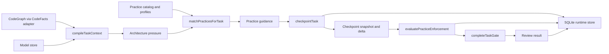
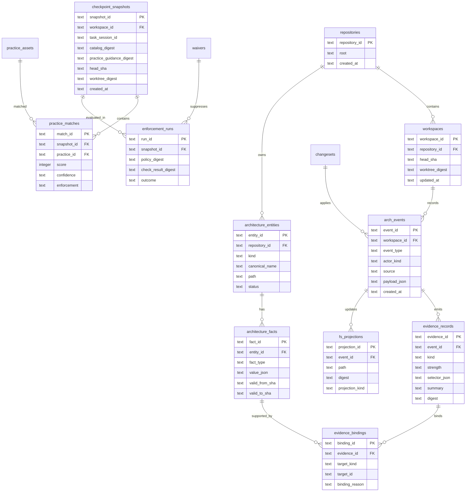
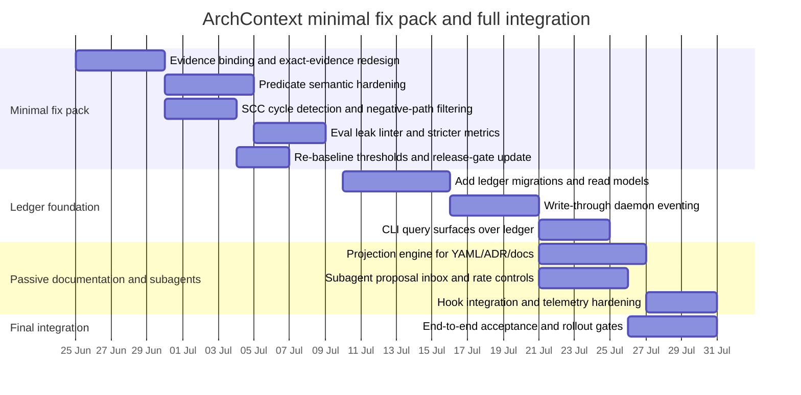

# Deep Research Report on ArchContext

## Executive summary

`arch-context` is already much closer to a shippable architecture-control loop than a typical “architecture assistant” prototype. The repository defines Local Core as the product centre, with a thin CLI/MCP surface over a local daemon, CodeGraph-backed code facts, a deterministic practice catalog, checkpoint/complete review flow, and a local SQLite runtime store. Practice Assets v1 were merged to `main` in PR #38 on 24 June 2026, with the roll-up claiming governed static practice assets, evidence-backed matching, deterministic complete-stage enforcement, waivers, central hook wiring, optional Context7 advisory docs, S6 eval/runtime/docs/package gates, and eight passing checks. The current release gate records strong headline metrics, including 93.3% Top-3 practice recall, 96.7% no-keyword structural recall, 100% benign precision, and 0% heuristic-only or dynamic-doc hard-gate rate. citeturn39view0turn38view1turn19view0turn20view4turn22view1turn22view4

The core architectural shape is coherent: `context-compiler` composes code facts, model state, pressure signals, and practice guidance; `application` turns that into checkpoint snapshots and deltas; `practice-engine` scores candidate practices from retrieval, structural predicates, pressure signals, and attached evidence; `review-engine` converts violations into complete-stage findings; and `local-store-sqlite` persists runtime state under a per-workspace `runtime.sqlite` with migrations and WAL enabled. That is a good base for your three product goals: passive architecture recording, fast local indexing with controlled issue detection, and a persistent architecture “book” integrated with hooks/CLI. citeturn33view1turn33view3turn32view1turn37view0turn37view3turn29view0turn29view1turn29view5

The main risk is not missing infrastructure; it is evidence semantics. The matcher currently fans all `codeContext.evidence` into every candidate practice, computes `bestStrength` from that global union, and treats “exact evidence” as a substring match against the practice ID in evidence IDs or summaries. Structural predicates also include several semantically weak mappings, such as converting “declared layer violation observed” and “cross-boundary import added” into raw import-edge detection, and implementing several “missing” predicates as positive term matches instead of absence proofs. Negative-path handling is currently all-or-nothing at the asset level, cycle detection is pairwise rather than SCC-based, and the “no-keyword structural” eval set still contains practice-identifying labels inside evidence IDs/summaries and, in places, symbol/path naming. In short: the current v1 stack is demonstrably useful, but its inference path is still vulnerable to evidence leakage and over-attribution. citeturn42view1turn42view3turn41view2turn40view0turn24view0turn24view1turn24view2turn24view3

My overall product judgement is therefore: **acceptable for controlled opt-in shipment, not yet ideal for broadly trusted architecture recommendation and enforcement without a minimal semantic hardening pass**. The fastest route to “can ship” is a minimal fix pack focused on evidence binding, predicate semantics, SCC cycle detection, negative-path semantics, and eval leak prevention. In parallel, the SQL-ledger goal is highly feasible because the repo already standardises on local SQLite with migrations, digests, checkpoint snapshots, change journals, and local daemon RPC. I recommend a **hybrid model**: keep Git `.archcontext/` YAML as the human-reviewable interchange/projection layer initially, but add an append-only, queryable architecture ledger inside the existing SQLite runtime as the authoritative operational store for evidence, matches, checkpoints, and proposed/approved architecture mutations. citeturn27view0turn27view1turn29view0turn29view1turn32view1turn34view0turn38view1

Assumptions used in this report are intentionally conservative. The current repository explicitly targets local SQLite (`node:sqlite`, WAL, FTS5) in the per-workspace runtime, TypeScript/Bun/Node 24, thin CLI/MCP layers over daemon RPC, Git-backed `.archcontext/` structured YAML as the current architecture fact source, and no SaaS routing of repository contents by default. I therefore assume SQLite is the primary target SQL engine for the proposed ledger, local-first deployment remains the default, and cloud-side analytics are out of scope unless explicitly added later. citeturn38view1turn13view4

## Architecture and data flow analysis

The repository describes itself as an “architecture control loop” embedded in an agentic coding runtime. The README and product spec place Local Core at the centre: one `archctx` install ships the CLI, daemon, MCP stdio adapter, local RPC schema, SQLite migrations, CodeGraph adapter compatibility, and runtime provenance. The GitHub App is explicitly optional governance rather than execution. The product success path is `prepare → checkpoint → intervention/change → reconcile → cleanup → complete`, with architecture changes recorded into structured models and checked before completion. citeturn39view0turn38view1

At the package level, the repo is a Bun workspace over `packages/contracts`, `packages/core`, `packages/local-runtime`, `packages/surfaces`, and `packages/cloud`. The README’s repository map and the root `package.json` align on that structure. The most relevant implementation surfaces for your request are: `packages/core/practice-engine`, `packages/core/context-compiler`, `packages/core/application`, `packages/core/review-engine`, `packages/local-runtime/runtime-daemon`, and `packages/local-runtime/local-store-sqlite`. citeturn12view0turn39view0

The application data flow is straightforward and well-factored. `compileTaskContext` in `context-compiler` obtains code facts and model state, builds a `NormalizedCodeContext`, detects architecture pressure, loads the practice catalog, runs `matchPracticesForTask`, and injects practice guidance into the compiled context alongside digests for code facts, model, code context, catalog, and practice guidance. `checkpointTask` in `application` then re-syncs code facts, recompiles context, builds a `PracticeCheckpointSnapshotV1`, computes staleness and deltas against the previous snapshot, and emits a `PracticeCheckpointResultV1` whose schema requires task session, event, freshness state, digests, delta, hook metadata, and next snapshot. `review-engine.completeTaskGate` consumes practice-enforcement output and turns non-waived violations into complete-stage findings unless the overall task context is stale. citeturn33view0turn33view1turn33view3turn32view1turn34view0turn34view1turn37view0turn37view3



The practice matcher itself uses a hybrid ranking model. First it scopes active assets, resolves matching profiles, builds retrieval documents from practice titles, summaries, tags, triggers, scope dimensions, and guidance text, and runs an in-memory lexical retriever against a query assembled from the task, code symbols, edges, and pressure signals. It then adds “exact assets” that have direct evidence matches even if retrieval did not surface them. Asset scoring combines retrieval score, pressure-signal bonus, predicate bonus, exact-evidence bonus, and a bonus based on the highest evidence strength observed. Enforcement is then derived from evidence strength and the asset’s evidence policy, with heuristic-only evidence capped by `maxEnforcementWhenOnlyHeuristic` and sub-threshold strength downgraded to advisory. citeturn40view0turn42view0turn42view1turn42view3turn8view3

The evidence model is the most important internal mechanism, because it determines both ranking and the later ability to promote advice into checkpoints or complete-stage violations. The engine defines an evidence ordering of `heuristic < declared < observed < verified`. Predicate evidence can come from raw term matches, absence assertions, import edges, or simple cycle detection. Exact practice evidence is inferred when any `codeContext.evidence` ID or summary contains the practice ID or its hyphenated variant. Finally, the matcher unconditionally appends **all** `codeContext.evidence` items as `sourceEvidence` to **every** asset under consideration, deduplicates, computes the maximum strength across that aggregate, and uses that for recommendation and enforcement thresholds. That design makes the system permissive and easy to bootstrap, but it also creates the evidence-binding problem discussed later. citeturn40view0turn41view2turn42view1turn42view3

The current structural-predicate registry is a pragmatic first pass rather than a semantically finished ontology. A few predicates are semantically aligned, such as `telemetry-evidence-missing` and `lockfile-not-updated`, which use `missingTermPredicate`. Others are substantially looser. `declared-layer-violation-observed` and `cross-boundary-import-added` both degenerate to `edgePredicate("imports")`, which emits every import edge. `cleanup-contract-missing`, `schema-contract-missing`, and `migration-cleanup-missing` are implemented as positive term matches rather than actual “missing” proofs. That means the predicate vocabulary currently mixes “presence of risky cues” and “absence of required proof” under one undifferentiated evidence mechanism. citeturn40view0turn41view2

Complete-stage enforcement is nevertheless more conservative than the matcher. The check registry only registers deterministic checkers such as `compatibility-contract-required`, `dependency-direction`, `migration-removal-condition`, `migration-review-date`, `no-new-cycle`, `owner-required`, and `required-test-evidence`. For dependency direction, only evidence subjects with specific violation prefixes are treated as actionable, such as `boundary-violation:`, `cross-boundary-import-added:`, and `declared-layer-violation-observed:`. For `no-new-cycle` and `dependency-direction`, the checker compares current subjects with the checkpoint baseline and fails only on newly introduced violations; missing baseline yields `not_applicable`, not a hard failure. `review-engine` then merges those violations with other policy findings and suppresses duplicate compatibility findings where appropriate. citeturn11view0turn11view1turn11view2turn37view0turn37view3

The runtime and release-gate story is unusually strong for an early-stage repo. The root `verify` script chains type-checking, boundary audits, all practice tests, full test suite, packaged CLI smoke, privacy-route audit, privacy capture checks, Context7/hook readbacks, security-scan readback, acceptance-ledger verification, sprint status, and `bun evals/run.ts --check`. PR #38’s summary states that the release shipped the whole S1–S6 Practice Assets stack in one roll-up while retaining the slice PRs as history, and the PR page records eight passing checks. The S6 release-gate artefact also documents gate surfaces and current thresholds for catalogue scale, quality, runtime, packaging, rollout, rollback, and docs ops. citeturn18view0turn18view1turn18view2turn18view3turn19view0turn20view4turn21view0

The current runtime gate already contains several design elements that support your desired hook/CLI/subagent future. Checkpoint results are schema-bound and include hook metadata that must report `egress: none`, `network: forbidden`, and `failOpen: true`. The daemon coalesces repeated checkpoint events by a coalesce key and reports whether analysis was skipped, which is a useful primitive for frequency-controlled issue detection. The runbook says central hook execution is trigger-only, local-RPC only, and must fail open if the daemon is unavailable. Optional external docs are network-gated, privacy-scoped, pinned, and cached separately as advisory resources. citeturn34view1turn35view1turn13view2turn35view4

## Validation of previously reported issues

I could not execute the repository locally in this environment, so what follows is a **source-based validation with concrete pointers and tests to run**. In practice, that is adequate for triage because the issues you reported are semantic defects visible directly in the matcher, checker, and eval fixtures. The short version is: all six issue classes are either still present or only partially addressed. Existing tests cover adjacent behaviours, but not the exact failure modes you flagged. citeturn27view0turn27view1turn27view2

| Issue | Current status | Source-based validation | Existing coverage | Recommended new test |
|---|---|---|---|---|
| Evidence binding | **Still present** | `scoreAsset` appends all `codeContext.evidence` as `sourceEvidence` to every asset; `bestStrength` is computed from that union | One test preserves exact observed evidence through scope filtering, but not per-practice binding | Unrelated observed evidence must not raise evidence strength or enforcement for another practice |
| Predicate semantics | **Still weak** | Several “missing” predicates are positive term predicates; layer/boundary predicates reduce to generic import edges | Unknown predicates are rejected, but semantics are not asserted | Each predicate should emit typed subjects consistent with its name |
| Absence evidence | **Still weak** | `missingTermPredicate` only scans task, symbol names/paths, and evidence summaries; it does not prove absence in code or model scope | No direct absence-proof regression found | Presence in source evidence should suppress `missing:*`; absence should be scoped |
| Negative-path handling | **Still coarse** | Any match to `negativePathGlobs` drops the whole asset before scoring | No direct mixed-path regression found | Mixed `src/` + `tests/` context should still allow a `src/`-backed match |
| Cycle detection | **Still incomplete** | `cyclePredicate` only finds two-node mutual imports, not longer SCCs | Existing tests exercise two-node cycle delta only | Three-node import cycle should match and enforce correctly |
| Label leakage | **Still present in evals** | “No-keyword structural” fixtures still embed practice IDs in evidence IDs/summaries, and some symbols/paths remain highly label-bearing | Gate forbids task text containing candidate terms, but not evidence/symbol/path leakage | Fixture audit should fail if expected practice ID appears in evidence IDs/summaries or canonicalised symbol/path labels |

The evidence-binding problem is concrete. In `practice-engine/src/index.ts`, `scoreAsset` gathers predicate evidence and exact evidence for the candidate asset, but then appends `sourceEvidence` built from **every** item in `input.codeContext.evidence`, regardless of whether that evidence was actually about the asset in question. It then computes `bestStrength` from the full deduplicated set and uses that single maximum to decide whether the asset clears `minimumStrengthForRecommendation`, how much observed-bonus to add, and which enforcement level applies. That means a single unrelated observed or verified evidence record can artificially upgrade multiple otherwise-heuristic matches. The existing regression test only checks that exact observed evidence is not filtered out by inferred scope; it does not check that unrelated evidence stays unrelated. citeturn42view1turn42view3turn27view0

A precise regression to add is this:

```ts
test("unrelated observed evidence does not upgrade another practice", () => {
  // Arrange a task whose retrieval matches practice A and practice B.
  // Attach observed evidence explicitly about practice A only.
  // Assert practice B remains heuristic/advisory and does not inherit A's evidence strength.
});
```

Run it with:

```bash
bun test packages/core/practice-engine/test/practice-engine.test.ts
```

and then re-run the eval gate:

```bash
bun evals/run.ts --check
bun run record:s6:eval && bun run readback:s6:eval
```

Those are already the repo’s accepted local verification surfaces for practice matching and eval quality. citeturn18view1turn19view0

Predicate semantics are only partially encoded today. In the supported predicate map, `declared-layer-violation-observed` and `cross-boundary-import-added` both map to `edgePredicate("imports")`, which means the matcher cannot distinguish “any import exists” from “a declared layer was violated” or “a new cross-boundary import was added”. Similarly, `cleanup-contract-missing`, `schema-contract-missing`, and `migration-cleanup-missing` are positive term predicates even though their names imply that some required artefact is absent. Enforcement is stricter because `dependency-direction` later filters subjects by violation prefixes, but that still leaves recommendation-phase scoring semantically noisy and makes it easy for benign imports to contribute predicate bonus. citeturn40view0turn11view0turn11view2

The right regression here is not merely “matching happens” but “the emitted subjects are semantically typed”. For example, a `declared-layer-violation-observed` predicate test should assert that evidence subjects begin with `declared-layer-violation:` or another typed prefix, rather than raw `source->target` edges. A `schema-contract-missing` test should assert that a missing schema emits absence evidence only when there is a positively identified public API change and a specific schema artefact is absent in the relevant scope. The current test suite rejects unknown predicate names, which is good for catalogue hygiene, but it does not yet test the meaning of registered predicates. citeturn27view0turn11view2

Absence evidence remains especially fragile. `missingTermPredicate` builds a haystack from the task, symbol names, symbol paths, and evidence summaries, then emits synthetic `runtime-check` evidence like `missing:<pattern>` if the regex does not match that haystack. That is a cheap heuristic, not a proof of absence. It will produce false “missing telemetry” findings when telemetry exists in source bodies or structured model state but is not named in symbols, paths, or evidence summaries; conversely it may suppress the absence warning because a path contains the word “telemetry” even if no actual instrumentation exists. The release-gate’s strong waiver and negative-case metrics are real, but they do not yet prove that absence predicates are semantically calibrated. citeturn41view2turn22view1turn22view5

Negative-path handling is also coarse. `scoreAsset` calls `negativeScopeEvidence(asset.appliesTo.negativePathGlobs ?? [], input)` and returns `undefined` immediately if **any** matching symbol path is found. That means a task context containing both `src/service.ts` and `tests/service.test.ts` can eliminate a practice entirely if the practice excludes test paths, even when the positive evidence is clearly from the production path. This is not merely conservative; it is lossy, because it prevents partial support from surviving mixed contexts. I did not find an existing regression test for this exact mixed-path case. citeturn42view0turn42view2turn25view6

The fix should be to move from asset-level veto to evidence-level filtering. In other words: remove or down-rank offending evidence originating from negative paths, but keep the match if there is still sufficient positive evidence outside the excluded scope. A regression should create a `NormalizedCodeContext` with one production symbol and one test symbol, set a practice’s `negativePathGlobs` to exclude tests, and assert that the production-backed match still appears while test-backed evidence is absent from the final evidence list. That would also directly protect your “passive documentation of architecture changes” goal, because mixed implementation/test edits are a very normal coding pattern. citeturn42view0turn27view0

Cycle detection is only pairwise today. `cyclePredicate` converts import edges into strings and emits evidence when it finds a reversed edge, which detects `A→B` and `B→A` but misses longer cycles such as `A→B→C→A`. The existing complete-enforcement tests for `modularity.no-new-cycle` exercise two-node historical vs newly introduced cycles and digest stability, which is valuable, but those tests do not show that arbitrary SCCs are handled. If your architecture issue detector is meant to be trustworthy, SCC-based cycle detection is a necessity rather than an enhancement. citeturn41view2turn25view1turn27view1

Label leakage is the clearest eval-quality concern. The S6 gate explicitly states that “no-keyword structural positives” assert the task text does not contain the expected candidate terms, and the dataset metadata validator enforces that. However, the fixtures still include the expected practice IDs in evidence IDs and evidence summaries, and often highly suggestive labels in symbol names and paths. For example, `practice-no-keyword-pos-022` contains evidence ID `evidence.practice-no-keyword-pos-022.modularity-no-new-cycle` and summary text “Observed structural applicability for modularity.no-new-cycle…”, while `practice-no-keyword-pos-024` does the same for `modularity.respect-dependency-direction`, and `practice-no-keyword-pos-025` for `observability.boundary-telemetry`. Because `exactPracticeEvidence` searches evidence IDs and summaries for the practice ID, those fixtures guarantee an “exact evidence” hit by construction, which materially inflates the no-keyword metric. citeturn21view0turn23view2turn24view0turn24view1turn24view2turn41view2

The minimal leak fix is to add a dataset linter that forbids the expected practice ID, dotted ID, or hyphenated ID from appearing in task text, evidence IDs, evidence summaries, canonicalised symbol names, and path basenames for “no-keyword structural” cases. Then split the metric into two separate gates: a **strict no-label structural recall** metric and a more permissive **typed-evidence structural recall** metric. That gives you a cleaner research signal without losing your ability to test deliberate evidence-binding cases. citeturn23view2turn24view0turn24view1turn24view2

## SQL ledger feasibility and design options

Feasibility is high because much of the substrate already exists. The product spec already standardises on local SQLite with WAL and FTS5 in a per-workspace `runtime.sqlite`. The local store already has migrations, repository sessions, snapshots, task states, observed evidence, review results, cross-repo landscape state, change-set journal, and external docs cache. In other words, the repo is **not** starting from flat files only; it already owns a durable local SQL runtime. What is missing is a first-class architecture ledger schema that can represent architecture entities, facts, evidence bindings, matches, checkpoints, enforcement, and documentation projections in a queryable, append-friendly way. citeturn38view1turn29view0turn29view1turn29view5

Your three goals align naturally with a hybrid architectural store. Passive recording of architecture changes wants an append-only fact/event layer. Fast local indexing and timely issue detection wants SQL-native selective queries, digests, and hooks. Documentation and human review still benefit from Git-visible projections under `.archcontext/` and generated Markdown/ADR/diagram outputs. Because the current spec says structured YAML in `.archcontext/` is the architecture fact source and Markdown/diagrams are projections, the least risky migration is to preserve Git-facing YAML initially while introducing SQL as the operational ledger and eventually, if desired, the authoritative runtime source. citeturn38view1turn39view0

| Option | What becomes authoritative | Strengths | Weaknesses | Fit with current repo | Recommendation |
|---|---|---|---|---|---|
| File-system only | `.archcontext/` YAML and generated docs | Easy to review in Git; low infra complexity | Poor queryability; awkward incremental hooks; weak provenance joins; harder frequency control | Matches current stated fact-source model | Good baseline, not sufficient for your goals |
| SQL ledger only | `runtime.sqlite` architecture tables | Fast queries; append-only events; better hook/CLI integration; stronger evidence joins | Harder Git review; projection drift risk; heavier migration | Uses existing runtime and daemon model well, but would reverse current fact-source model abruptly | Too aggressive as a first step |
| Hybrid ledger | SQL runtime ledger + YAML/docs projections | Best operational fit; preserves Git review; enables passive capture and low-latency queries | More sync logic; two representations to reconcile | Best aligned with current spec, runbooks, and daemon/store architecture | **Recommended** |

The schema should be ledger-first rather than document-first. I recommend an append-only `arch_events` table plus normalised/materialised tables for current state. The event table gives you provenance, digests, tamper-evidence, and replay. The relational tables give you performant reads for hooks, CLI, and subagents. This also aligns with the repo’s habit of using digests, snapshots, and journals for deterministic state transitions. citeturn32view1turn34view0turn29view0



A practical first migration would add new migrations after the current `0005_external_docs_cache`, not replace existing store semantics. The most important new tables are `architecture_entities`, `architecture_facts`, `arch_events`, `evidence_records`, `evidence_bindings`, `checkpoint_snapshots`, `practice_matches`, `enforcement_runs`, `waivers_index`, and `fs_projections`. I would **not** store raw source bodies in the ledger. Instead, store selectors, digests, typed facts, and bounded summaries, following the repo’s existing privacy model and its explicit refusal to route repository contents to SaaS services. citeturn29view0turn38view1turn13view2

The migration strategy should be staged:

1. **Introduce ledger tables without changing authority.** Keep `.archcontext/` YAML authoritative; populate SQL by importing current practice policy, waivers, checkpoint snapshots, observed evidence, and change-set journal records.
2. **Write-through on daemon operations.** Every `prepare`, `checkpoint`, `plan_update`, `apply_update`, and `complete` should append `arch_events` and refresh materialised tables.
3. **Project back to Git-visible artefacts.** Generate or update `.archcontext/` YAML, ADR stubs, architecture summaries, and diagrams from approved events or approved change sets.
4. **Enable subagent proposal capture.** Subagents do not write facts directly; they write proposed events or change sets with bounded evidence.
5. **Optionally flip authority later.** Only after proving stable round-tripping and Git review ergonomics should you consider SQL as the primary source of truth for runtime state. citeturn38view1turn32view1turn29view0

For file-system sync, I recommend a **digest-governed reconciler** rather than a naïve bidirectional sync. The current repo already uses `headSha`, `worktreeDigest`, catalog digests, context digests, and change-set approval boundaries. Reuse that pattern. Each projection row should record the source event/change-set digest and the output file digest. On load, the daemon can compare file digests and either import approved file changes as events or flag drift requiring explicit reconciliation. That is safer than “last writer wins”, especially once subagents can propose architecture updates. citeturn32view1turn37view0turn29view0

Hooks, CLI, and subagents fit naturally into that ledger. The spec already constrains MCP to `prepare_task`, `checkpoint`, `plan_update`, `apply_update`, and `complete_task`. The runbook already adds central hook install/status commands, and the daemon already coalesces checkpoint traffic. The cleanest design is therefore: hooks trigger bounded checkpoints; CLI queries the materialised ledger and submits approved change-set operations; subagents produce **proposals** that are recorded as `arch_events` with `actor_kind=subagent` and must pass approval/change-set gates before they affect projections or enforcement. citeturn38view1turn13view2turn35view1

The subagent integration should be frequency-controlled at the daemon boundary, not inside every agent implementation. There is already a sidecar-research policy in `.ai/harness/policy.json` saying sidecar research is on by default, preferred runners include `subagent` and `codex exec --json`, and the main agent decides whether spawning is worthwhile. Combine that with the daemon’s coalesced checkpoint logic: only spawn architecture research when a checkpoint delta contains new structural findings, a confidence downgrade, or unresolved “requires proof” items, and suppress repeated spawns for the same `coalesceKey` or snapshot digest. citeturn17view3turn35view1

## Implementation plan and gating

The minimal fix pack should focus on semantic correctness, not new surface area. The current repo already has enough infrastructure to operate; the next value lies in making recommendations and enforcement reliably evidence-bound.

| Priority | Change | Why it matters | Files most likely touched |
|---|---|---|---|
| Highest | Replace global `sourceEvidence` fan-out with bound evidence joins | Removes artificial strength inflation and cross-practice contamination | `packages/core/practice-engine/src/index.ts`, eval fixtures, tests |
| Highest | Remove substring-based “exact practice evidence” as the primary binding mechanism | Stops label leakage and brittle ID-coupling | `packages/core/practice-engine/src/index.ts`, evidence types/contracts |
| Highest | Rework structural predicates into typed subject emitters | Makes recommendation and enforcement semantics align | `packages/core/practice-engine/src/index.ts`, `check-registry.ts`, tests |
| High | Upgrade cycle detection to SCC/Tarjan or Kosaraju | Catches real import cycles beyond two-node pairs | `practice-engine/src/index.ts`, enforcement tests |
| High | Change negative-path logic from asset veto to evidence filtering | Prevents mixed-context false negatives | `practice-engine/src/index.ts`, scope tests |
| High | Split strict no-label eval gate from typed-evidence gate | Restores trust in the “no-keyword” metric | `evals/run.ts`, `evals/practices/*.jsonl`, release-gate docs |
| Medium | Add SQL architecture ledger tables and write-through eventing | Enables passive recording and fast CLI queries | `local-store-sqlite`, `runtime-daemon`, `application` |
| Medium | Add projection/reconciliation layer to `.archcontext/` docs | Delivers passive documentation goal | daemon + changeset/projection code |
| Medium | Add subagent proposal outbox/inbox with rate control | Delivers controlled spawned-research workflow | daemon, local store, CLI |

The first typing/API change I recommend is to make evidence binding explicit. Today `NormalizedCodeContext.evidence` items appear to have selectors, summaries, and confidence, but the matcher binds them to practices through substring search. Introduce typed optional fields such as `practiceHints?: string[]`, `predicateHints?: string[]`, `subjectHints?: string[]`, `origin: "codegraph" | "user" | "checkpoint" | "subagent" | "external-doc"`, and `bindingMode: "exact" | "candidate" | "none"`. Then change `scoreAsset` so that only evidence explicitly bound to the candidate asset, candidate predicate, or candidate subjects contributes to `bestStrength`. Global, unbound evidence may still be retained in the context, but it should not upgrade unrelated matches. This is the single highest-leverage API change. citeturn42view1turn42view3

The second change is to distinguish **positive evidence**, **absence assertions**, and **governance declarations** in the type system. At the moment, a synthetic `missing:*` runtime-check and a real observed import edge both flow through the same ranking machinery. Add a field such as `polarity: "positive" | "absence" | "declaration"` and a field such as `supportsKinds: ("recommendation" | "checkpoint" | "complete")[]`. Then enforce a rule: absence assertions cannot promote a match past advisory unless they are scoped and corroborated by positive evidence that a governed subject requiring the artefact exists. This will stop missing-predicate inflation and make later calibration much easier. citeturn41view2turn11view2

The third change is to make predicate outputs typed. Instead of returning generic `PracticeEvidenceV1[]` from every predicate, introduce predicate-specific helper emitters such as `layerViolationEvidence(subject, details)`, `boundaryImportEvidence(subject, deltaFromBaseline)`, `missingSchemaEvidence(subject, expectedPath)`, and `cycleEvidence(cycleId, members)`. That keeps recommendation and enforcement in sync, because the check registry already depends on typed subject prefixes for at least some checks. citeturn11view0turn11view2turn40view0

The fourth change is to harden metrics. The current gate already tracks Top-3 recall, context constraint recall, irrelevant ratio, benign precision, no-keyword recall, hard-gate rates, and waiver rejection. Keep those, but add calibration and operational quality measures. In practice I recommend: `precision@1`, `precision@3`, `MRR`, `ECE`, `Brier score`, benign false-positive rate by scenario family, absence-predicate false-positive rate, structural-only recall after label-linting, and “evidence contamination rate” defined as the share of matches whose strongest evidence came from unbound global evidence. The existing eval readback already stores thresholds and pass/fail assertions, so extending it fits the repo’s current style cleanly. citeturn22view4turn22view5

For telemetry, I would keep it strictly local by default and aggregate only digests and counters unless the user explicitly exports a packet. That matches the current privacy posture. The release and runbook materials already distinguish real rollout telemetry from local readbacks, warn not to over-claim rollout completion, and constrain documentation fetches to bounded metadata with explicit `--allow-network`. Operational telemetry for the minimal fix pack should therefore include: checkpoint count, coalesced checkpoint ratio, average match-set size, percentage of matches with exact evidence, percentage with predicate evidence only, SCC cycle detections, negative-path suppressions, and subagent spawn counts per task session—stored locally in SQLite and exportable as an explicit packet. citeturn13view2turn13view3turn17view3turn35view1

A sensible rollout uses the runbook’s existing phased model: catalogue only, advisory prepare, central hook checkpoint, repo opt-in enforcement, optional Context7. I would insert the minimal semantic fix pack **before** widening repo opt-in enforcement. In other words: do not expand “best practice recommendation” reach based only on the current S6 metrics; first add strict leak-free structural evaluation and evidence binding, then re-baseline thresholds, then widen opt-in. citeturn13view2turn21view0turn22view1



The gating criteria for “minimal fix pack complete” should be stricter than the current S6 base line. I would require: zero known evidence-contamination regressions; zero leak-lint violations in strict structural fixtures; strict structural recall above 85%; benign FP rate below 2% on negative scenarios; ECE below 0.08; Brier score improvement over the current baseline; SCC-cycle test coverage; mixed negative-path test coverage; and no increase in heuristic-only or dynamic-doc hard-gate rate above zero. These are the criteria that would let me say the recommendation engine is ready to support wider operational use, not just internal opt-in. citeturn22view4turn22view5

## Security, privacy and performance considerations

The security and privacy baseline in the repo is strong and should be preserved. The product spec explicitly requires SaaS code-content routing to remain zero by default and says the cloud side must not request, call, process, store, or route repository contents, PR diffs/patches, filenames, symbols, CodeGraph, model bodies, prompts/completions, or detailed findings. Context7 fetches are optional, manual, network-gated, and bounded to library/query metadata rather than source bodies, diffs, prompts, completions, secrets, or raw repository paths. Local Core must remain usable with no GitHub App, no cloud account, no LLM provider, and no Context7 provider. citeturn38view1turn13view2turn39view0

For subagents, the main design rule should be **proposal, not authority**. The harness policy already supports sidecar research with preferred runners including `subagent` and `codex exec --json`. That is appropriate for passive architecture research, but subagents should not mutate the canonical architecture ledger directly. They should emit bounded proposals referencing digests, selectors, and typed evidence summaries. Promotion of those proposals into architecture facts, docs projections, policies, or waivers should require the same change-set and approval semantics used elsewhere in the product. That keeps subagents composable without breaking determinism or auditability. citeturn17view3turn32view1

Performance-wise, the repo already includes useful constraints. Context compilation budgets cap bytes and item counts; checkpoint analysis is coalesced in the daemon; runtime SQLite uses WAL and a busy timeout; the S6 runtime gate measures loader and matcher p95 against explicit thresholds; and the checkpoint hook path is designed to fail open and keep network forbidden. Those are exactly the right primitives for your “frequency-controlled” detection goal. The missing piece is policy: when to trigger deeper subagent architecture research. My recommendation is to trigger only on new checkpoint deltas that either introduce a deterministic violation subject, downgrade confidence, or produce a `requiresProof` item, and to suppress repeats on identical `coalesceKey`, checkpoint digest, or head/worktree pair. citeturn33view3turn29view5turn22view2turn34view1turn35view1

For telemetry, store the minimum operational facts needed to evaluate quality and adoption, and no raw code. Recommended local telemetry fields are: task session ID digest, snapshot digest, match count, evidence-kind distribution, evidence-binding mode distribution, strict-structural fixture pass/fail counts, checkpoint coalescing counters, subagent spawn counts, projection drift counters, and waiver/apply outcomes. If any export exists, make it explicit and packet-based, mirroring the repo’s existing readback pattern. The runbook already distinguishes local readbacks from real rollout telemetry; follow that discipline for subagent and ledger telemetry too. citeturn13view2turn13view3

## Actionable checklist and recommended gating metrics

The shortest path to a “ship with confidence” posture is to treat this as a semantic hardening release rather than a features release. The codebase already has the daemon, local store, checkpoint schema, change journal, runbooks, and gate machinery you need. What it needs next is a cleaner evidence contract and a more honest eval harness. citeturn29view0turn32view1turn34view0turn21view0

The actionable checklist is as follows.

- Refactor `practice-engine` so that evidence contributes to a match only when it is explicitly bound to that practice, predicate, or subject. Remove the current unconditional `sourceEvidence` fan-out and downgrade unbound evidence to contextual metadata rather than ranking evidence. citeturn42view1turn42view3
- Replace substring-based `exactPracticeEvidence` with typed evidence bindings. Keep a compatibility shim temporarily if needed, but make it advisory-only and never sufficient for checkpoint/complete promotion. citeturn41view2
- Split predicate classes into typed positive predicates, typed absence predicates, and governance declarations. Re-implement `cleanup-contract-missing`, `schema-contract-missing`, and `migration-cleanup-missing` as scoped absence checks tied to positively identified governed subjects. citeturn40view0turn41view2
- Replace pairwise cycle detection with SCC-based cycle detection and add regressions for three-node and larger cycles. citeturn41view2turn25view1
- Change negative-path semantics from asset veto to evidence filtering, and add mixed `src/` plus `tests/` regressions. citeturn42view0turn42view2
- Add a strict eval linter that forbids expected practice IDs from appearing in task text, evidence IDs, evidence summaries, and canonicalised symbol/path labels for strict structural fixtures. Re-baseline the “no-keyword” metric after the leak fix. citeturn23view2turn24view0turn24view1turn24view2
- Add architecture-ledger migrations to the existing SQLite runtime, starting with append-only events plus normalised read models for entities, facts, evidence, matches, checkpoints, enforcement runs, and projections. citeturn29view0turn38view1
- Make daemon operations write through to the ledger, and generate Git-visible `.archcontext/` projections and doc updates from approved architecture events or approved change sets. citeturn32view1
- Introduce subagent proposal capture with frequency control at the daemon boundary, using checkpoint deltas and coalesce keys as the trigger/suppression mechanism. citeturn17view3turn35view1

The recommended gating metric set for the next release should be:

| Metric | Keep or add | Recommended threshold | Purpose |
|---|---|---:|---|
| Practice Top-3 recall | Keep | ≥ 92% | Maintain current retrieval usefulness |
| Strict structural recall | Add | ≥ 85% | Leak-free structural usefulness |
| Precision@1 | Add | ≥ 75% | Top recommendation quality |
| Precision@3 | Add | ≥ 85% | Shortlist quality |
| Benign precision | Keep | ≥ 98% | Prevent non-benign false positives |
| Benign false-positive rate | Add | ≤ 2% | Operational safety for recommendation use |
| Heuristic-only hard-gate rate | Keep | 0% | Safety invariant |
| Dynamic-doc hard-gate rate | Keep | 0% | Trust-boundary invariant |
| Waiver invalid/tampered rejection | Keep | 100% | Governance invariant |
| Evidence contamination rate | Add | 0 known regressions; trend to near 0 | Detect cross-practice evidence bleed |
| ECE | Add | ≤ 0.08 | Confidence calibration |
| Brier score | Add | Improve vs current baseline | Confidence calibration |
| SCC cycle coverage | Add | 100% targeted test pass | Cycle semantics |
| Mixed negative-path coverage | Add | 100% targeted test pass | Negative-path semantics |

On the evidence reviewed, I would accept the current state as **conditionally shippable for tightly controlled opt-in use** because the repo has real gates, real tests, real runtime boundaries, and a coherent local-first architecture. I would **not** treat the current best-practice recommendation semantics as fully trustworthy for broader adoption until the minimal fix pack above lands and the stricter eval gates are green. That is the difference between “can ship” and “can rely on”. citeturn19view0turn20view4turn22view1turn42view1turn41view2turn24view0