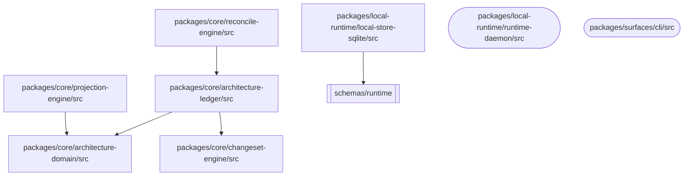
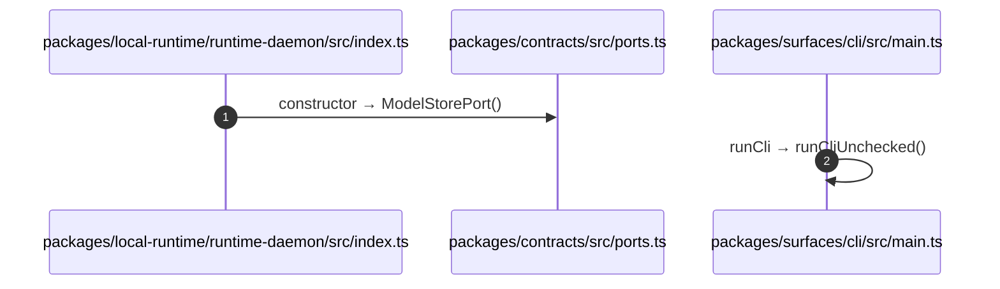

# Implementation Notes: archctx-capability-docs-projection

> **Status**: Active
> **Plan**: plans/plan-20260808-0116-archctx-capability-docs-projection.md
> **Contract**: tasks/contracts/20260808-0116-archctx-capability-docs-projection.contract.md
> **Review**: tasks/reviews/20260808-0116-archctx-capability-docs-projection.review.md
> **Last Updated**: 2026-08-08 01:16
> **Lifecycle**: notes

## Design Decisions

- ...

## Deviations From Plan Or Spec

- None recorded.

## Tradeoffs Considered

| Option | Decision | Reason |
|--------|----------|--------|
| ... | ... | ... |

## Open Questions

- None.

## Evidence Links

- Checks: `.ai/harness/checks/latest.json`
- Run snapshots: `.ai/harness/runs/`

## Promotion Candidates

- Promote to `tasks/lessons.md` only after a repeated correction or failure pattern.
- Promote to `docs/researches/` only when it is durable repo knowledge with evidence.
- Promote to harness asset files only after verification across more than one task or fixture.

---

## T0 — `.gitignore` repo-local override

`.archcontext/` 是本 repo 的 Git-visible 架構真值(root `CLAUDE.md` Architecture Ledger Contract),但 repo-harness init 的 managed block 會把整個目錄列入 ignore。本 worktree(base `7415329`)的 committed `.gitignore` 用的還是舊的 `# BEGIN/END: claude-runtime-temp` block,裡面**沒有** `.archcontext/`;帶 `.archcontext/` 的新 block 目前只存在於主 worktree 的未提交改動裡。所以本輪的修法是**前置防護**:在 managed block 之後追加 repo-local 反向規則,managed block 內部一個字沒動。

驗證(以 python 臨時把 `.archcontext/` 插進 managed block 模擬未來的 init 產物,再還原):

```
?? .archcontext/model/nodes/zz-probe.yaml     # 未被 ignore
!! .archcontext/.local/zz-probe.txt           # 仍被 ignore
```

## T1 — render input Git ref + entity-summary 機器區

### 改了什麼

`renderArchitectureDocumentationProjection` 的 input 新增兩個**必填**欄位:

- `verifiedAgainst: { branch, commit, committedAt }` — 由 `assertArchitectureProjectionVerifiedAgainst()` fail-closed 校驗。空值、`unknown`/`unborn`/`detached` 以外的佔位字串、非 hex commit、非 ISO 日期一律拋錯,沒有 optional 預設、沒有「取不到就空字串」。
- `sourceScaleSignals: CapabilitySourceScaleSignal[]` — 由 `loadCapabilitySourceScaleSignals(root, model)` 實測。宣告了 `source.include` 卻沒有對應測量的 node 直接拋 `architecture-docs-projection-scale-signal-missing`;沒宣告 `source.include` 的 node 才走「無法推導」標註路徑。

`renderEntitySummary` 重寫成 handoff §2 的機器區形狀:引言 blockquote(狀態 / `Verified against: <branch>@<commit>`(commit 日期)/ Capability ID / Matched Prefixes / Local Contracts / 事實優先級)+ `## 1` 的 1.1 架構圖(誠實標註「尚未生成」,不輸出空 mermaid fence)、1.2 模組職責表、1.3 規模信號(文件數/總行數/前綴/復算命令)、1.4 依賴邊界 + `## 2` 結構位。

### 三個非顯而易見的決定

1. **`committedAt` 用 commit 的 committer date,不用 `generatedAt`。** CLI 的 `--generated-at` 預設是 epoch(既有的決定性慣例),直接拿它做日期會讓文檔印出 `main@<真實 sha>(1970-01-01)`——真 commit 配假日期。改讀 `git show -s --format=%cI HEAD`,日期跟著 commit 走,一樣是決定性的。

2. **`verifiedAgainst` 只折進 entity-summary 的 per-target `sourceDigest`,不進全域 `sourceDigest`。** 它確實是渲染輸入,不折進 digest 的話 HEAD 一移動就會被 drift 判成 `projection-generated-region-manually-edited`——把「commit 換了」誣告成「有人手改機器區」。折進全域 digest 又會讓 index/diagrams/decisions 全部跟著每個 commit 髒掉。折進 per-target 之後:HEAD 移動 → 只有 modules/ 下的 entity 文檔 + manifest 報 `projection-generated-region-stale`,其餘 target 輸出與改動前 byte 相同(有測試釘死)。

3. **skeleton 只在檔案不存在時寫一次。** `ProjectionTargetDraft.skeleton = { prefix, suffix }`:prefix 是 `# <name> 架構文檔`,suffix 是空的 `## 3` / `## 4` / `## Optimization Backlog` 標題。兩者都在 marker **外**,之後每次投影都只 splice region,標題與人工區永不被碰。既有檔案沒 marker 時仍走既有 `mixed` 追加語義。

### 邊界取捨

- 規模掃描留在 projection-engine(它本來就有 `loadArchitectureDocumentationInputs` 這類 fs IO),但**只用 `node:fs`**,不引 `node:child_process`——`@archcontext/core` 目前零 child_process,不在這一刀破例。代價是掃描口徑是 include/exclude glob + 跳過 `.git/`、`node_modules/`,不是 `git ls-files`,所以復算命令寫的是 `archctx docs plan --json` 而不是一條 git 管線。
- Git ref 的實讀留在各 surface(daemon 復用既有 `readCurrentBranch`/`readHeadSha`,CLI 補 `readHeadCommittedAt`,readback script 各自 execFileSync)。校驗只有一份,就是 core 匯出的 `assertArchitectureProjectionVerifiedAgainst`。

### 留給 T2 / T3 的擴展點

- **T2(P1 flowchart)**:`renderEntitySummary`(`packages/core/projection-engine/src/index.ts`)裡 `### 1.1 架構圖` 那一段是唯一要換的位置。import 邊需要新的 render input(建議沿用 `sourceScaleSignals` 的形狀:`importEdges: { nodeId, edges: [...] }[]`,由 caller 從 adapter 取,render 保持純)。
- **T3(P2 sequenceDiagram)**:`## 2. P2:端到端數據流` 段落同理。fail-closed 語義可以直接複用 `assertArchitectureProjectionVerifiedAgainst` 的寫法。
- 兩者都不需要動 marker/skeleton/drift:機器區已經是一整段連續 region,加內容不改結構。

### 已知待處理(不屬 T1)

- `docs/architecture/modules/capability-architecture-context.md` 是舊渲染器產物,`# Architecture Context` 標題在 marker **內**。T6 實跑投影後那行會被 region 換掉,檔案會沒有 H1——需要在 T6 手動把標題補到 marker 外(新檔案由 skeleton 自動處理,只有這一份存量檔案要遷移)。
- `scripts/architecture-ledger-al9-doc-projections-readback.ts` 的 `current.driftOk` 在 T6 重投影之前必然是 false(渲染輸出形狀變了)。該 readback 不在 `bun run verify` 鏈上,其 `.test.ts` 只跑合成 packet,所以 `bun test` 不受影響。

## T2 / T3 — P1 flowchart 與 P2 sequenceDiagram

### 新的 render input(兩個都必填)

```ts
importGraphs: CapabilityImportGraph[]            // { nodeId, files, edges: {from,to}[], truncated }
entrypointCallGraphs: CapabilityEntrypointCallGraph[]  // { nodeId, entrypoints: { path, seeds, seedsTruncated }[] }
```

沿用 T1 建議的 `sourceScaleSignals` 形狀:caller 取數、render 純函數。兩者都折進 entity-summary 的 per-target `sourceDigest`(理由同 T1 決定 2:重新測量索引要報 `projection-generated-region-stale`,不能被誣告成手改;index/diagrams/decisions 仍 byte 不變)。

### 取數面(codegraph-adapter,同步)

`loadCapabilityCodeGraphProjectionInputs(root, model, { binary?, importNodeLimit? })` 一次算出兩份輸入。刻意**沒有**動 `CodeGraphProvider` 介面:那是 async 的 port,而既有 `CodeGraphCliProvider` 底下全是 `execFileSync`,async 只是外觀。把新查詢做成同步模組函數,daemon / CLI / readback script 四個 caller 全部保持同步,不用把 `completeTaskProjectionDrift`、`buildArchitectureDocsProjection` 改成 async,也不用給 CLI 塞一個 provider 實例。

配套從 projection-engine 匯出 `loadCapabilitySourceFootprints(root, model)`(`loadCapabilitySourceScaleSignals` 改成它的 consumer),讓「哪些檔案屬於這個能力」只有一份實作。

### 三個非顯而易見的決定

1. **P1 用「dump 全庫 import 節點再按 footprint 過濾」,不用路徑查詢。** codegraph `query` 是模糊排序搜尋:實測 `query -k import "packages/core/projection-engine"` 回 0 筆,`"projection-engine"` 回 4 筆且全不在該目錄下;而 `-k import` 配夠大的 limit 查 `"import"` 會把索引裡的 import 節點整批倒出來(本庫 1352 筆,limit 3000/6000 同值 = 已飽和)。路徑查詢的召回率不可控 = 會靜默漏邊,所以改成一次全量 dump + 客戶端按 `source.include` 過濾。`results.length >= limit` 記成 `truncated`,渲染時明寫「邊集可能不完整」,不假裝完整。

2. **T2 誠實省略 / T3 fail-closed,兩邊不對稱是有意的。** T2:node 有 `source.include` 但沒有 importGraph(索引不可用)→ 段內標註原因並省略圖;T3:node 宣告了 `source.entrypoints` 卻沒有對應 callGraph → `assertCapabilityEntrypointCallGraphs` 直接拋 `architecture-docs-projection-call-graph-missing`。這是 handoff 對兩項交付的原文要求(P1 可省、P2 不得退化成空模板)。assert 另外校驗「追蹤到的入口集合 == 宣告的入口集合」,半套資料同樣拋 `...-call-graph-entrypoint-mismatch`,避免部分採集混充完整軌跡。

3. **圖節點按目錄聚合,不按檔案。** 檔案級節點在中型能力上就會炸成幾百個節點。目錄聚合下溯源仍是精確的:圖邊集 == 輸入 import 邊集在 `dirname` 下的像(同目錄邊丟棄),測試兩個方向都釘死(每條畫出的邊有真實邊支撐、每條跨目錄真實邊都被畫出)。節點形狀承載三種語義:`([...])` 宣告入口所在目錄、`[...]` 能力範圍內、`[[...]]` 範圍外的匯入目標。

### mermaid 安全化

- 節點 id:`<prefix>_<sanitized slug>_<path digest 前 8 hex>`。純 slug 會讓 `a/b` 與 `a-b` 撞同一個 id;digest 後綴保證唯一,又不像純 digest 那樣不可讀。id 恆以字母開頭。
- label:一律雙引號包裹,單次 pass 轉義 `"`→`'`、`#`→`#35;`、`;`→`#59;`、`,`→`#44;`(後三者分別是 mermaid 的 entity code 界定符與 sequence participant alias 的終止符)。單次 pass 是必要的:先換 `#` 再換 `;` 會把剛產生的 escape 再打壞。
- 沒有引入 mermaid 依賴。語法驗證用結構斷言:fence 內每一行只能是 header、節點宣告、或邊,正則整行匹配。

### 預算(都在 IO 層,render 保持 total function)

`CODEGRAPH_IMPORT_NODE_QUERY_LIMIT = 5000`(整庫一次 dump)、`CODEGRAPH_ENTRYPOINT_SEED_BUDGET = 5`(每個入口取前 5 個頂層 function/method,按行號)、`CODEGRAPH_ENTRYPOINT_CALL_BUDGET = 8`(每個種子留 8 條 call)。超出一律回報 `truncated` / `seedsTruncated` / `callsTruncated`,渲染時印出來。子進程開銷 = 1 + 入口數 ×(1 + 種子數);本庫 live node 目前無 `source`,實際開銷為 0(loader 在 model 沒有任何宣告時直接短路,不 spawn)。

### 已知限制

- `resolveImportTarget` 只解析**相對** specifier。`@archcontext/*` 這種 workspace alias 解析不到真實檔案 → 不產生邊。跨 package 的依賴邊因此在 P1 圖上缺席,這是「只畫真值」的代價,不補啟發式。
- P2 種子只取 `function` / `method`;純 class 或純 re-export 的入口會得到空種子,段內標「索引未回報頂層函式」。
- call trail 混型別引用(codegraph `node` 的 `Calls →` 實測會列出 `NativeModel`、`ArchitectureDecisionRecord` 這類型別),所以 §2 開頭固定掛「半自動生成的候選圖」blockquote,並註明本刀不做語義命名覆寫機制。

### 測試面

- `packages/core/projection-engine/test/entity-summary.test.ts`:原 11 個測試全綠(其中兩條佔位文案斷言隨實作更新),新增 P1 5 條 + P2 4 條 + footprint 1 條。
- `packages/local-runtime/codegraph-adapter/test/capability-projection-inputs.test.ts`(新增):假 CLI shim 驗 footprint 過濾、specifier 解析、truncated、種子/軌跡解析、無索引回空、無宣告不 spawn、CLI 出錯直接拋。
- 這個新檔一開始每條測試各跑一次 loader,並行測試下把鄰居 `codegraph-adapter.test.ts` 的 import-edge 測試擠到 5s timeout(單獨跑必過)。改成 happy path 共用一次 loader、truncated 測試用無入口 model,連跑 5 次穩定。

### 留給 T4 / T6

- render input 的必填欄位現在有四個(`verifiedAgainst`、`sourceScaleSignals`、`importGraphs`、`entrypointCallGraphs`)。新 caller 照 `daemon:6591` / `cli:986` 的形狀抄,`...loadCapabilityCodeGraphProjectionInputs(root, model)` 展開即可。
- T6 給 `capability.architecture-context` 補 `source.include/entrypoints` 之後,`archctx docs plan` 會第一次真的去 spawn codegraph。本 worktree **沒有** `.codegraph/` 索引(只有主 worktree 有),所以在這裡跑 T6 之前要先 `codegraph init`,否則 P1 走「索引不可用」省略路徑、而 P2 會因為宣告了 entrypoints 直接拋錯 —— 這是設計上的 fail-closed,不是 bug。

## T4 — agent-context 接線:BLOCKED(ChangeSet 寫入白名單)

### 卡點

`renderAgentContextProjection` 按 ADR-0043 把 region 寫進**能力自己的源碼目錄**(`<primary source dir>/CLAUDE.md`、`AGENTS.md`)。所有 ChangeSet 寫入——不論走 `daemon.planUpdate/applyUpdate`(既有 `docs plan|preview|apply` 的形狀)還是 `applyArchitectureProjectionChangeSet`——最終都過 `ChangeSetEngine.apply` → `applyFileOperation` → `assertSafeTarget` → `assertAllowedArchContextPath`(`packages/core/policy-engine/src/index.ts:188-193`),而該白名單(`:36-45`)只有 `.archcontext/*` 六項與 `docs/architecture/`。

實測(worktree 根,`evaluateChangeSetPaths` 直呼):

```
primary source dir: packages/core/projection-engine
[
  { "id": "path-denied:packages/core/projection-engine/CLAUDE.md",
    "type": "path-denied", "severity": "error",
    "message": "Path is outside ArchContext write allowlist: packages/core/projection-engine/CLAUDE.md" },
  { "id": "path-denied:packages/core/projection-engine/AGENTS.md", ... }
]
```

`preview()` 會回 `allowed: false`,`apply()` 會直接拋。所以「plan/preview 零副作用 + apply 走 ChangeSet」這條路在白名單放行之前**不可能綠**,接線本身不是缺口。

### 為什麼不自行放行

1. `packages/core/policy-engine/` 不在 contract 的 `allowed_paths`(`packages/core/changeset-engine/` 亦然)。
2. 這是寫入安全邊界,不是機械接線。`assertAllowedArchContextPath(root, path)` 只拿得到路徑,拿不到 model:最省事的放行方式是按 basename 允許任意 `**/CLAUDE.md`、`**/AGENTS.md`,代價是 ChangeSet 從此能寫倉庫任何位置的 agent 契約檔(含 repo root 那份人工路由契約)。要做到「只放行本次投影算出的 target 路徑」,得改 `assertAllowedArchContextPath` 的簽名或加第二道 per-ChangeSet 允許集,波及 policy-engine + changeset-engine 兩個 package。
3. `packages/core/policy-engine/test/policy-engine.test.ts` 有 `evaluateChangeSetPaths(root, ["src/app.ts"])` 必須被拒的斷言;放行方案必須同時保住「任意源碼路徑仍拒」這條不變量,該測試檔同樣不在 `allowed_paths`。

### 交還給調度的選項(未決,不自行選)

- A:白名單加 basename 規則(`**/CLAUDE.md`、`**/AGENTS.md`)。改動最小,寫入面最寬。
- B:ChangeSet 帶 per-draft 允許路徑集,由 agent-context plan 算出後注入。寫入面最緊,但要動 policy-engine + changeset-engine 兩個 package 的介面。
- C:先只做 `agent-context plan|preview`(純渲染 + 零寫入的 diff 報告),`apply` 留到白名單決策落地。

### 已確認不缺的部分

- schema enum(`schemas/runtime/projection-target.schema.json:13`)、default manifest placement rules(`packages/local-runtime/model-store-yaml/src/index.ts:129-144`)、渲染器與 8 條單測都在,`model-store-yaml` 確實不需要動。
- `mergeAgentContextRegion` 的 digest-mismatch 拋錯(`projection-engine/src/index.ts` `agent-context-marker-output-digest-mismatch`)只帶 nodeId,不帶檔案路徑與期望/實際 digest;CLI/daemon 面要「不吞不降級地呈現哪個檔、哪個 marker、期望/實際」的話,這個錯誤訊息需要一併加料——留給接線那一刀。

## T5 — projection freshness 檢查(交付 5b)

### 語義切分:drift 問「渲染輸出對不對」,freshness 問「它描述的代碼還在不在原地」

新增的不是 drift 的變體。`architectureDocumentationProjectionDrift` 比對 digest:磁碟上的檔案跟當前 model 渲染出來的是否一致。freshness 比對的是 `verifiedAgainst.commit` 到 HEAD 之間,有沒有檔案落在某個 node 的 `source.include`(減去 `source.exclude`)footprint 內。兩者不互相蘊含。

### 三處改動

1. **manifest 帶上機器可讀的 `verifiedAgainst`**(`projection-engine/src/index.ts`,`manifestValue` 新增頂層欄位)。T1 只把它渲染進 entity-summary 引言的散文裡;freshness 需要的是 commit 這個**數據**,不能靠回頭 parse Markdown。manifest 無 schema 約束(`schemas/` 下沒有它的 schema),此欄位純加法,`architecture-ledger-al9-doc-projections-readback.ts` 只讀 `schemaVersion`,不受影響。

2. **`evaluateArchitectureProjectionFreshness`(core,純函數全函數)** + `loadArchitectureProjectionManifestVerifiedAgainst`(fs readback,三態:`manifest-missing` / `manifest-unreadable` / `present`)。變更集由 caller 量,型別是顯式二態 `CapabilitySourceChangeSet = { measured, paths } | { unavailable, reason }`——`unavailable` 是一等結果,不是空陣列。reason codes 六個:`projection-manifest-missing`、`projection-manifest-unreadable`、`projection-verified-against-missing`、`projection-verified-against-invalid`、`projection-change-set-unavailable`、`projection-source-changed-since-verified-commit`。

3. **daemon 量變更集 + 接進 review**(`runtime-daemon/src/index.ts`):`readChangedPathsSince(root, commit)` 跑 `git diff --name-only <commit>..HEAD`,失敗(shallow、commit 不存在、無 git)回 `unavailable` 帶 git stderr;`completeTaskProjectionFreshness(root)` 組裝,`completeTask` 沿 `projectionDrift` 的形狀注入。review-engine 側 `reviewProjectionFreshness` 發 finding。

### 四個非顯而易見的決定

1. **footprint 匹配用 include/exclude 述詞,不用 ADR-0043 單一 owner tie-break。** `resolveArchitectureOwnerForPath` 在同特異度平手時回 `ambiguous`(不回 owner)——拿它做 freshness,globs 重疊的兩個 node 會雙雙靜默漏報。改用跟 `loadCapabilitySourceFootprints`(也就是餵給渲染器的那個述詞)完全相同的匹配:**凡是渲染輸入變了的 node 都算 stale**,重疊照報。有測試釘死重疊場景。

2. **只比較已提交歷史,不含工作區未提交改動。** `verifiedAgainst.commit` 是 commit,`complete` 又幾乎總是在髒工作區跑;把未提交改動算進來會讓每個進行中的任務都被判 stale,閘門直接廢掉。未提交改動是 WIP,不是「投影落後於某個 commit」。

3. **finding 的 `id` 與 `type` 都留在 `stale-context`,觸發源靠 message + `extensions.projectionFreshnessGate` 區分。** handoff 契約明文 `review.failOn: stale-context`;`failOn` 在本庫目前沒有代碼消費者(全庫 grep 只有 `.archcontext/policies/review.yaml`、default manifest 與 cloud runner 的同名無關欄位),外部消費者(repo-harness `check-architecture-sync --strict`)按 id 還是 type 匹配未知,兩個都留在契約上最安全。兩條 stale-context 不會同時出現:HEAD-snapshot mismatch 為真時 freshness 跟其他下游檢查一起被 skip,並記 `extensions.projectionFreshnessChecksSkipped: "stale-context"`(`practiceChecksSkipped` 先例)。

4. **manifest 不存在 → 不發 finding(回 `undefined`)。** 沒有投影就沒有「投影落後」可言,沿用 `completeTaskProjectionDrift` 的同一個短路。core 的 evaluate 仍然把 `manifest-missing` 當成一個 reason code 處理,保持全函數。

### 觀察到的重疊(不屬本刀,留報)

T1 決定 2 把 `verifiedAgainst` 折進 entity-summary 的 per-target `sourceDigest`,副作用是**HEAD 一動,`projection-drift` 就會報 `projection-generated-region-stale`**——不管改的是什麼檔。所以在 `complete` 這條路上,freshness 目前多半被 drift 的噪音蓋住(daemon 新測試裡「footprint 外的提交」那一段就是這個現象,已在測試註解裡寫明:斷言只驗 freshness gate 靜默,不驗整體 `pass`)。freshness 的獨立價值在於:語義精確(只在能力 footprint 真的動了時才報)、finding id 落在 handoff 契約要求的 `stale-context` 上、且 `evaluateArchitectureProjectionFreshness` 可被不跑整套渲染的消費者單獨調用。要不要收斂 drift 的 HEAD 噪音是另一個決定,不在本刀。

### 測試面

- `packages/core/projection-engine/test/projection-freshness.test.ts`(新增,10 條):命中/未命中/exclude 擋掉/空變更集/重疊 footprint 雙報/樣本上限 10 + truncated/變更集不可測 fail-closed/verifiedAgainst 四種缺失形態/manifest 帶 `verifiedAgainst`/readback 三態往返。
- `packages/core/review-engine/test/review-engine.test.ts`(+3 條):stale 投影擋 `complete_task` 且 finding id/type 都是 `stale-context`、message 帶觸發源、gate 進 extensions 且過 `review-result.schema.json`;fresh 時零 finding 零 extension;HEAD-mismatch 時 freshness 被 skip、既有語義原樣不變。
- `packages/local-runtime/runtime-daemon/test/local-runtime.test.ts`(+2 條):真 git repo 走 plan→commit→complete 全路(footprint 內提交 → 報;footprint 外提交 → 不報;重投影 → 清除),以及 verifiedAgainst.commit 在本倉不存在時 fail-closed 報 `projection-change-set-unavailable`。

## T6 — live 驗收(投影實跑 + 冪等)

### 1. worktree codegraph 索引

本 worktree 原本沒有 `.codegraph/`(T2 註記屬實)。`codegraph init .` 建索引:`Indexed 347 files / 8,829 nodes, 38,336 edges in 733ms`。`.codegraph/` 由 committed `.gitignore:9` 擋住(`git check-ignore -v` 實證),不進版本庫;init 沒有留下 daemon(目錄下無 `daemon.pid` / `daemon.sock`)。

### 2. live node 補 `source`(走 ChangeSet,未手編 YAML)

用的是 CLI 唯一的 entity 變更路徑:`archctx plan --path <node yaml> --expected-hash <digest> --body <yaml>` → `archctx apply --id <changeset> --approved --expected-worktree-digest <digest>`。這條路過 `ChangeSetEngine.plan/approve/apply` → `applyFileOperation` → `assertSafeTarget` / `assertAllowedArchContextPath` → `assertExpectedHash` → `atomicWriteFile`,不繞任何寫入邊界。body 用 `stableYaml()` 生成,保持與 `writeYaml` 完全相同的 canonical 形態(鍵排序、引號、縮排、結尾換行)。

最終落地:

```yaml
source:
  entrypoints:
    - "packages/local-runtime/runtime-daemon/src/index.ts"
    - "packages/surfaces/cli/src/main.ts"
  exclude:
    - "packages/**/test/**"
  include:
    - "packages/**/src/**"
```

`exclude` 是第二輪 ChangeSet 補的:第一輪只寫 `include: packages/**/src/**`,投影出來的 P1 圖裡混進了 `packages/surfaces/cli/test/fixtures/monorepo-basic/packages/{lib,web}/src` —— 這三個 fixture 檔確實命中 glob,但不是這個能力的源碼。收斂後檔案數 66 → 63。

已知形狀限制(不屬本刀):CLI 的 `plan` 子命令把 op 寫死成 `create_entity`(`packages/surfaces/cli/src/main.ts:352`),對既有檔案做欄位更新時 journal / ledger 事件裡記的 op kind 與語義上的 `update_entity_fields` 不符。檔案寫入語義是對的(`applyFileOperation` 只在 `delete_entity` 分支才分歧,其餘都是 expectedHash 校驗 + atomic write),但 provenance 的 op kind 不精確。要修得動 CLI 加一個 op 旗標,不在 T6 範圍。

### 3. 存量檔案 H1 遷移

`docs/architecture/modules/capability-architecture-context.md` 的舊 H1 `# Architecture Context` 在 marker **內**。遷移方式是在 marker 之前的人工區補一行 H1,舊的那行由重投影連同整個 region 一起換掉。

標題文案用 `# Architecture Context 架構文檔`,對齊 `entitySummarySkeleton()` 給新檔案寫的 `# ${node.name} 架構文檔`(`packages/core/projection-engine/src/index.ts:1198`)—— 這樣存量檔案與「刪掉重投影」產生的新檔案 byte 相同。派工單裡寫的 `# <domain>/<capability> 架構文檔` 在本庫沒有對應實作(`docs/researches/` 下沒有 handoff 原文),以渲染器實際契約為準。

### 4. 兩次 apply(冪等)

流程:`git checkout -- docs/architecture/` 回到 HEAD 基線 → 補人工區 H1 → 快照 `/tmp/t6-pre` → `archctx docs apply --approved`(第一次)→ 快照 `/tmp/t6-post1` → 再跑一次。

第一次 apply 後 `git diff --stat docs/architecture`:

```
 docs/architecture/.projection-manifest.json        |  27 +++--
 docs/architecture/changelog.md                     |   2 +-
 docs/architecture/decisions/index.md               |   7 +-
 docs/architecture/diagrams/architecture.likec4     |   2 +-
 docs/architecture/diagrams/architecture.mmd        |   2 +-
 .../diagrams/architecture.structurizr.json         |   2 +-
 docs/architecture/index.md                         |   2 +-
 .../modules/capability-architecture-context.md     | 115 +++++++++++++++++++--
 8 files changed, 133 insertions(+), 26 deletions(-)
```

非 modules 的六個檔各只動 1 行,是 marker 屬性上的全域 `sourceDigest` —— model 加了 `source` 欄位,全域 digest 必然跟著變。

人工區未被觸碰的驗證方式:把每個檔案裡所有 `BEGIN…END ARCHCONTEXT:generated` 區段整段替換成佔位符,再比對 `/tmp/t6-pre` 與投影後的結果:

```
SAME  modules/capability-architecture-context.md | human-region bytes: 49
SAME  index.md | human-region bytes: 1455
SAME  changelog.md | human-region bytes: 12
SAME  decisions/index.md | human-region bytes: 12
```

第二次 apply 後 `diff -r /tmp/t6-post1 docs/architecture` 無輸出,`git diff --stat` 與第一次逐字相同 → 冪等成立。

P1 flowchart(真實 import 邊):



目錄聚合後 5 條邊(檔案級原始邊 19 條)。T2 註記的 `@archcontext/*` alias 不解析在 live 上完全兌現:63 個檔案裡跨 package 的依賴幾乎全走 alias,所以畫出來的邊只有相對 import 那幾條。圖是誠實的,但對這個能力的實際資訊量偏低 —— 這是 P1 邊來源的真實上限,值得後續單獨切一刀(解析 workspace alias 到真實檔案)。

P2 sequenceDiagram(節錄,從兩個 entrypoint 生成,無 fail-closed 觸發):



T2 註記的「call trail 混型別引用」在 live 上也兌現了:`constructor → ModelStorePort()`、`RuntimeRpcCompatibilityIssue()` 這些是 type reference,不是呼叫。§2 開頭那條「半自動候選圖」blockquote 正好覆蓋這個限制。

### 5. drift / freshness / readback 收斂

- `archctx docs drift` → `ok: true`、`reasonCodes: []`、`diffs: []`(投影前是 `projection-generated-region-stale` + `projection-manifest-stale`)。
- `bun scripts/architecture-ledger-al9-doc-projections-readback.ts run --out /tmp/… --report /tmp/… --json` → 頂層 `ok: true`,`current.driftOk: true`(T1 註記預期它在重投影前必然 false,現已轉真)。out / report 指到 `/tmp` 是刻意的:預設輸出落在 `docs/verification/`,不在本 contract 的 `allowed_paths`,跑完 `git status docs/verification` 為空。
- `bun run typecheck` → 通過(tsc 無輸出)。
- `bun test packages/core/projection-engine packages/core/review-engine packages/local-runtime/codegraph-adapter` → `79 pass / 0 fail`(其中 projection-engine 單跑 `49 pass / 0 fail`)。

### 6. 順手發現(不屬本刀,未修)

`packages/core/projection-engine/src/index.ts` 有三處把真實 NUL 位元組(0x00 本體,不是轉義序列)寫進 template literal 當 map key 分隔符,在第 1074 與 1132 行。JS 語義上可用,但整個檔案因此被 ripgrep 等工具判成 binary(`rg` 直接回 `binary file matches`,要 `--text` 才搜得到)。git 目前仍當 text 處理(只嗅探前 8000 bytes),所以 diff 沒受影響。建議改成兩字元轉義序列或換個可見分隔符。

## T7 — 黏性戳記(Q2)+ agent-context 接線(Q1)+ 兩個收口

### 1. Q2:`verifiedAgainst` 從「渲染當下 HEAD」改成黏性戳記

問題是投影**沒有不動點**:正文印 `Verified against: <HEAD>`,而 T1 把 `verifiedAgainst` 折進 entity-summary 的 per-target `sourceDigest`,所以文檔一被 commit,`completeTaskProjectionDrift` 用新 HEAD 重算就必然不匹配 —— 每個 commit 都擋 `complete_task`,重投影的產物過一個 commit 又失效。

改法:

- `entitySourceDigest`(`projection-engine/src/index.ts`)**移除** `verifiedAgainst`、**加入** `sourceScaleSignals`。前者不是渲染輸入而是戳記,後者本來就是渲染輸入(LOC/檔案數印在 §1.3)卻漏折,導致規模變化被誤判成 `projection-generated-region-manually-edited`。
- `generatedStartMarker` 加 optional `verifiedAgainst="<branch>@<commit>@<committedAt>"` 屬性;`parseGeneratedRegionMetadata` 同步解析。該屬性**不進**任何 digest 計算輸入。
- 渲染迴圈:每個 entity target 先 `stickyVerifiedAgainst(existing, targetId, entitySourceDigest)` —— 既有 marker 的 sourceDigest 等於本次算出的 entity sourceDigest,且其戳記屬性通過 `assertArchitectureProjectionVerifiedAgainst`,就沿用舊戳;否則蓋 caller 傳入的 ref。缺失/畸形一律重蓋,不拋、不把壞值帶進正文。
- manifest 的 `targets[]` 條目帶 per-target `verifiedAgainst`;`loadArchitectureProjectionManifestVerifiedAgainst` 改回讀 per-target(按 `scope.id` 對到 nodeId)。
- `evaluateArchitectureProjectionFreshness` 輸入改成 `changeSets: { commit, changeSet }[]`,逐 node 按自己的戳記比對;daemon `completeTaskProjectionFreshness` 按 distinct commit 各跑一次 `readChangedPathsSince`。

### 2. 偏離派工單:manifest 頂層 `verifiedAgainst` 移除,不是保留

派工單寫「頂層保留為本次渲染 run 的 ref」。實作時發現這一條與本刀的驗收心臟直接衝突:manifest 進 drift 的 digest 比對(`projection-manifest-stale`),頂層放當前 HEAD 就等於把不動點從正文搬到 manifest —— 投影 commit 之後 `complete_task` 照樣被擋。

所以頂層欄位刪掉,戳記只存在於 per-target 條目。理由:戳記本來就是 per-target 的(不同 node 可以停在不同 commit),頂層那份在 per-target 存在後既不是真值也不可判定;而它是唯一一個會隨 HEAD 變動、又進 digest 比對的欄位。freshness 的權威讀取面本來就要按派工單第 4 點改成 per-target,頂層已無消費者。

實證(`bun test packages/local-runtime/runtime-daemon`,`committing the projection itself does not block the next complete_task`):真 git repo 走 `planUpdate` → `applyUpdate` → `git commit` 投影本身 → 不重投影直接 `complete_task` → `result: "pass"`、`findings: []`、drift 與 freshness gate 都沒出現,而文檔正文仍印著 apply 當時那個 commit。

### 3. 殘留缺口(不在本刀修,交還調度)

黏性戳記的定義是「內容輸入未變就沿用」。當一次 footprint 內的改動**不改變文檔的任何斷言**(檔案數、總行數、import 邊、呼叫軌跡全都不變,例如只改一行字面值),重跑投影不會重蓋戳記,於是 freshness 的 `projection-source-changed-since-verified-commit` **無法靠重投影清除**。常見改動(增刪行、增刪檔、動 import)都會改 `entitySourceDigest`,所以重投影照樣清得掉;但這個窄口是真的死結。要關掉它得再動一次戳記語義(例如區分「檢查」與「重新驗證」兩種渲染模式),那是設計決定,不是本刀的執行範圍。

### 4. Q1:agent-context 接線

- `agentContextProjectionTargetPaths(model)` 是**唯一**推導函數,回 `{ nodeId, primarySourceDir, path }[]`;`renderAgentContextProjection` 與 `projectionOwnedPaths` 都是它的 consumer,測試釘死「推導集 === 渲染出來的 files 路徑集」防漂移。`primarySourceDirectoryFromInclude` 回 `"."` 時拋 `agent-context-primary-source-dir-is-repository-root: <nodeId>`(repo 根契約檔永不進寫入面)。
- changeset-engine:`ChangeOperationKind` 加 `"render_agent_context"`;`ChangeSetEngineDeps.agentContextScope?: { derive(root) }`;`preview()` 改**逐 operation** 驗路徑,所以 `render_projection` 帶 agent-context 路徑照樣被拒。推導是**惰性**的:draft 裡沒有 `render_agent_context` 就完全不呼叫 `derive`,避免某個 repo 的 model 推導失敗連累所有無關 ChangeSet。
- policy-engine:`assertAllowedArchContextPath(root, path, scope?)`,基礎 `ALLOWLIST` 一字未動;放行條件 = `operation === "agent-context" && scope.agentContextPaths.has(path)`,**且**路徑 basename 是 `CLAUDE.md`/`AGENTS.md`、**且**位於子目錄。後兩條是在寫入邊界上重新斷言的,不 import projection-engine:即使推導壞掉、把 repo 根 `CLAUDE.md` 或同目錄 `NOTES.md` 塞進集合,寫入面也不會被撐開。放行之後 repo-escape / symlink 檢查順序不變。
- 沒有把推導集 digest 寫進 `ChangeSetBase`(派工單第 3 點的「建議」)。理由有二:apply 時重新推導本身就是 fail-closed(plan 之後縮小的範圍在 apply 會被拒),digest 只多擋「範圍變過」這件事;而 `ChangeSetBase` 在 `schemas/runtime/changeset.schema.json` 裡是 `additionalProperties: false`,加欄位會多出第二處 schema 分歧。
- CLI `archctx agent-context plan|preview|apply` 鏡像 docs 子命令,走同一條 `planUpdate`/`applyUpdate`;plan/preview 零副作用(實測 `git status` 前後逐字相同、目標檔案未被建立)。
- 沒有新增 daemon 的 `applyAgentContextProjectionChangeSet`(派工單第 5 點)。`docs apply` 本身也不走 `applyArchitectureProjectionChangeSet`(那是 ledger project/rollback 專用),鏡像 docs 就是走 `planUpdate`/`applyUpdate`;多加一個沒有 caller 的 private method 是死碼。ChangeSetEngine 建構處已接 derive hook。
- `mergeAgentContextRegion` 的 digest-mismatch 錯誤補全成 `agent-context-marker-output-digest-mismatch: <path> (node <nodeId>; marker records <expected>, region body digests to <actual>)`。

### 5. `projectionOwnedPaths(model)`

`docs/architecture/**` + 推導出來的 agent-context 目標路徑。freshness 的變更集要減掉它:agent-context 目標檔就落在該能力自己的 `source.include` footprint 內,把投影自己的產物算成能力源碼,會讓每次投影 commit 都報該能力 stale → 要求再投影 → 產出同樣的位元組,一個沒有不動點的迴圈。

它會在 model 有根 glob 能力節點時拋錯,這是刻意的:同一個推導只有一種行為,寫入面拒絕的東西,freshness 也不會假裝它不存在。

### 6. 兩個收口

- `projection-engine/src/index.ts` 兩處真實 0x00 位元組(`${from}\0${to}`、`${trace.path}\0${call.path}\0${label}`)改成兩字元轉義,運行時值不變。`rg "entitySourceDigest" packages/core/projection-engine/src/index.ts` 現在回 6 個命中(先前整檔被判 binary)。
- `entitySummarySkeleton` 新檔標題改成 handoff 形式 `# <domain>/<name> 架構文檔`:node.id 去掉 `capability.` 前綴、餘段以 `/` 連接(`capability.docs.projection` → `docs/projection`)。用 id 不用 `node.name`,因為標題是文檔的穩定地址,而 id 是 model 裡唯一保證唯一且路徑形狀的東西。存量檔 `docs/architecture/modules/capability-architecture-context.md` 的 `# Architecture Context 架構文檔` 在人工區,未被觸碰(投影兩次後仍逐字保留)。

### 7. 順手修的 caller 破損

`scripts/architecture-ledger-al9-complete-task-provenance-readback.ts` 自己手抄了一份 manifest 形狀,不用 `plan.manifest`。manifest 加 per-target `verifiedAgainst` 之後那份抄本落後,readback 的 `postApplyDriftOk` / `passesAfterProjectionApply` 變 false(AL9-14 / EG1 / EG4 掛掉)。改成直接用 `plan.manifest`,七個 gate 全綠。`docs-projections-readback` 那支本來就用 `plan.manifest`,不受影響。

另核對:`existingFiles` 在全部四個 caller(CLI `buildArchitectureDocsProjection`、daemon `completeTaskProjectionDrift`、兩支 al9 readback script)都有傳,無缺口。

### 8. 已知契約分歧(需調度決定,不在 allowed_paths)

`schemas/runtime/changeset.schema.json` 的 `operations[].op` enum 沒有 `render_agent_context`。運行期不受影響(全庫只有測試會拿這個 schema 驗 ChangeSet,而既有那條測試驗的是 `write_policy`/`write_waiver` draft,仍然綠),但已發佈的 ChangeSet 契約與 TS union 就此不一致。補一行 enum 即可,`schemas/` 不在本 contract 的 `allowed_paths`,依派工單第 9 點停下上報。

## T8 — 關掉黏性戳記的窄口死結

### 1. 死結與裁決後的條件

T7 §3 記的窄口:覆蓋源碼改動若不動任何渲染斷言(同行改字面值,檔案數/LOC/import 邊/呼叫軌跡全不變),`entitySourceDigest` 不變 → 重投影沿用舊戳 → freshness 的 `projection-source-changed-since-verified-commit` 永遠清不掉 → `complete_task` 被 `stale-context` 卡死。

黏性條件收緊成兩條同時成立:

1. entity `sourceDigest` 未變(本次渲染出來的 body 會逐字相同),**且**
2. 該 node 的覆蓋源碼在舊戳 commit 之後沒有變更(footprint 命中,排除 `projectionOwnedPaths(model)`)。

有覆蓋變更 → 重蓋 caller 傳入的當前 ref。語義上誠實:這次渲染確實重讀了當前樹,freshness 也隨之清除。

### 2. render 保持純:per-node 輸入,不是 render 自己去讀 git

新增 render input `sourceChangesSinceStamp: CapabilitySourceChangeSinceStamp[]`(必填,形狀沿 `changeSets`/`importGraphs` 慣例):

```ts
type CapabilitySourceChangeSinceStamp =
  | { nodeId; commit; status: "unchanged" }
  | { nodeId; commit; status: "changed"; changedPathCount }
  | { nodeId; commit; status: "unmeasurable"; reason };
```

`commit` 是「這份測量對應的戳記 commit」。render 拿它跟 marker 上的戳記 commit 對照,對不上就當沒測量——否則會把 A commit 的變更集套到 B commit 的基準上。

未宣告 `source.include` 的 node **不需要條目**:它底下不可能有覆蓋變更,戳記無條件沿用。這一條是從 `model`(本來就是 render input)推的,不是從 caller 要的,所以 `renderer.test.ts` 那種沒有 source 的 fixture 傳 `[]` 就對。

### 3. 量不到 → 重蓋 + 可見提示,不 fail-closed

戳記 commit 在本庫不存在(rebase 後、shallow clone)時,`git diff <commit>..HEAD` 失敗。硬 fail 會讓 rebase 之後 `docs apply` 永久卡死——比原死結更糟。改成重蓋當前 ref,並在 plan 上掛一條 `notices`:

- `ArchitectureDocumentationProjectionPlan.notices: ArchitectureDocumentationProjectionNotice[]`,code 目前只有 `projection-stamp-change-set-unmeasurable`,帶 nodeId / targetId / path / stampedCommit / detail。
- 不進任何 digest,不影響 drift,不擋 apply。
- CLI:`docs plan|preview|drift` 的 envelope 直接帶 `notices`;`docs apply` 的 envelope 來自 daemon,由 `withProjectionNotices()` 補上,免得寫檔那一刀反而看不到提示。

觸發提示的三種形態一律重蓋:caller 沒給該 node 的測量、測量的 commit 與 marker 戳記不符、測量本身 unmeasurable。marker 戳記缺失/畸形仍然是靜默重蓋(不是「量不到」,是本來就沒戳)。

### 4. 一個述詞,兩個消費者

`probeCapabilitySourceStamps()`(private)是唯一比對「node 戳記 vs 測得變更集」的地方,footprint 述詞與 `projectionOwnedPaths` 排除都在裡面。兩個消費者:

- `evaluateArchitectureProjectionFreshness`(語義不變,只是改吃 probe)
- `capabilitySourceChangesSinceStamps`(新增,export,給渲染端)

沒有寫第二份 matcher,freshness 與戳記生命週期不可能對同一個問題給出不同答案。

### 5. caller 端只有一個實作

`loadCapabilitySourceChangesSinceStamps(root, model)` 放在 `runtime-daemon`(git 讀取本來就在那,`readChangedPathsSince` 已存在;core 不 spawn process,而 `git-adapter` 不在本 contract 的 allowed_paths)。四個渲染 caller 全走它:daemon `completeTaskProjectionDrift`、CLI `buildArchitectureDocsProjection`、兩支 al9 readback script。`completeTaskProjectionFreshness` 與它共用 `measureChangeSetsForManifestStamps()`(per distinct stamp commit 各跑一次 diff)。

### 6. 順手修的錯誤分類:戳記刷新不是「手改」

drift 的最後一段原本是「outputDigest 對不上就報 `projection-generated-region-manually-edited`」。戳記是唯一不進 digest 的渲染輸入,所以「純戳記刷新」會落進這個分支,把重新驗證誣告成手改——正好是本刀死結場景裡使用者會看到的訊息。改成先判 region 是否自洽(body digest == 自己 marker 記的 outputDigest):

- 不自洽 → `projection-generated-region-manually-edited`(機器區被手改)
- 自洽但與本次期望不同 → `projection-generated-region-stale`(待重新驗證)

### 7. 測試

- `entity-summary.test.ts` +3:覆蓋變更但斷言不變 → 重蓋且除戳記行外 byte 相同、無 source 的 node 仍沿用舊戳;unmeasurable / commit 不符 / 完全沒測量 → 重蓋 + notice(內容逐欄斷言);純戳記刷新的 drift reasonCode 是 stale 不是 manually-edited。
- `local-runtime.test.ts` +2:**死結場景端到端**(真 git repo,同行字面值改動 commit → freshness 報 stale → `docs apply` → 戳記更新為新 commit、文檔除 marker 與 `Verified against` 行外逐字不變 → complete `pass`、findings 空 → 同 HEAD 再 apply 一次零 diff);戳記 commit 在本庫不存在 → 測量回 unmeasurable、apply 成功、戳記更新、不拋。
- 反證:把黏性條件臨時改回「digest 未變就沿用」,死結測試在 `expect(afterDoc).toContain("@<新commit>")` 掛掉(實跑確認,已還原)。
- 既有斷言無一替換。T7 的 `committing the projection itself does not block the next complete_task` 與 `moving HEAD with unchanged inputs is a fixed point` 原樣續綠。

### 8. 驗證

`bun run typecheck` 通過;`bun test packages/core/projection-engine packages/core/review-engine packages/local-runtime/runtime-daemon packages/surfaces/cli packages/surfaces/renderer` → `271 pass / 0 fail`;`bun run test:contracts` → `157 pass / 0 fail`;`package-boundary-audit` / `privacy-route-audit` 通過;兩支 al9 readback `ok: true`(輸出指到 `/tmp`,`docs/verification` 未被寫)。

live:`archctx docs apply --approved` 後第二次 apply `diff -r` 零輸出,`docs drift` → `ok: true`、`reasonCodes: []`、`notices: []`;`daemon stop` 後本 worktree 無殘留進程。
